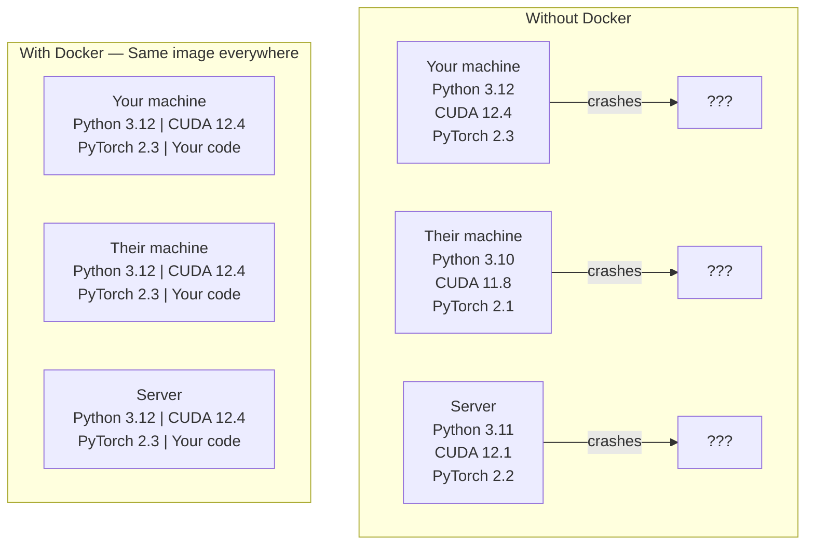

# Docker for AI

> Containers make "works on my machine" a thing of the past.

**Type:** Build
**Languages:** Python
**Prerequisites:** Phase 0, Lessons 01 and 03
**Time:** ~60 minutes

## Learning Objectives

- Build a GPU-enabled Docker image with CUDA, PyTorch, and AI libraries from a Dockerfile
- Mount host directories as volumes to persist models, datasets, and code across container rebuilds
- Configure the NVIDIA Container Toolkit to expose GPUs inside containers
- Orchestrate multi-service AI applications (inference server + vector database) using Docker Compose

## The Problem

You trained a model on your laptop with PyTorch 2.3, CUDA 12.4, and Python 3.12. Your colleague has PyTorch 2.1, CUDA 11.8, and Python 3.10. Your model crashes on their machine. Your Dockerfile works on both.

AI projects are dependency nightmares. A typical stack includes Python, PyTorch, CUDA drivers, cuDNN, system-level C libraries, and specialized packages like flash-attn that need exact compiler versions. Docker packages all of this into a single image that runs identically everywhere.

## The Concept

Docker wraps your code, runtime, libraries, and system tools into an isolated unit called a container. Think of it as a lightweight virtual machine, except it shares the host OS kernel instead of running its own, so it starts in seconds instead of minutes.



### Why AI projects need Docker more than most

1. **GPU drivers are fragile.** CUDA 12.4 code does not run on CUDA 11.8. Docker isolates the CUDA toolkit inside the container while sharing the host GPU driver through the NVIDIA Container Toolkit.

2. **Model weights are large.** A 7B parameter model is 14 GB in fp16. You do not want to re-download it every time you rebuild. Docker volumes let you mount a models directory from the host.

3. **Multi-service architectures are common.** A real AI application is not just a Python script. It is an inference server, a vector database for RAG, maybe a web frontend. Docker Compose orchestrates all of these with one command.

### Key vocabulary

| Term | What it means |
|------|---------------|
| Image | A read-only template. Your recipe. Built from a Dockerfile. |
| Container | A running instance of an image. Your kitchen. |
| Dockerfile | Instructions to build an image. Layer by layer. |
| Volume | Persistent storage that survives container restarts. |
| docker-compose | A tool for defining multi-container applications in YAML. |

### Common container patterns in AI

```
Dev Container
 Full toolkit. Editor support. Jupyter. Debugging tools.
 Used during development and experimentation.

Training Container
 Minimal. Just the training script and dependencies.
 Runs on GPU clusters. No editor, no Jupyter.

Inference Container
 Optimized for serving. Small image. Fast cold start.
 Runs behind a load balancer in production.
```

## Build It

### Step 1: Install Docker

```bash
# macOS
brew install --cask docker
open /Applications/Docker.app

# Ubuntu
curl -fsSL https://get.docker.com | sh
sudo usermod -aG docker $USER
# Log out and back in for group change to take effect
```

Verify:

```bash
docker --version
docker run hello-world
```

### Step 2: Install NVIDIA Container Toolkit (Linux with NVIDIA GPU)

This lets Docker containers access your GPU. macOS and Windows (WSL2) users can skip this; Docker Desktop handles GPU passthrough differently on those platforms.

```bash
distribution=$(. /etc/os-release;echo $ID$VERSION_ID)
curl -fsSL https://nvidia.github.io/libnvidia-container/gpgkey | sudo gpg --dearmor -o /usr/share/keyrings/nvidia-container-toolkit-keyring.gpg
curl -s -L https://nvidia.github.io/libnvidia-container/$distribution/libnvidia-container.list | \
 sed 's#deb https://#deb [signed-by=/usr/share/keyrings/nvidia-container-toolkit-keyring.gpg] https://#g' | \
 sudo tee /etc/apt/sources.list.d/nvidia-container-toolkit.list

sudo apt-get update
sudo apt-get install -y nvidia-container-toolkit
sudo nvidia-ctk runtime configure --runtime=docker
sudo systemctl restart docker
```

Test GPU access inside a container:

```bash
docker run --rm --gpus all nvidia/cuda:12.4.1-base-ubuntu22.04 nvidia-smi
```

If you see your GPU info, the toolkit is working.

### Step 3: Understand base images

Choosing the right base image saves hours of debugging.

```
nvidia/cuda:12.4.1-devel-ubuntu22.04
 Full CUDA toolkit. Compilers included.
 Use for: building packages that need nvcc (flash-attn, bitsandbytes)
 Size: ~4 GB

nvidia/cuda:12.4.1-runtime-ubuntu22.04
 CUDA runtime only. No compilers.
 Use for: running pre-built code
 Size: ~1.5 GB

pytorch/pytorch:2.3.1-cuda12.4-cudnn9-runtime
 PyTorch pre-installed on top of CUDA.
 Use for: skipping the PyTorch install step
 Size: ~6 GB

python:3.12-slim
 No CUDA. CPU only.
 Use for: inference on CPU, lightweight tools
 Size: ~150 MB
```

### Step 4: Write a Dockerfile for AI development

Here is the Dockerfile in `code/Dockerfile`. Walk through it:

```dockerfile
FROM nvidia/cuda:12.4.1-devel-ubuntu22.04

ENV DEBIAN_FRONTEND=noninteractive
ENV PYTHONUNBUFFERED=1

RUN apt-get update && apt-get install -y --no-install-recommends \
 python3.12 \
 python3.12-venv \
 python3.12-dev \
 python3-pip \
 git \
 curl \
 build-essential \
 && rm -rf /var/lib/apt/lists/*

RUN update-alternatives --install /usr/bin/python python /usr/bin/python3.12 1

RUN python -m pip install --no-cache-dir --upgrade pip setuptools wheel

RUN python -m pip install --no-cache-dir \
 torch==2.3.1 \
 torchvision==0.18.1 \
 torchaudio==2.3.1 \
 --index-url https://download.pytorch.org/whl/cu124

RUN python -m pip install --no-cache-dir \
 numpy \
 pandas \
 scikit-learn \
 matplotlib \
 jupyter \
 transformers \
 datasets \
 accelerate \
 safetensors

WORKDIR /workspace

VOLUME ["/workspace", "/models"]

EXPOSE 8888

CMD ["python"]
```

Build it:

```bash
docker build -t ai-dev -f phases/00-setup-and-tooling/07-docker-for-ai/code/Dockerfile.
```

This takes a while the first time (downloading CUDA base image + PyTorch). Subsequent builds use cached layers.

Run it:

```bash
docker run --rm -it --gpus all \
 -v $(pwd):/workspace \
 -v ~/models:/models \
 ai-dev python -c "import torch; print(f'PyTorch {torch.__version__}, CUDA: {torch.cuda.is_available()}')"
```

Run Jupyter inside the container:

```bash
docker run --rm -it --gpus all \
 -v $(pwd):/workspace \
 -v ~/models:/models \
 -p 8888:8888 \
 ai-dev jupyter notebook --ip=0.0.0.0 --port=8888 --no-browser --allow-root
```

### Step 5: Volume mounts for data and models

Volume mounts are critical for AI work. Without them, your 14 GB model downloads vanish when the container stops.

```bash
# Mount your code
-v $(pwd):/workspace

# Mount a shared models directory
-v ~/models:/models

# Mount datasets
-v ~/datasets:/data
```

Inside your training script, load from the mounted path:

```python
from transformers import AutoModel

model = AutoModel.from_pretrained("/models/llama-7b")
```

The model lives on your host filesystem. Rebuild the container as often as you want without re-downloading.

### Step 6: Docker Compose for multi-service AI apps

A real RAG application needs an inference server and a vector database. Docker Compose runs both with one command.

See `code/docker-compose.yml`:

```yaml
services:
 ai-dev:
 build:
 context:.
 dockerfile: Dockerfile
 deploy:
 resources:
 reservations:
 devices:
 - driver: nvidia
 count: all
 capabilities: [gpu]
 volumes:
 -../../../:/workspace
 - ~/models:/models
 - ~/datasets:/data
 ports:
 - "8888:8888"
 stdin_open: true
 tty: true
 command: jupyter notebook --ip=0.0.0.0 --port=8888 --no-browser --allow-root

 qdrant:
 image: qdrant/qdrant:v1.12.5
 ports:
 - "6333:6333"
 - "6334:6334"
 volumes:
 - qdrant_data:/qdrant/storage

volumes:
 qdrant_data:
```

Start everything:

```bash
cd phases/00-setup-and-tooling/07-docker-for-ai/code
docker compose up -d
```

Now your AI dev container can reach the vector database at `http://qdrant:6333` by service name. Docker Compose creates a shared network automatically.

Test the connection from inside the AI container:

```python
from qdrant_client import QdrantClient

client = QdrantClient(host="qdrant", port=6333)
print(client.get_collections())
```

Stop everything:

```bash
docker compose down
```

Add `-v` to also delete the qdrant volume:

```bash
docker compose down -v
```

### Step 7: Useful Docker commands for AI work

```bash
# List running containers
docker ps

# List all images and their sizes
docker images

# Remove unused images (reclaim disk space)
docker system prune -a

# Check GPU usage inside a running container
docker exec -it <container_id> nvidia-smi

# Copy a file from container to host
docker cp <container_id>:/workspace/results.csv./results.csv

# View container logs
docker logs -f <container_id>
```

## Use It

You now have a reproducible AI development environment. For the rest of this course:

- Use `docker compose up` to start your dev environment and vector database together
- Mount your code, models, and data as volumes so nothing is lost between rebuilds
- When a lesson requires a new Python package, add it to the Dockerfile and rebuild
- Share your Dockerfile with teammates. They get the exact same environment.

### No GPU?

Remove the `--gpus all` flag and the NVIDIA deploy block. The container still works for CPU-based lessons. PyTorch detects the absence of CUDA and falls back to CPU automatically.

## Exercises

1. Build the Dockerfile and run `python -c "import torch; print(torch.__version__)"` inside the container
2. Start the docker-compose stack and verify Qdrant is accessible from the AI container at `http://qdrant:6333/collections`
3. Add `flask` to the Dockerfile, rebuild, and run a simple API server on port 5000. Map the port with `-p 5000:5000`
4. Measure the image size with `docker images`. Try switching the base image from `devel` to `runtime` and compare sizes

## Key Terms

| Term | What people say | What it actually means |
|------|----------------|----------------------|
| Container | "Lightweight VM" | An isolated process using the host kernel, with its own filesystem and network |
| Image layer | "Cached step" | Each Dockerfile instruction creates a layer. Unchanged layers are cached, so rebuilds are fast. |
| NVIDIA Container Toolkit | "GPU in Docker" | A runtime hook that exposes host GPUs to containers via `--gpus` flag |
| Volume mount | "Shared folder" | A directory on the host mapped into the container. Changes persist after the container stops. |
| Base image | "Starting point" | The `FROM` image your Dockerfile builds on top of. Determines what is pre-installed. |
