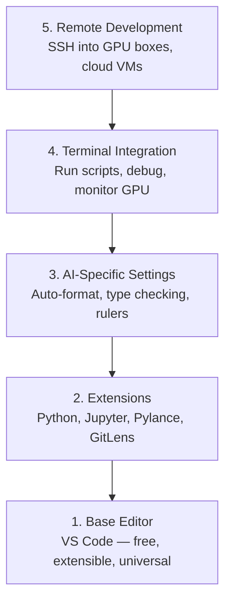

# Editor Setup

> Your editor is your co-pilot. Configure it once so it stays out of your way and starts pulling its weight.

**Type:** Build
**Languages:** --
**Prerequisites:** Phase 0, Lesson 01
**Time:** ~20 minutes

## Learning Objectives

- Install VS Code with essential extensions for Python, Jupyter, linting, and remote SSH
- Configure format-on-save, type checking, and notebook output scrolling for AI workflows
- Set up Remote SSH to edit and debug code on remote GPU machines as if they were local
- Evaluate editor alternatives (Cursor, Windsurf, Neovim) and their tradeoffs for AI work

## The Problem

You'll spend thousands of hours inside your editor writing Python, running notebooks, debugging training loops, and SSH-ing into GPU boxes. A misconfigured editor turns every session into friction: no autocomplete, no type hints, no inline errors, manual formatting, and a clunky terminal workflow.

The right setup takes 20 minutes. Skipping it costs you 20 minutes every day.

## The Concept

An AI engineering editor setup needs five things:



## Build It

### Step 1: Install VS Code

VS Code is the recommended editor. It is free, runs on every OS, has first-class Jupyter notebook support, and the extension ecosystem covers everything you need for AI work.

Download it from [code.visualstudio.com](https://code.visualstudio.com/).

Verify from the terminal:

```bash
code --version
```

If `code` is not found on macOS, open VS Code, press `Cmd+Shift+P`, type "Shell Command", and select "Install 'code' command in PATH".

### Step 2: Install Essential Extensions

Open the integrated terminal in VS Code (`Ctrl+`` ` or `` Cmd+` ``) and install the extensions that matter for AI work:

```bash
code --install-extension ms-python.python
code --install-extension ms-python.vscode-pylance
code --install-extension ms-toolsai.jupyter
code --install-extension eamodio.gitlens
code --install-extension ms-vscode-remote.remote-ssh
code --install-extension ms-python.debugpy
code --install-extension ms-python.black-formatter
code --install-extension charliermarsh.ruff
```

What each one does:

| Extension | Why |
|-----------|-----|
| Python | Language support, virtual env detection, run/debug |
| Pylance | Fast type checking, autocomplete, import resolution |
| Jupyter | Run notebooks inside VS Code, variable explorer |
| GitLens | See who changed what, inline git blame |
| Remote SSH | Open a folder on a remote GPU box as if it were local |
| Debugpy | Step-through debugging for Python |
| Black Formatter | Auto-format on save, consistent style |
| Ruff | Fast linting, catches common mistakes |

The file `code/.vscode/extensions.json` in this lesson contains the full recommendations list. When you open the project folder, VS Code will prompt you to install them.

### Step 3: Configure Settings

Copy the settings from `code/.vscode/settings.json` in this lesson, or apply them manually through `Settings > Open Settings (JSON)`.

The key settings for AI work:

```jsonc
{
 "python.analysis.typeCheckingMode": "basic",
 "editor.formatOnSave": true,
 "editor.rulers": [88, 120],
 "notebook.output.scrolling": true,
 "files.autoSave": "afterDelay"
}
```

Why these matter:

- **Type checking on basic**: Catches wrong argument types before you run. Saves debugging time on tensor shape mismatches and wrong API parameters.
- **Format on save**: Never think about formatting again. Black handles it.
- **Rulers at 88 and 120**: Black wraps at 88. The 120 marker shows when docstrings and comments are getting too long.
- **Notebook output scrolling**: Training loops print thousands of lines. Without scrolling, the output panel explodes.
- **Auto-save**: You will forget to save. Your training script will run stale code. Auto-save prevents that.

### Step 4: Terminal Integration

VS Code's integrated terminal is where you run training scripts, monitor GPUs, and manage environments.

Set it up properly:

```jsonc
{
 "terminal.integrated.defaultProfile.osx": "zsh",
 "terminal.integrated.defaultProfile.linux": "bash",
 "terminal.integrated.fontSize": 13,
 "terminal.integrated.scrollback": 10000
}
```

Useful shortcuts:

| Action | macOS | Linux/Windows |
|--------|-------|---------------|
| Toggle terminal | `` Ctrl+` `` | `` Ctrl+` `` |
| New terminal | `Ctrl+Shift+`` ` | `Ctrl+Shift+`` ` |
| Split terminal | `Cmd+\` | `Ctrl+\` |

Split terminals are useful: one for running your script, one for monitoring GPU with `nvidia-smi -l 1` or `watch -n 1 nvidia-smi`.

### Step 5: Remote Development (SSH into GPU Boxes)

This is the most important extension for AI work. You will run training on remote machines (cloud VMs, lab servers, Lambda, Vast.ai). Remote SSH lets you open the remote filesystem, edit files, run terminals, and debug as if everything were local.

Setup:

1. Install the Remote SSH extension (done in Step 2).
2. Press `Ctrl+Shift+P` (or `Cmd+Shift+P`), type "Remote-SSH: Connect to Host".
3. Enter `user@your-gpu-box-ip`.
4. VS Code installs its server component on the remote machine automatically.

For passwordless access, set up SSH keys:

```bash
ssh-keygen -t ed25519 -C "your-email@example.com"
ssh-copy-id user@your-gpu-box-ip
```

Add the host to `~/.ssh/config` for convenience:

```
Host gpu-box
 HostName 203.0.113.50
 User ubuntu
 IdentityFile ~/.ssh/id_ed25519
 ForwardAgent yes
```

Now `Remote-SSH: Connect to Host > gpu-box` connects instantly.

## Alternatives

### Cursor

[cursor.com](https://cursor.com) is a VS Code fork with built-in AI code generation. It uses the same extension ecosystem and settings format. If you use Cursor, everything in this lesson still applies. Import the same `settings.json` and `extensions.json`.

### Windsurf

[windsurf.com](https://windsurf.com) is another AI-first VS Code fork. Same story: same extensions, same settings format, same Remote SSH support.

### Vim/Neovim

If you already use Vim or Neovim and are productive in it, stay there. The minimum setup for AI Python work:

- **pyright** or **pylsp** for type checking (via Mason or manual install)
- **nvim-lspconfig** for language server integration
- **jupyter-vim** or **molten-nvim** for notebook-like execution
- **telescope.nvim** for file/symbol search
- **none-ls.nvim** with black and ruff for formatting/linting

If you do not already use Vim, do not start now. The learning curve will compete with learning AI engineering. Use VS Code.

## Use It

With this setup, your daily workflow looks like:

1. Open the project folder in VS Code (or connect via Remote SSH to a GPU box).
2. Write Python in the editor with autocomplete, type hints, and inline errors.
3. Run Jupyter notebooks inline with the Jupyter extension.
4. Use the integrated terminal for training scripts, `uv pip install`, and GPU monitoring.
5. Review changes with GitLens before committing.

## Exercises

1. Install VS Code and all extensions listed in Step 2
2. Copy the `settings.json` from this lesson into your VS Code config
3. Open a Python file and verify that Pylance shows type hints and Black formats on save
4. If you have access to a remote machine, set up Remote SSH and open a folder on it

## Key Terms

| Term | What people say | What it actually means |
|------|----------------|----------------------|
| LSP | "Autocomplete engine" | Language Server Protocol: a standard for editors to get type info, completions, and diagnostics from a language-specific server |
| Pylance | "The Python plugin" | Microsoft's Python language server using Pyright for type checking and IntelliSense |
| Remote SSH | "Working on the server" | VS Code extension that runs a lightweight server on a remote machine and streams the UI to your local editor |
| Format on save | "Auto-prettier" | The editor runs a formatter (Black, Ruff) every time you save, so code style is always consistent |
