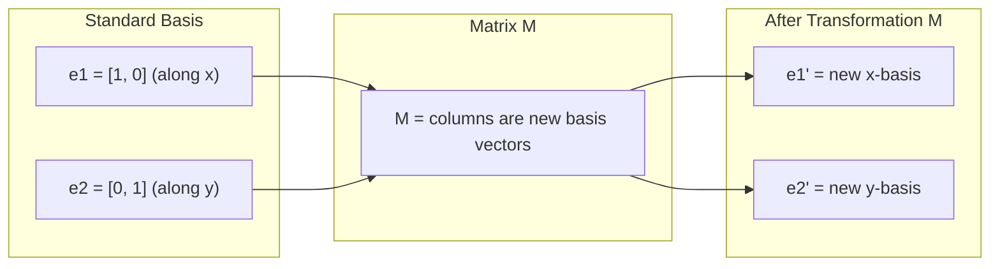
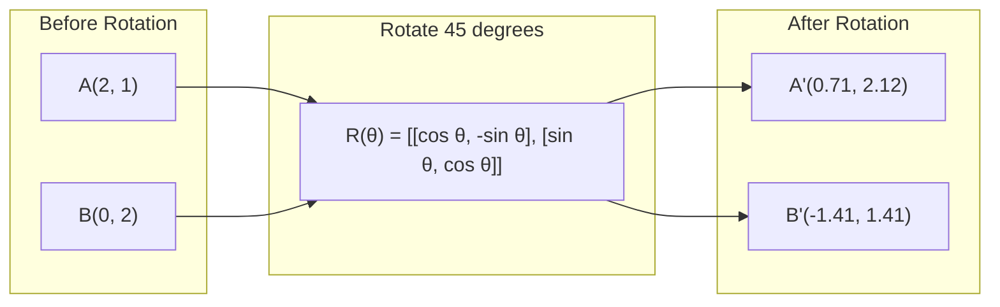
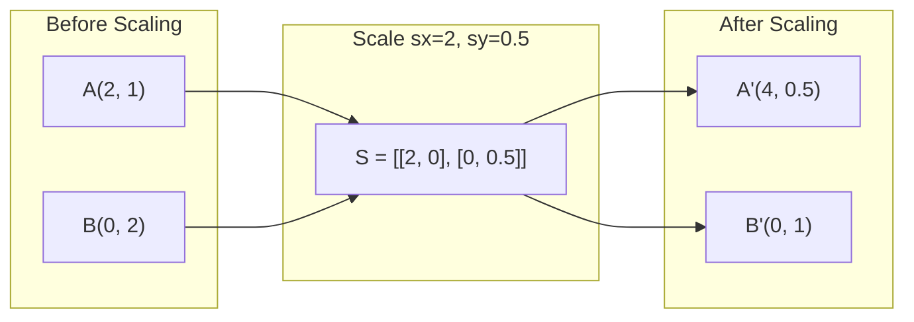
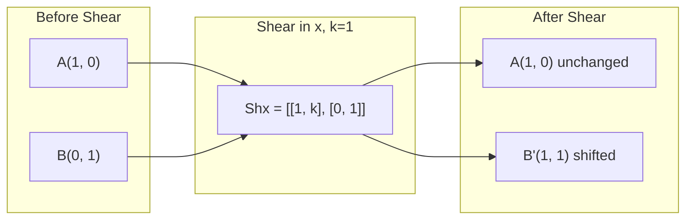
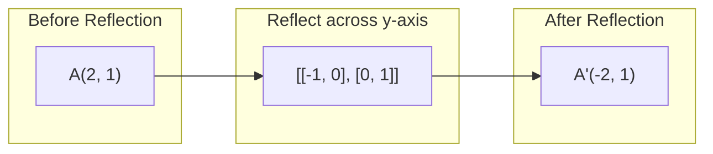
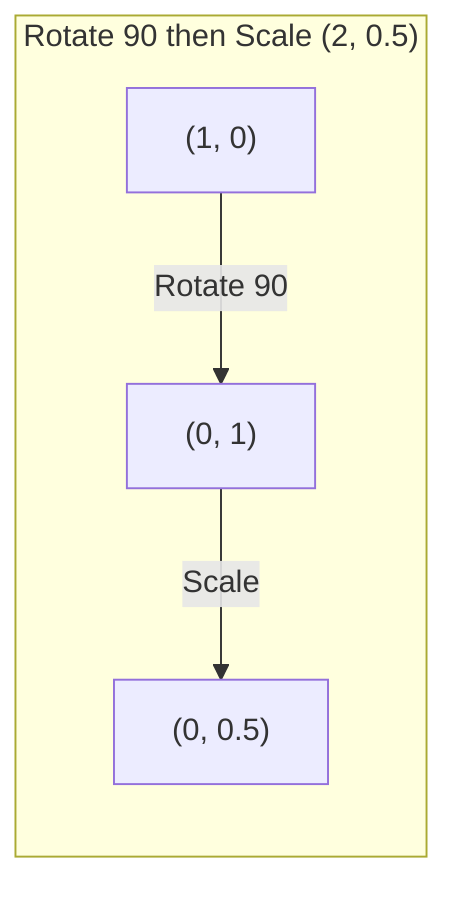
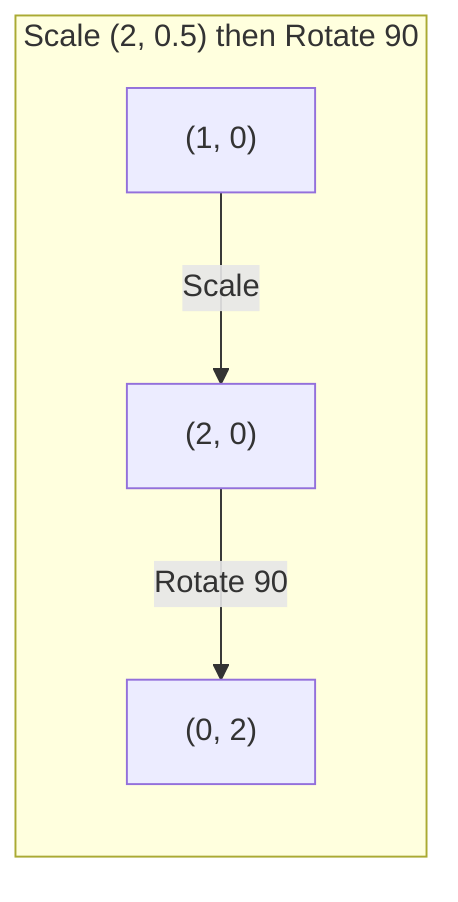

# Matrix Transformations

> A matrix is a machine that reshapes space. Learn what it does to every point, and you understand the whole transformation.

**Type:** Build
**Languages:** Python, Julia
**Prerequisites:** Phase 1, Lessons 01-02 (Linear Algebra Intuition, Vectors & Matrices Operations)
**Time:** ~75 minutes

## Learning Objectives

- Construct rotation, scaling, shearing, and reflection matrices and apply them to 2D and 3D points
- Compose multiple transformations by matrix multiplication and verify that order matters
- Compute eigenvalues and eigenvectors of 2x2 matrices from the characteristic equation
- Explain why eigenvalues determine PCA directions, RNN stability, and spectral clustering behavior

## The Problem

You read about PCA and see "find the eigenvectors of the covariance matrix." You read about model stability and see "check if all eigenvalues have magnitude less than 1." You read about data augmentation and see "apply a random rotation." None of this makes sense until you understand what matrices do to space geometrically.

Matrices are not just grids of numbers. They are spatial machines. A rotation matrix spins points. A scaling matrix stretches them. A shearing matrix tilts them. Every transformation a neural network applies to data is one of these operations or a composition of them. This lesson makes those operations concrete.

## The Concept

### Transformations as matrices

Every linear transformation in 2D can be written as a 2x2 matrix. The matrix tells you exactly where the basis vectors [1, 0] and [0, 1] end up. Everything else follows.



### Rotation

A 2D rotation by angle theta keeps distances and angles intact. It moves every point along a circular arc.



In 3D, you rotate around an axis. Each axis has its own rotation matrix:

```
Rz(theta) = | cos -sin 0 | Rotate around z-axis
 | sin cos 0 | (x-y plane spins, z stays)
 | 0 0 1 |

Rx(theta) = | 1 0 0 | Rotate around x-axis
 | 0 cos -sin | (y-z plane spins, x stays)
 | 0 sin cos |

Ry(theta) = | cos 0 sin | Rotate around y-axis
 | 0 1 0 | (x-z plane spins, y stays)
 | -sin 0 cos |
```

### Scaling

Scaling stretches or compresses along each axis independently.



### Shearing

Shearing tilts one axis while keeping the other fixed. It turns rectangles into parallelograms.



Shear matrices:
- `Shx = [[1, k], [0, 1]]` shifts x by k * y
- `Shy = [[1, 0], [k, 1]]` shifts y by k * x

### Reflection

Reflection mirrors points across an axis or line.



Reflection matrices:
- Reflect across y-axis: `[[-1, 0], [0, 1]]`
- Reflect across x-axis: `[[1, 0], [0, -1]]`

### Composition: chaining transformations

Applying transformation A then B is the same as multiplying their matrices: `result = B @ A @ point`. Order matters. Rotate then scale gives different results than scale then rotate.



Composed: `S @ R = [[0, -2], [0.5, 0]]`



Composed: `R @ S = [[0, -0.5], [2, 0]]`

Different results. Matrix multiplication is not commutative.

### Eigenvalues and eigenvectors

Most vectors change direction when a matrix hits them. Eigenvectors are special: the matrix only scales them, never rotates them. The scaling factor is the eigenvalue.

```
A @ v = lambda * v

v is the eigenvector (direction that survives)
lambda is the eigenvalue (how much it stretches)

Example: A = | 2 1 |
 | 1 2 |

Eigenvector [1, 1] with eigenvalue 3:
 A @ [1,1] = [3, 3] = 3 * [1, 1] (same direction, scaled by 3)

Eigenvector [1, -1] with eigenvalue 1:
 A @ [1,-1] = [1, -1] = 1 * [1, -1] (same direction, unchanged)
```

The matrix stretches space by 3x along [1, 1] and keeps [1, -1] unchanged. Every other direction is a mix of these two.

### Eigendecomposition

If a matrix has n linearly independent eigenvectors, it can be decomposed:

```
A = V @ D @ V^(-1)

V = matrix whose columns are eigenvectors
D = diagonal matrix of eigenvalues
V^(-1) = inverse of V

This says: rotate into eigenvector coordinates, scale along each axis, rotate back.
```

### Why eigenvalues matter

**PCA.** The eigenvectors of the covariance matrix are the principal components. The eigenvalues tell you how much variance each component captures. Sort by eigenvalue, keep the top k, and you have dimensionality reduction.

**Stability.** In recurrent networks and dynamical systems, eigenvalues with magnitude > 1 cause outputs to explode. Magnitude < 1 causes them to vanish. This is the vanishing/exploding gradient problem stated in one sentence.

**Spectral methods.** Graph neural networks use eigenvalues of the adjacency matrix. Spectral clustering uses eigenvalues of the Laplacian. The eigenvectors reveal the structure of the graph.

### Determinant as volume scaling factor

The determinant of a transformation matrix tells you how much it scales area (2D) or volume (3D).

```
det = 1: area preserved (rotation)
det = 2: area doubled
det = 0: space crushed to lower dimension (singular)
det = -1: area preserved but orientation flipped (reflection)

| det(Rotation) | = 1 (always)
| det(Scale sx, sy) | = sx * sy
| det(Shear) | = 1 (area preserved)
| det(Reflection) | = -1 (orientation flipped)
```

## Build It

### Step 1: Transformation matrices from scratch (Python)

```python
import math

def rotation_2d(theta):
 c, s = math.cos(theta), math.sin(theta)
 return [[c, -s], [s, c]]

def scaling_2d(sx, sy):
 return [[sx, 0], [0, sy]]

def shearing_2d(kx, ky):
 return [[1, kx], [ky, 1]]

def reflection_x():
 return [[1, 0], [0, -1]]

def reflection_y():
 return [[-1, 0], [0, 1]]

def mat_vec_mul(matrix, vector):
 return [
 sum(matrix[i][j] * vector[j] for j in range(len(vector)))
 for i in range(len(matrix))
 ]

def mat_mul(a, b):
 rows_a, cols_b = len(a), len(b[0])
 cols_a = len(a[0])
 return [
 [sum(a[i][k] * b[k][j] for k in range(cols_a)) for j in range(cols_b)]
 for i in range(rows_a)
 ]

point = [1.0, 0.0]
angle = math.pi / 4

rotated = mat_vec_mul(rotation_2d(angle), point)
print(f"Rotate (1,0) by 45 deg: ({rotated[0]:.4f}, {rotated[1]:.4f})")

scaled = mat_vec_mul(scaling_2d(2, 3), [1.0, 1.0])
print(f"Scale (1,1) by (2,3): ({scaled[0]:.1f}, {scaled[1]:.1f})")

sheared = mat_vec_mul(shearing_2d(1, 0), [1.0, 1.0])
print(f"Shear (1,1) kx=1: ({sheared[0]:.1f}, {sheared[1]:.1f})")

reflected = mat_vec_mul(reflection_y(), [2.0, 1.0])
print(f"Reflect (2,1) across y: ({reflected[0]:.1f}, {reflected[1]:.1f})")
```

### Step 2: Composition of transformations

```python
R = rotation_2d(math.pi / 2)
S = scaling_2d(2, 0.5)

rotate_then_scale = mat_mul(S, R)
scale_then_rotate = mat_mul(R, S)

point = [1.0, 0.0]
result1 = mat_vec_mul(rotate_then_scale, point)
result2 = mat_vec_mul(scale_then_rotate, point)

print(f"Rotate 90 then scale: ({result1[0]:.2f}, {result1[1]:.2f})")
print(f"Scale then rotate 90: ({result2[0]:.2f}, {result2[1]:.2f})")
print(f"Same? {result1 == result2}")
```

### Step 3: Eigenvalues from scratch (2x2)

For a 2x2 matrix `[[a, b], [c, d]]`, eigenvalues solve the characteristic equation: `lambda^2 - (a+d)*lambda + (ad - bc) = 0`.

```python
def eigenvalues_2x2(matrix):
 a, b = matrix[0]
 c, d = matrix[1]
 trace = a + d
 det = a * d - b * c
 discriminant = trace ** 2 - 4 * det
 if discriminant < 0:
 real = trace / 2
 imag = (-discriminant) ** 0.5 / 2
 return (complex(real, imag), complex(real, -imag))
 sqrt_disc = discriminant ** 0.5
 return ((trace + sqrt_disc) / 2, (trace - sqrt_disc) / 2)

def eigenvector_2x2(matrix, eigenvalue):
 a, b = matrix[0]
 c, d = matrix[1]
 if abs(b) > 1e-10:
 v = [b, eigenvalue - a]
 elif abs(c) > 1e-10:
 v = [eigenvalue - d, c]
 else:
 if abs(a - eigenvalue) < 1e-10:
 v = [1, 0]
 else:
 v = [0, 1]
 mag = (v[0] ** 2 + v[1] ** 2) ** 0.5
 return [v[0] / mag, v[1] / mag]

A = [[2, 1], [1, 2]]
vals = eigenvalues_2x2(A)
print(f"Matrix: {A}")
print(f"Eigenvalues: {vals[0]:.4f}, {vals[1]:.4f}")

for val in vals:
 vec = eigenvector_2x2(A, val)
 result = mat_vec_mul(A, vec)
 scaled = [val * vec[0], val * vec[1]]
 print(f" lambda={val:.1f}, v={[round(x,4) for x in vec]}")
 print(f" A@v = {[round(x,4) for x in result]}")
 print(f" l*v = {[round(x,4) for x in scaled]}")
```

### Step 4: Determinant as volume scaling factor

```python
def det_2x2(matrix):
 return matrix[0][0] * matrix[1][1] - matrix[0][1] * matrix[1][0]

print(f"det(rotation 45) = {det_2x2(rotation_2d(math.pi/4)):.4f}")
print(f"det(scale 2,3) = {det_2x2(scaling_2d(2, 3)):.1f}")
print(f"det(shear kx=1) = {det_2x2(shearing_2d(1, 0)):.1f}")
print(f"det(reflect y) = {det_2x2(reflection_y()):.1f}")

singular = [[1, 2], [2, 4]]
print(f"det(singular) = {det_2x2(singular):.1f}")
print("Singular: columns are proportional, space collapses to a line.")
```

## Use It

NumPy handles all of this with optimized routines.

```python
import numpy as np

theta = np.pi / 4
R = np.array([[np.cos(theta), -np.sin(theta)],
 [np.sin(theta), np.cos(theta)]])

point = np.array([1.0, 0.0])
print(f"Rotate (1,0) by 45 deg: {R @ point}")

S = np.diag([2.0, 3.0])
composed = S @ R
print(f"Scale(2,3) after Rotate(45): {composed @ point}")

A = np.array([[2, 1], [1, 2]], dtype=float)
eigenvalues, eigenvectors = np.linalg.eig(A)
print(f"\nEigenvalues: {eigenvalues}")
print(f"Eigenvectors (columns):\n{eigenvectors}")

for i in range(len(eigenvalues)):
 v = eigenvectors[:, i]
 lam = eigenvalues[i]
 print(f" A @ v{i} = {A @ v}, lambda * v{i} = {lam * v}")

print(f"\ndet(R) = {np.linalg.det(R):.4f}")
print(f"det(S) = {np.linalg.det(S):.1f}")

B = np.array([[3, 1], [0, 2]], dtype=float)
vals, vecs = np.linalg.eig(B)
D = np.diag(vals)
V = vecs
reconstructed = V @ D @ np.linalg.inv(V)
print(f"\nEigendecomposition A = V @ D @ V^-1:")
print(f"Original:\n{B}")
print(f"Reconstructed:\n{reconstructed}")
```

### 3D rotations with NumPy

```python
def rotation_3d_z(theta):
 c, s = np.cos(theta), np.sin(theta)
 return np.array([[c, -s, 0], [s, c, 0], [0, 0, 1]])

def rotation_3d_x(theta):
 c, s = np.cos(theta), np.sin(theta)
 return np.array([[1, 0, 0], [0, c, -s], [0, s, c]])

point_3d = np.array([1.0, 0.0, 0.0])
rotated_z = rotation_3d_z(np.pi / 2) @ point_3d
rotated_x = rotation_3d_x(np.pi / 2) @ point_3d

print(f"\n3D point: {point_3d}")
print(f"Rotate 90 around z: {np.round(rotated_z, 4)}")
print(f"Rotate 90 around x: {np.round(rotated_x, 4)}")
```

## Ship It

This lesson builds the geometric foundation for PCA (Phase 2) and neural network weight analysis. The eigenvalue/eigenvector code built here is the same algorithm that powers dimensionality reduction, spectral clustering, and stability analysis in production ML systems.

## Exercises

1. Apply rotation, scaling, and shearing to a unit square (corners at [0,0], [1,0], [1,1], [0,1]). Print the transformed corners for each. Verify that rotation preserves distances between corners.

2. Find the eigenvalues of the matrix [[4, 2], [1, 3]] by hand using the characteristic equation. Then verify with your from-scratch function and with NumPy.

3. Create a composition of three transformations (rotate 30 degrees, scale by [1.5, 0.8], shear with kx=0.3) and apply it to 8 points arranged in a circle. Print before and after coordinates. Compute the determinant of the composed matrix and verify it equals the product of the individual determinants.

## Key Terms

| Term | What people say | What it actually means |
|------|----------------|----------------------|
| Rotation matrix | "Spins things" | An orthogonal matrix that moves points along circular arcs while preserving distances and angles. Determinant is always 1. |
| Scaling matrix | "Makes things bigger" | A diagonal matrix that stretches or compresses independently along each axis. Determinant is the product of scale factors. |
| Shearing matrix | "Slants things" | A matrix that shifts one coordinate proportionally to another, turning rectangles into parallelograms. Determinant is 1. |
| Reflection | "Mirrors things" | A matrix that flips space across an axis or plane. Determinant is -1. |
| Composition | "Do two things" | Multiplying transformation matrices to chain operations. Order matters: B @ A means apply A first, then B. |
| Eigenvector | "Special direction" | A direction that the matrix only scales, never rotates. The transformation's fingerprint. |
| Eigenvalue | "How much it stretches" | The scalar factor by which the matrix scales its eigenvector. Can be negative (flip) or complex (rotation). |
| Eigendecomposition | "Break the matrix apart" | Writing a matrix as V @ D @ V^(-1), separating it into its fundamental scaling directions and magnitudes. |
| Determinant | "A single number from a matrix" | The factor by which the transformation scales area (2D) or volume (3D). Zero means the transformation is irreversible. |
| Characteristic equation | "Where eigenvalues come from" | det(A - lambda * I) = 0. The polynomial whose roots are the eigenvalues. |

## Further Reading

- [3Blue1Brown: Linear Transformations](https://www.3blue1brown.com/lessons/linear-transformations) -- visual intuition for how matrices reshape space
- [3Blue1Brown: Eigenvectors and Eigenvalues](https://www.3blue1brown.com/lessons/eigenvalues) -- the best visual explanation of what eigenvectors mean geometrically
- [MIT 18.06 Lecture 21: Eigenvalues and Eigenvectors](https://ocw.mit.edu/courses/18-06-linear-algebra-spring-2010/) -- Gilbert Strang's classic treatment
