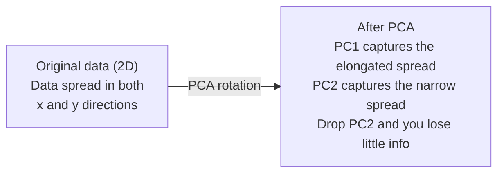

# Dimensionality Reduction

> High-dimensional data has structure. You find it by looking from the right angle.

**Type:** Build
**Language:** Python
**Prerequisites:** Phase 1, Lessons 01 (Linear Algebra Intuition), 02 (Vectors, Matrices & Operations), 03 (Eigenvalues & Eigenvectors), 06 (Probability & Distributions)
**Time:** ~90 minutes

## Learning Objectives

- Implement PCA from scratch: center data, compute the covariance matrix, eigendecompose, and project
- Use explained variance ratio and the elbow method to choose the number of principal components
- Compare PCA, t-SNE, and UMAP for visualizing MNIST digits in 2D and explain their tradeoffs
- Apply kernel PCA with an RBF kernel to separate nonlinear data structures that standard PCA cannot handle

## The Problem

You have a dataset with 784 features per sample. Maybe it is pixel values of handwritten digits. Maybe it is gene expression levels. Maybe it is user behavior signals. You cannot visualize 784 dimensions. You cannot plot them. You cannot even think about them.

But most of those 784 features are redundant. The actual information lives on a much smaller surface. A handwritten "7" does not need 784 independent numbers to describe it. It needs a few: the angle of the stroke, the length of the crossbar, how much it leans. The rest is noise.

Dimensionality reduction finds that smaller surface. It takes your 784-dimensional data and compresses it to 2, 10, or 50 dimensions while keeping the structure that matters.

## The Concept

### The curse of dimensionality

High-dimensional spaces are unintuitive. Three things break as dimensions grow.

**Distance becomes meaningless.** In high dimensions, the distance between any two random points converges to the same value. If every point is roughly the same distance from every other point, nearest-neighbor search stops working.

```
Dimension Avg distance ratio (max/min between random points)
2 ~5.0
10 ~1.8
100 ~1.2
1000 ~1.02
```

**Volume concentrates in corners.** A unit hypercube in d dimensions has 2^d corners. In 100 dimensions, nearly all the volume is in the corners, far from the center. Data points spread to the edges and your models starve for data in the interior.

**You need exponentially more data.** To maintain the same density of samples in a space, going from 2D to 20D means you need 10^18 times more data. You never have enough. Reducing dimensions brings the data density back to something workable.

### PCA: find the directions that matter

Principal Component Analysis (PCA) finds the axes along which your data varies the most. It rotates your coordinate system so the first axis captures the most variance, the second captures the next most, and so on.

The algorithm:

```
1. Center the data (subtract the mean from each feature)
2. Compute covariance (how features move together)
3. Eigendecomposition (find the principal directions)
4. Sort by eigenvalue (biggest variance first)
5. Project (keep top k eigenvectors, drop the rest)
```

Why eigendecomposition? The covariance matrix is symmetric and positive semi-definite. Its eigenvectors are orthogonal directions in feature space. The eigenvalues tell you how much variance each direction captures. The eigenvector with the largest eigenvalue points along the direction of maximum variance.



- **Before PCA:** Data cloud is spread diagonally across both x and y axes
- **After PCA:** Coordinate system is rotated so PC1 aligns with the direction of maximum variance (elongated spread) and PC2 aligns with the direction of minimum variance (narrow spread)
- **Dimensionality reduction:** Dropping PC2 projects the data onto PC1, losing very little information

### Explained variance ratio

Each principal component captures a fraction of the total variance. The explained variance ratio tells you how much.

```
Component Eigenvalue Explained ratio Cumulative
PC1 4.73 0.473 0.473
PC2 2.51 0.251 0.724
PC3 1.12 0.112 0.836
PC4 0.89 0.089 0.925...
```

When the cumulative explained variance reaches 0.95, you know that many components capture 95% of the information. Everything after that is mostly noise.

### Choosing the number of components

Three strategies:

1. **Threshold.** Keep enough components to explain 90-95% of the variance.
2. **Elbow method.** Plot explained variance per component. Look for a sharp drop-off.
3. **Downstream performance.** Use PCA as preprocessing. Sweep k and measure your model's accuracy. The best k is wherever accuracy plateaus.

### t-SNE: preserve neighborhoods

t-Distributed Stochastic Neighbor Embedding (t-SNE) is designed for visualization. It maps high-dimensional data to 2D (or 3D) while preserving which points are near each other.

The intuition: in the original space, compute a probability distribution over pairs of points based on their distances. Near points get high probability. Far points get low probability. Then find a 2D arrangement where the same probability distribution holds. Points that were neighbors in 784 dimensions stay neighbors in 2D.

Key properties of t-SNE:
- Non-linear. It can unfold complex manifolds that PCA cannot.
- Stochastic. Different runs produce different layouts.
- Perplexity parameter controls how many neighbors to consider (typical range: 5-50).
- Distances between clusters in the output are not meaningful. Only the clusters themselves are.
- Slow on large datasets. O(n^2) by default.

### UMAP: faster, better global structure

Uniform Manifold Approximation and Projection (UMAP) works similarly to t-SNE but with two advantages:
- Faster. It uses approximate nearest-neighbor graphs instead of computing all pairwise distances.
- Better global structure. The relative positions of clusters in the output tend to be more meaningful than in t-SNE.

UMAP builds a weighted graph in high-dimensional space (the "fuzzy topological representation") and then finds a low-dimensional layout that preserves this graph as well as possible.

Key parameters:
- `n_neighbors`: how many neighbors define local structure (similar to perplexity). Higher values preserve more global structure.
- `min_dist`: how tightly points pack together in the output. Lower values create denser clusters.

### When to use which

| Method | Use case | Preserves | Speed |
|--------|----------|-----------|-------|
| PCA | Preprocessing before training | Global variance | Fast (exact), works on millions of samples |
| PCA | Quick exploratory visualization | Linear structure | Fast |
| t-SNE | Publication-quality 2D plots | Local neighborhoods | Slow (< 10k samples ideal) |
| UMAP | 2D visualization at scale | Local + some global structure | Medium (handles millions) |
| PCA | Feature reduction for models | Variance-ranked features | Fast |
| t-SNE / UMAP | Understanding cluster structure | Cluster separation | Medium to slow |

Rule of thumb: use PCA for preprocessing and data compression. Use t-SNE or UMAP when you need to visualize structure in 2D.

### Kernel PCA

Standard PCA finds linear subspaces. It rotates your coordinate system and drops axes. But what if the data lies on a nonlinear manifold? A circle in 2D cannot be separated by any line. Standard PCA will not help.

Kernel PCA applies PCA in a high-dimensional feature space induced by a kernel function, without explicitly computing the coordinates in that space. This is the kernel trick -- the same idea behind SVMs.

The algorithm:
1. Compute the kernel matrix K where K_ij = k(x_i, x_j)
2. Center the kernel matrix in feature space
3. Eigendecompose the centered kernel matrix
4. The top eigenvectors (scaled by 1/sqrt(eigenvalue)) are the projections

Common kernel functions:

| Kernel | Formula | Good for |
|--------|---------|----------|
| RBF (Gaussian) | exp(-gamma * \|\|x - y\|\|^2) | Most nonlinear data, smooth manifolds |
| Polynomial | (x. y + c)^d | Polynomial relationships |
| Sigmoid | tanh(alpha * x. y + c) | Neural network-like mappings |

When to use kernel PCA vs standard PCA:

| Criterion | Standard PCA | Kernel PCA |
|-----------|-------------|------------|
| Data structure | Linear subspace | Nonlinear manifold |
| Speed | O(min(n^2 d, d^2 n)) | O(n^2 d + n^3) |
| Interpretability | Components are linear combinations of features | Components lack direct feature interpretation |
| Scalability | Works on millions of samples | Kernel matrix is n x n, memory-limited |
| Reconstruction | Direct inverse transform | Requires pre-image approximation |

The classic example: concentric circles in 2D. Two rings of points, one inside the other. Standard PCA projects both onto the same line -- useless for classification. Kernel PCA with an RBF kernel maps the inner circle and outer circle to different regions, making them linearly separable.

### Reconstruction Error

How good is your dimensionality reduction? You compressed 784 dimensions to 50. What did you lose?

Measure reconstruction error:
1. Project data to k dimensions: X_reduced = X @ W_k
2. Reconstruct: X_hat = X_reduced @ W_k^T
3. Compute MSE: mean((X - X_hat)^2)

For PCA, reconstruction error has a clean relationship to explained variance:

```
Reconstruction error = sum of eigenvalues NOT included
Total variance = sum of ALL eigenvalues
Fraction lost = (sum of dropped eigenvalues) / (sum of all eigenvalues)
```

The explained variance ratio for each component is:

```
explained_ratio_k = eigenvalue_k / sum(all eigenvalues)
```

Plotting cumulative explained variance against number of components gives you the "elbow" curve. The right number of components is where:
- The curve flattens out (diminishing returns)
- Cumulative variance crosses your threshold (usually 0.90 or 0.95)
- Downstream task performance plateaus

Reconstruction error is useful beyond choosing k. You can use it for anomaly detection: samples with high reconstruction error are outliers that do not fit the learned subspace. This is the basis of PCA-based anomaly detection in production systems.

## Build It

### Step 1: PCA from scratch

```python
import numpy as np

class PCA:
 def __init__(self, n_components):
 self.n_components = n_components
 self.components = None
 self.mean = None
 self.eigenvalues = None
 self.explained_variance_ratio_ = None

 def fit(self, X):
 self.mean = np.mean(X, axis=0)
 X_centered = X - self.mean

 cov_matrix = np.cov(X_centered, rowvar=False)

 eigenvalues, eigenvectors = np.linalg.eigh(cov_matrix)

 sorted_idx = np.argsort(eigenvalues)[::-1]
 eigenvalues = eigenvalues[sorted_idx]
 eigenvectors = eigenvectors[:, sorted_idx]

 self.components = eigenvectors[:, :self.n_components].T
 self.eigenvalues = eigenvalues[:self.n_components]
 total_var = np.sum(eigenvalues)
 self.explained_variance_ratio_ = self.eigenvalues / total_var

 return self

 def transform(self, X):
 X_centered = X - self.mean
 return X_centered @ self.components.T

 def fit_transform(self, X):
 self.fit(X)
 return self.transform(X)
```

### Step 2: Test on synthetic data

```python
np.random.seed(42)
n_samples = 500

t = np.random.uniform(0, 2 * np.pi, n_samples)
x1 = 3 * np.cos(t) + np.random.normal(0, 0.2, n_samples)
x2 = 3 * np.sin(t) + np.random.normal(0, 0.2, n_samples)
x3 = 0.5 * x1 + 0.3 * x2 + np.random.normal(0, 0.1, n_samples)

X_synthetic = np.column_stack([x1, x2, x3])

pca = PCA(n_components=2)
X_reduced = pca.fit_transform(X_synthetic)

print(f"Original shape: {X_synthetic.shape}")
print(f"Reduced shape: {X_reduced.shape}")
print(f"Explained variance ratios: {pca.explained_variance_ratio_}")
print(f"Total variance captured: {sum(pca.explained_variance_ratio_):.4f}")
```

### Step 3: MNIST digits in 2D

```python
from sklearn.datasets import fetch_openml

mnist = fetch_openml("mnist_784", version=1, as_frame=False, parser="auto")
X_mnist = mnist.data[:5000].astype(float)
y_mnist = mnist.target[:5000].astype(int)

pca_mnist = PCA(n_components=50)
X_pca50 = pca_mnist.fit_transform(X_mnist)
print(f"50 components capture {sum(pca_mnist.explained_variance_ratio_):.2%} of variance")

pca_2d = PCA(n_components=2)
X_pca2d = pca_2d.fit_transform(X_mnist)
print(f"2 components capture {sum(pca_2d.explained_variance_ratio_):.2%} of variance")
```

### Step 4: Compare with sklearn

```python
from sklearn.decomposition import PCA as SklearnPCA
from sklearn.manifold import TSNE

sklearn_pca = SklearnPCA(n_components=2)
X_sklearn_pca = sklearn_pca.fit_transform(X_mnist)

print(f"\nOur PCA explained variance: {pca_2d.explained_variance_ratio_}")
print(f"Sklearn PCA explained variance: {sklearn_pca.explained_variance_ratio_}")

diff = np.abs(np.abs(X_pca2d) - np.abs(X_sklearn_pca))
print(f"Max absolute difference: {diff.max():.10f}")

tsne = TSNE(n_components=2, perplexity=30, random_state=42)
X_tsne = tsne.fit_transform(X_mnist)
print(f"\nt-SNE output shape: {X_tsne.shape}")
```

### Step 5: UMAP comparison

```python
try:
 from umap import UMAP

 reducer = UMAP(n_components=2, n_neighbors=15, min_dist=0.1, random_state=42)
 X_umap = reducer.fit_transform(X_mnist)
 print(f"UMAP output shape: {X_umap.shape}")
except ImportError:
 print("Install umap-learn: pip install umap-learn")
```

## Use It

PCA as preprocessing before a classifier:

```python
from sklearn.decomposition import PCA as SklearnPCA
from sklearn.linear_model import LogisticRegression
from sklearn.model_selection import train_test_split
from sklearn.metrics import accuracy_score

X_train, X_test, y_train, y_test = train_test_split(
 X_mnist, y_mnist, test_size=0.2, random_state=42
)

results = {}
for k in [10, 30, 50, 100, 200]:
 pca_k = SklearnPCA(n_components=k)
 X_tr = pca_k.fit_transform(X_train)
 X_te = pca_k.transform(X_test)

 clf = LogisticRegression(max_iter=1000, random_state=42)
 clf.fit(X_tr, y_train)
 acc = accuracy_score(y_test, clf.predict(X_te))
 var_captured = sum(pca_k.explained_variance_ratio_)
 results[k] = (acc, var_captured)
 print(f"k={k:>3d} accuracy={acc:.4f} variance={var_captured:.4f}")
```

Performance plateaus well before 784 dimensions. That plateau is your operating point.

## Ship It

This lesson produces:
- `outputs/skill-dimensionality-reduction.md` - a skill for choosing the right dimensionality reduction technique for a given task

## Exercises

1. Modify the PCA class to support `inverse_transform`. Reconstruct MNIST digits from 10, 50, and 200 components. Print the reconstruction error (mean squared difference from the original) for each.

2. Run t-SNE on the same MNIST subset with perplexity values of 5, 30, and 100. Describe how the output changes. Why does perplexity affect cluster tightness?

3. Take a dataset with 50 features where only 5 are informative (generate one with `sklearn.datasets.make_classification`). Apply PCA and check whether the explained variance curve correctly identifies that the data is effectively 5-dimensional.

## Key Terms

| Term | What people say | What it actually means |
|------|----------------|----------------------|
| Curse of dimensionality | "Too many features" | Distances, volumes, and data density all behave counterintuitively as dimensions grow. Models need exponentially more data to compensate. |
| PCA | "Reduce dimensions" | Rotate your coordinate system so the axes align with the directions of maximum variance, then drop the low-variance axes. |
| Principal component | "An important direction" | An eigenvector of the covariance matrix. The direction in feature space along which the data varies most. |
| Explained variance ratio | "How much info this component has" | The fraction of total variance captured by one principal component. Sum the top k ratios to see how much k components preserve. |
| Covariance matrix | "How features correlate" | A symmetric matrix where entry (i,j) measures how feature i and feature j move together. Diagonal entries are individual variances. |
| t-SNE | "That cluster plot" | A nonlinear method that maps high-dimensional data to 2D by preserving pairwise neighborhood probabilities. Good for visualization, not for preprocessing. |
| UMAP | "Faster t-SNE" | A nonlinear method based on topological data analysis. Preserves both local and some global structure. Scales better than t-SNE. |
| Perplexity | "A t-SNE knob" | Controls the effective number of neighbors each point considers. Low perplexity focuses on very local structure. High perplexity captures broader patterns. |
| Manifold | "The surface the data lives on" | A lower-dimensional surface embedded in a higher-dimensional space. A sheet of paper crumpled in 3D is a 2D manifold. |

## Further Reading

- [A Tutorial on Principal Component Analysis](https://arxiv.org/abs/1404.1100) (Shlens) - clear derivation of PCA from the ground up
- [How to Use t-SNE Effectively](https://distill.pub/2016/misread-tsne/) (Wattenberg et al.) - interactive guide to t-SNE pitfalls and parameter choices
- [UMAP documentation](https://umap-learn.readthedocs.io/) - theory and practical guidance from the UMAP authors
