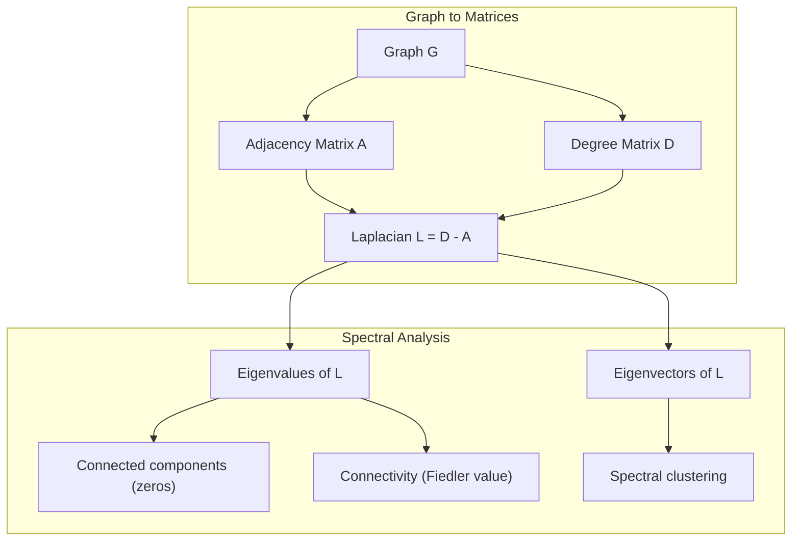
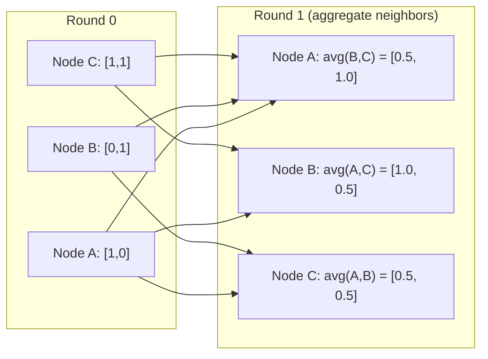

# Graph Theory for Machine Learning

> Graphs are the data structure of relationships. If your data has connections, you need graph theory.

**Type:** Build
**Language:** Python
**Prerequisites:** Phase 1, Lessons 01-03 (linear algebra, matrices)
**Time:** ~90 minutes

## Learning Objectives

- Build a graph class with adjacency matrix/list representations and implement BFS and DFS traversals
- Compute the graph Laplacian and use its eigenvalues to detect connected components and cluster nodes
- Implement one round of GNN-style message passing as a normalized adjacency matrix multiplication
- Apply spectral clustering to partition a graph using the Fiedler vector

## The Problem

Social networks, molecules, knowledge bases, citation networks, road maps -- all are graphs. Traditional ML treats data as flat tables. Each row is independent. Each feature is a column. But when the structure of connections matters, tables fail.

Consider a social network. You want to predict what product a user will buy. Their purchase history matters. But their friends' purchase history matters more. The connections carry signal.

Or consider a molecule. You want to predict if it binds to a protein. The atoms matter, but what really matters is how atoms are bonded to each other. The structure is the data.

Graph Neural Networks (GNNs) are the fastest-growing area in deep learning. They power drug discovery, social recommendation, fraud detection, and knowledge graph reasoning. Every GNN builds on the same foundation: basic graph theory.

You need four things:
1. A way to represent graphs as matrices (so you can multiply them)
2. Traversal algorithms to explore graph structure
3. The Laplacian -- the single most important matrix in spectral graph theory
4. Message passing -- the operation that makes GNNs work

## The Concept

### Graphs: Nodes and Edges

A graph G = (V, E) consists of vertices (nodes) V and edges E. Each edge connects two nodes.

**Directed vs undirected.** In an undirected graph, edge (u, v) means u connects to v AND v connects to u. In a directed graph (digraph), edge (u, v) means u points to v, but not necessarily the reverse.

**Weighted vs unweighted.** In an unweighted graph, edges either exist or they don't. In a weighted graph, each edge has a numerical weight -- a distance, a cost, a strength.

| Graph type | Example |
|-----------|---------|
| Undirected, unweighted | Facebook friendship network |
| Directed, unweighted | Twitter follow network |
| Undirected, weighted | Road map (distances) |
| Directed, weighted | Web page links (PageRank scores) |

### The Adjacency Matrix

The adjacency matrix A is the core representation. For a graph with n nodes:

```
A[i][j] = 1 if there is an edge from node i to node j
A[i][j] = 0 otherwise
```

For undirected graphs, A is symmetric: A[i][j] = A[j][i]. For weighted graphs, A[i][j] = weight of edge (i, j).

**Example -- a triangle:**

```
Nodes: 0, 1, 2
Edges: (0,1), (1,2), (0,2)

A = [[0, 1, 1],
 [1, 0, 1],
 [1, 1, 0]]
```

The adjacency matrix is the input to every GNN. Matrix operations on A correspond to operations on the graph.

### Degree

The degree of a node is the number of edges connected to it. For directed graphs, you have in-degree (edges coming in) and out-degree (edges going out).

The degree matrix D is diagonal:

```
D[i][i] = degree of node i
D[i][j] = 0 for i != j
```

For the triangle example: D = diag(2, 2, 2) because every node connects to two others.

Degree tells you about node importance. High degree = hub node. The degree distribution of a network reveals its structure. Social networks follow power laws (few hubs, many leaf nodes). Random graphs have Poisson-distributed degrees.

### BFS and DFS

The two fundamental graph traversal algorithms. You need both.

**Breadth-First Search (BFS):** Explore all neighbors first, then neighbors' neighbors. Uses a queue (FIFO).

```
BFS from node 0:
 Visit 0
 Queue: [1, 2] (neighbors of 0)
 Visit 1
 Queue: [2, 3] (add neighbors of 1)
 Visit 2
 Queue: [3] (neighbors of 2 already visited)
 Visit 3
 Queue: [] (done)
```

BFS finds shortest paths in unweighted graphs. The distance from the start to any node equals the BFS level at which that node is first discovered. This is why BFS is used for hop-count distances in social networks.

**Depth-First Search (DFS):** Go as deep as possible before backtracking. Uses a stack (LIFO) or recursion.

```
DFS from node 0:
 Visit 0
 Stack: [1, 2] (neighbors of 0)
 Visit 2 (pop from stack)
 Stack: [1, 3] (add neighbors of 2)
 Visit 3 (pop from stack)
 Stack: [1]
 Visit 1 (pop from stack)
 Stack: [] (done)
```

DFS is useful for:
- Finding connected components (run DFS from unvisited nodes)
- Cycle detection (back edges in DFS tree)
- Topological sorting (reverse DFS finish order)

| Algorithm | Data structure | Finds | Use case |
|-----------|---------------|-------|----------|
| BFS | Queue | Shortest paths | Social network distance, knowledge graph traversal |
| DFS | Stack | Components, cycles | Connectivity, topological sort |

### The Graph Laplacian

L = D - A. The most important matrix in spectral graph theory.

For the triangle:

```
D = [[2, 0, 0], A = [[0, 1, 1], L = [[2, -1, -1],
 [0, 2, 0], [1, 0, 1], [-1, 2, -1],
 [0, 0, 2]] [1, 1, 0]] [-1, -1, 2]]
```

The Laplacian has remarkable properties:

1. **L is positive semi-definite.** All eigenvalues are >= 0.

2. **The number of zero eigenvalues equals the number of connected components.** A connected graph has exactly one zero eigenvalue. A graph with 3 disconnected components has three zero eigenvalues.

3. **The smallest non-zero eigenvalue (Fiedler value) measures connectivity.** A large Fiedler value means the graph is well-connected. A small Fiedler value means the graph has a weak point -- a bottleneck.

4. **The eigenvector of the Fiedler value (Fiedler vector) reveals the best split.** Nodes with positive values go in one group, nodes with negative values go in the other. This is spectral clustering.



### Spectral Properties

The eigenvalues of the adjacency matrix and Laplacian reveal structural properties without any traversal.

**Spectral clustering** works like this:
1. Compute the Laplacian L
2. Find the k smallest eigenvectors of L (skip the first, which is all-ones for connected graphs)
3. Use those eigenvectors as new coordinates for each node
4. Run k-means on those coordinates

Why does this work? The eigenvectors of L encode the "smoothest" functions on the graph. Nodes that are well-connected get similar eigenvector values. Nodes separated by a bottleneck get different values. The eigenvectors naturally separate clusters.

**Random walk connection.** The normalized Laplacian relates to random walks on the graph. The stationary distribution of a random walk is proportional to node degree. The mixing time (how fast the walk converges) depends on the spectral gap.

### Message Passing

The core operation of Graph Neural Networks. Each node collects messages from its neighbors, aggregates them, and updates its own state.

```
h_v^(k+1) = UPDATE(h_v^(k), AGGREGATE({h_u^(k) : u in neighbors(v)}))
```

In the simplest form, AGGREGATE = mean, and UPDATE = linear transform + activation:

```
h_v^(k+1) = sigma(W * mean({h_u^(k) : u in neighbors(v)}))
```

This is matrix multiplication in disguise. If H is the matrix of all node features and A is the adjacency matrix:

```
H^(k+1) = sigma(A_norm * H^(k) * W)
```

where A_norm is the normalized adjacency matrix (each row sums to 1).

One round of message passing lets each node "see" its immediate neighbors. Two rounds let it see neighbors of neighbors. K rounds give each node information from its K-hop neighborhood.



### Concepts and ML Applications

| Concept | ML Application |
|---------|---------------|
| Adjacency matrix | GNN input representation |
| Graph Laplacian | Spectral clustering, community detection |
| BFS/DFS | Knowledge graph traversal, path finding |
| Degree distribution | Node importance, feature engineering |
| Message passing | GNN layers (GCN, GAT, GraphSAGE) |
| Eigenvalues of L | Community detection, graph partitioning |
| Spectral clustering | Unsupervised node grouping |
| PageRank | Node importance, web search |

## Build It

### Step 1: Graph class from scratch

```python
class Graph:
 def __init__(self, n_nodes, directed=False):
 self.n = n_nodes
 self.directed = directed
 self.adj = {i: {} for i in range(n_nodes)}

 def add_edge(self, u, v, weight=1.0):
 self.adj[u][v] = weight
 if not self.directed:
 self.adj[v][u] = weight

 def neighbors(self, node):
 return list(self.adj[node].keys())

 def degree(self, node):
 return len(self.adj[node])

 def adjacency_matrix(self):
 import numpy as np
 A = np.zeros((self.n, self.n))
 for u in range(self.n):
 for v, w in self.adj[u].items():
 A[u][v] = w
 return A

 def degree_matrix(self):
 import numpy as np
 D = np.zeros((self.n, self.n))
 for i in range(self.n):
 D[i][i] = self.degree(i)
 return D

 def laplacian(self):
 return self.degree_matrix() - self.adjacency_matrix()
```

The adjacency list (`self.adj`) stores neighbors efficiently. The adjacency matrix conversion uses numpy because all the spectral operations need it.

### Step 2: BFS and DFS

```python
from collections import deque

def bfs(graph, start):
 visited = set()
 order = []
 distances = {}
 queue = deque([(start, 0)])
 visited.add(start)
 while queue:
 node, dist = queue.popleft()
 order.append(node)
 distances[node] = dist
 for neighbor in graph.neighbors(node):
 if neighbor not in visited:
 visited.add(neighbor)
 queue.append((neighbor, dist + 1))
 return order, distances


def dfs(graph, start):
 visited = set()
 order = []
 stack = [start]
 while stack:
 node = stack.pop()
 if node in visited:
 continue
 visited.add(node)
 order.append(node)
 for neighbor in reversed(graph.neighbors(node)):
 if neighbor not in visited:
 stack.append(neighbor)
 return order
```

BFS uses a deque (double-ended queue) for O(1) popleft. DFS uses a list as a stack. Both visit every node exactly once -- O(V + E) time.

### Step 3: Connected components and Laplacian eigenvalues

```python
def connected_components(graph):
 visited = set()
 components = []
 for node in range(graph.n):
 if node not in visited:
 order, _ = bfs(graph, node)
 visited.update(order)
 components.append(order)
 return components


def laplacian_eigenvalues(graph):
 import numpy as np
 L = graph.laplacian()
 eigenvalues = np.linalg.eigvalsh(L)
 return eigenvalues
```

`eigvalsh` is for symmetric matrices -- the Laplacian is always symmetric for undirected graphs. It returns eigenvalues in ascending order. Count the zeros to find the number of connected components.

### Step 4: Spectral clustering

```python
def spectral_clustering(graph, k=2):
 import numpy as np
 L = graph.laplacian()
 eigenvalues, eigenvectors = np.linalg.eigh(L)
 features = eigenvectors[:, 1:k+1]

 labels = np.zeros(graph.n, dtype=int)
 for i in range(graph.n):
 if features[i, 0] >= 0:
 labels[i] = 0
 else:
 labels[i] = 1
 return labels
```

For k=2, the sign of the Fiedler vector splits the graph into two clusters. For k>2, you would run k-means on the first k eigenvectors (excluding the trivial all-ones eigenvector).

### Step 5: Message passing

```python
def message_passing(graph, features, weight_matrix):
 import numpy as np
 A = graph.adjacency_matrix()
 row_sums = A.sum(axis=1, keepdims=True)
 row_sums[row_sums == 0] = 1
 A_norm = A / row_sums
 aggregated = A_norm @ features
 output = aggregated @ weight_matrix
 return output
```

This is one round of GNN message passing. Each node's new features are the weighted average of its neighbors' features, transformed by the weight matrix. Stack multiple rounds to propagate information further.

## Use It

With networkx and numpy, the same operations are one-liners:

```python
import networkx as nx
import numpy as np

G = nx.karate_club_graph()

A = nx.adjacency_matrix(G).toarray()
L = nx.laplacian_matrix(G).toarray()

eigenvalues = np.linalg.eigvalsh(L.astype(float))
print(f"Smallest eigenvalues: {eigenvalues[:5]}")
print(f"Connected components: {nx.number_connected_components(G)}")

communities = nx.community.greedy_modularity_communities(G)
print(f"Communities found: {len(communities)}")

pr = nx.pagerank(G)
top_nodes = sorted(pr.items(), key=lambda x: x[1], reverse=True)[:5]
print(f"Top 5 PageRank nodes: {top_nodes}")
```

networkx handles graphs of any size with optimized C backends. Use it in production. Use your from-scratch implementation to understand what it does.

### numpy spectral analysis

```python
import numpy as np

A = np.array([
 [0, 1, 1, 0, 0],
 [1, 0, 1, 0, 0],
 [1, 1, 0, 1, 0],
 [0, 0, 1, 0, 1],
 [0, 0, 0, 1, 0]
])

D = np.diag(A.sum(axis=1))
L = D - A

eigenvalues, eigenvectors = np.linalg.eigh(L)
print(f"Eigenvalues: {np.round(eigenvalues, 4)}")
print(f"Fiedler value: {eigenvalues[1]:.4f}")
print(f"Fiedler vector: {np.round(eigenvectors[:, 1], 4)}")

fiedler = eigenvectors[:, 1]
group_a = np.where(fiedler >= 0)[0]
group_b = np.where(fiedler < 0)[0]
print(f"Cluster A: {group_a}")
print(f"Cluster B: {group_b}")
```

The Fiedler vector does the heavy lifting. Positive entries in one cluster, negative in the other. No iterative optimization needed -- just one eigendecomposition.

## Ship It

This lesson produces:
- `outputs/skill-graph-analysis.md` -- a skill reference for analyzing graph-structured data

## Connections

| Concept | Where it shows up |
|---------|------------------|
| Adjacency matrix | GCN, GAT, GraphSAGE input |
| Laplacian | Spectral clustering, ChebNet filters |
| BFS | Knowledge graph traversal, shortest path queries |
| Message passing | Every GNN layer, neural message passing |
| Spectral gap | Graph connectivity, mixing time of random walks |
| Degree distribution | Power-law networks, node feature engineering |
| Connected components | Preprocessing, handling disconnected graphs |
| PageRank | Node importance ranking, attention initialization |

GNNs deserve special mention. The graph convolution operation in GCN (Kipf & Welling, 2017) uses the adjacency matrix with added self-loops, A_hat = A + I:

```text
H^(l+1) = sigma(D_hat^(-1/2) * A_hat * D_hat^(-1/2) * H^(l) * W^(l))
```

where A_hat = A + I (adjacency plus self-loops) and D_hat is the degree matrix of A_hat. The self-loops ensure each node includes its own features during aggregation. This is exactly message passing with symmetric normalization. D_hat^(-1/2) * A_hat * D_hat^(-1/2) is the normalized adjacency matrix. The Laplacian shows up because this normalization is related to L_sym = I - D^(-1/2) * A * D^(-1/2). Understanding the Laplacian means understanding why GCNs work.

## Exercises

1. **Implement PageRank from scratch.** Start with uniform scores. At each step: score(v) = (1-d)/n + d * sum(score(u)/out_degree(u)) for all u pointing to v. Use d=0.85. Run until convergence (change < 1e-6). Test on a small web graph.

2. **Find communities using spectral clustering.** Create a graph with two clearly separated clusters (e.g., two cliques connected by a single edge). Run spectral clustering and verify it finds the right split. What happens as you add more cross-cluster edges?

3. **Implement Dijkstra's algorithm** for shortest paths in weighted graphs. Compare results to BFS on the same graph with uniform weights.

4. **Build a 2-layer message passing network.** Apply message passing twice with different weight matrices. Show that after 2 rounds, each node has information from its 2-hop neighborhood.

5. **Analyze a real-world graph.** Use the Karate Club graph (34 nodes, 78 edges). Compute degree distribution, Laplacian eigenvalues, and spectral clustering. Compare the spectral clustering result to the known ground truth split.

## Key Terms

| Term | What people say | What it actually means |
|------|----------------|----------------------|
| Graph | "Nodes and edges" | A mathematical structure G=(V,E) encoding pairwise relationships |
| Adjacency matrix | "The connection table" | An n x n matrix where A[i][j] = 1 if nodes i and j are connected |
| Degree | "How connected a node is" | The number of edges touching a node |
| Laplacian | "D minus A" | L = D - A, the matrix whose eigenvalues reveal graph structure |
| Fiedler value | "The algebraic connectivity" | The smallest non-zero eigenvalue of L, measuring how well-connected the graph is |
| BFS | "Level-by-level search" | Traversal that visits all neighbors before going deeper, finds shortest paths |
| DFS | "Go deep first" | Traversal that follows one path to its end before backtracking |
| Message passing | "Nodes talk to neighbors" | Each node aggregates information from its neighbors, the core of GNNs |
| Spectral clustering | "Cluster by eigenvectors" | Partition a graph using eigenvectors of its Laplacian |
| Connected component | "A separate piece" | A maximal subgraph where every node can reach every other node |

## Further Reading

- **Kipf & Welling (2017)** -- "Semi-Supervised Classification with Graph Convolutional Networks." The paper that launched modern GNNs. Shows that spectral graph convolutions simplify to message passing.
- **Spielman (2012)** -- "Spectral Graph Theory" lecture notes. The definitive introduction to Laplacians, spectral gaps, and graph partitioning.
- **Hamilton (2020)** -- "Graph Representation Learning." Book covering GNNs from fundamentals to applications.
- **Bronstein et al. (2021)** -- "Geometric Deep Learning: Grids, Groups, Graphs, Geodesics, and Gauges." The unifying framework paper.
- **Veličković et al. (2018)** -- "Graph Attention Networks." Extends message passing with attention mechanisms.
