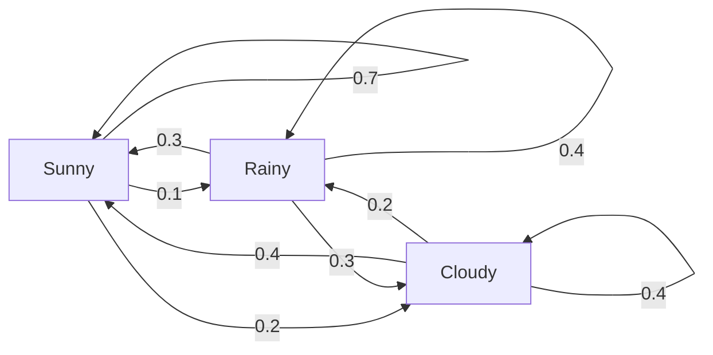
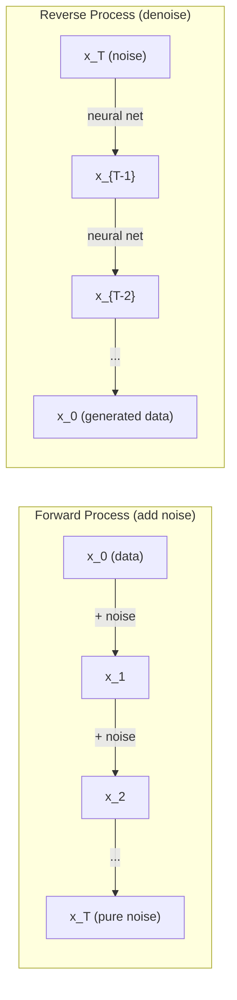

# Stochastic Processes

> Randomness with structure. The math behind random walks, Markov chains, and diffusion models.

**Type:** Learn
**Language:** Python
**Prerequisites:** Phase 1, Lessons 06-07 (probability, Bayes)
**Time:** ~75 minutes

## Learning Objectives

- Simulate 1D and 2D random walks and verify the sqrt(n) scaling of displacement
- Build a Markov chain simulator and compute its stationary distribution via eigendecomposition
- Implement Metropolis-Hastings MCMC and Langevin dynamics for sampling from target distributions
- Connect the forward diffusion process to Brownian motion and explain how the reverse process generates data

## The Problem

Many AI systems involve randomness that evolves over time. Not static randomness -- structured, sequential randomness where each step depends on what came before.

Language models generate tokens one at a time. Each token depends on the previous context. The model outputs a probability distribution, samples from it, and moves on. That is a stochastic process.

Diffusion models add noise to an image step by step until it becomes pure static. Then they reverse the process, denoising step by step until a new image emerges. The forward process is a Markov chain. The reverse process is a learned Markov chain running backward.

Reinforcement learning agents take actions in an environment. Each action leads to a new state with some probability. The agent follows a random policy in a random world. The whole thing is a Markov decision process.

MCMC sampling -- the backbone of Bayesian inference -- constructs a Markov chain whose stationary distribution is the posterior you want to sample from.

All of these build on four foundational ideas:
1. Random walks -- the simplest stochastic process
2. Markov chains -- structured randomness with a transition matrix
3. Langevin dynamics -- gradient descent with noise
4. Metropolis-Hastings -- sampling from any distribution

## The Concept

### Random Walks

Start at position 0. At each step, flip a fair coin. Heads: move right (+1). Tails: move left (-1).

After n steps, your position is the sum of n random +/-1 values. The expected position is 0 (the walk is unbiased). But the expected distance from the origin grows as sqrt(n).

This is counterintuitive. The walk is fair -- no drift in either direction. But over time, it wanders further and further from where it started. The standard deviation after n steps is sqrt(n).

```
Step 0: Position = 0
Step 1: Position = +1 or -1
Step 2: Position = +2, 0, or -2...
Step 100: Expected distance from origin ~ 10 (sqrt(100))
Step 10000: Expected distance from origin ~ 100 (sqrt(10000))
```

**In 2D**, the walk moves up, down, left, or right with equal probability. The same sqrt(n) scaling applies to the distance from the origin. The path traces a fractal-like pattern.

**Why sqrt(n)?** Each step is +1 or -1 with equal probability. After n steps, the position S_n = X_1 + X_2 +... + X_n where each X_i is +/-1. The variance of each step is 1, and the steps are independent, so Var(S_n) = n. Standard deviation = sqrt(n). By the central limit theorem, S_n / sqrt(n) converges to a standard normal distribution.

This sqrt(n) scaling shows up everywhere in ML. SGD noise scales as 1/sqrt(batch_size). Embedding dimensions scale as sqrt(d). The square root is the signature of independent random additions.

**Connection to Brownian motion.** Take a random walk with step size 1/sqrt(n) and n steps per unit time. As n goes to infinity, the walk converges to Brownian motion B(t) -- a continuous-time process where B(t) is normally distributed with mean 0 and variance t.

Brownian motion is the mathematical foundation of diffusion. It models the random jiggling of particles in a fluid, the fluctuations of stock prices, and -- crucially -- the noise process in diffusion models.

**Gambler's ruin.** A random walker starting at position k, with absorbing barriers at 0 and N. What is the probability of reaching N before 0? For a fair walk: P(reach N) = k/N. This is surprisingly simple and elegant. It connects to the theory of martingales -- the fair random walk is a martingale (expected future value = current value).

### Markov Chains

A Markov chain is a system that transitions between states according to fixed probabilities. The key property: the next state depends only on the current state, not on the history.

```
P(X_{t+1} = j | X_t = i, X_{t-1} =...) = P(X_{t+1} = j | X_t = i)
```

This is the Markov property. It means you can describe the entire dynamics with a transition matrix P:

```
P[i][j] = probability of going from state i to state j
```

Each row of P sums to 1 (you must go somewhere).

**Example -- Weather:**

```
States: Sunny (0), Rainy (1), Cloudy (2)

P = [[0.7, 0.1, 0.2], (if sunny: 70% sunny, 10% rainy, 20% cloudy)
 [0.3, 0.4, 0.3], (if rainy: 30% sunny, 40% rainy, 30% cloudy)
 [0.4, 0.2, 0.4]] (if cloudy: 40% sunny, 20% rainy, 40% cloudy)
```

Start in any state. After many transitions, the distribution of states converges to the stationary distribution pi, where pi * P = pi. This is the left eigenvector of P with eigenvalue 1.

For the weather chain, the stationary distribution might be [0.53, 0.18, 0.29] -- over the long run, it is sunny 53% of the time regardless of the starting state.



**Computing the stationary distribution.** There are two approaches:

1. **Power method**: multiply any initial distribution by P repeatedly. After enough iterations, it converges.
2. **Eigenvalue method**: find the left eigenvector of P with eigenvalue 1. This is the eigenvector of P^T with eigenvalue 1.

Both approaches require the chain to satisfy convergence conditions.

**Convergence conditions.** A Markov chain converges to a unique stationary distribution if it is:
- **Irreducible**: every state is reachable from every other state
- **Aperiodic**: the chain does not cycle with a fixed period

Most chains you encounter in ML satisfy both conditions.

**Absorbing states.** A state is absorbing if once you enter it, you never leave (P[i][i] = 1). Absorbing Markov chains model processes with terminal states -- a game that ends, a customer who churns, a token sequence that hits the end-of-text token.

**Mixing time.** How many steps until the chain is "close" to the stationary distribution? Formally, the number of steps until the total variation distance from stationarity drops below some threshold. Fast mixing = few steps needed. The spectral gap of P (1 minus the second-largest eigenvalue) controls the mixing time. Larger gap = faster mixing.

### Connection to Language Models

Token generation in a language model is approximately a Markov process. Given the current context, the model outputs a distribution over the next token. Temperature controls the sharpness:

```
P(token_i) = exp(logit_i / temperature) / sum(exp(logit_j / temperature))
```

- Temperature = 1.0: standard distribution
- Temperature < 1.0: sharper (more deterministic)
- Temperature > 1.0: flatter (more random)
- Temperature -> 0: argmax (greedy)

Top-k sampling truncates to the k highest-probability tokens. Top-p (nucleus) sampling truncates to the smallest set of tokens whose cumulative probability exceeds p. Both modify the Markov transition probabilities.

### Brownian Motion

The continuous-time limit of the random walk. Position B(t) has three properties:
1. B(0) = 0
2. B(t) - B(s) is normally distributed with mean 0 and variance t - s (for t > s)
3. Increments on non-overlapping intervals are independent

Brownian motion is continuous but nowhere differentiable -- it jiggles at every scale. The path has fractal dimension 2 in the plane.

In discrete simulation, you approximate Brownian motion by:

```
B(t + dt) = B(t) + sqrt(dt) * z, where z ~ N(0, 1)
```

The sqrt(dt) scaling is important. It comes from the central limit theorem applied to random walks.

### Langevin Dynamics

Gradient descent finds the minimum of a function. Langevin dynamics finds the probability distribution proportional to exp(-U(x)/T), where U is an energy function and T is temperature.

```
x_{t+1} = x_t - dt * gradient(U(x_t)) + sqrt(2 * T * dt) * z_t
```

Two forces act on the particle:
1. **Gradient force** (-dt * gradient(U)): pushes toward low energy (like gradient descent)
2. **Random force** (sqrt(2*T*dt) * z): pushes in random directions (exploration)

At temperature T = 0, this is pure gradient descent. At high temperature, it is nearly a random walk. At the right temperature, the particle explores the energy landscape and spends more time in low-energy regions.

**Connection to diffusion models.** The forward process of a diffusion model is:

```
x_t = sqrt(alpha_t) * x_{t-1} + sqrt(1 - alpha_t) * noise
```

This is a Markov chain that gradually mixes the data with noise. After enough steps, x_T is pure Gaussian noise.

The reverse process -- going from noise back to data -- is also a Markov chain, but its transition probabilities are learned by a neural network. The network learns to predict the noise that was added at each step, then subtracts it.



### MCMC: Markov Chain Monte Carlo

Sometimes you need to sample from a distribution p(x) that you can evaluate (up to a constant) but cannot sample from directly. Bayesian posteriors are the classic example -- you know the likelihood times the prior, but the normalizing constant is intractable.

**Metropolis-Hastings** constructs a Markov chain whose stationary distribution is p(x):

1. Start at some position x
2. Propose a new position x' from a proposal distribution Q(x'|x)
3. Compute acceptance ratio: a = p(x') * Q(x|x') / (p(x) * Q(x'|x))
4. Accept x' with probability min(1, a). Otherwise stay at x.
5. Repeat.

If Q is symmetric (e.g., Q(x'|x) = Q(x|x') = N(x, sigma^2)), the ratio simplifies to a = p(x') / p(x). You only need the ratio of probabilities -- the normalizing constant cancels.

The chain is guaranteed to converge to p(x) under mild conditions. But convergence can be slow if the proposal is too small (random walk) or too large (high rejection). Tuning the proposal is the art of MCMC.

**Why it works.** The acceptance ratio ensures detailed balance: the probability of being at x and moving to x' equals the probability of being at x' and moving to x. Detailed balance implies that p(x) is the stationary distribution of the chain. So after enough steps, the samples come from p(x).

**Practical considerations:**
- **Burn-in**: discard the first N samples. The chain needs time to reach the stationary distribution from its starting point.
- **Thinning**: keep every k-th sample to reduce autocorrelation.
- **Multiple chains**: run several chains from different starting points. If they converge to the same distribution, you have evidence of convergence.
- **Acceptance rate**: for Gaussian proposals in d dimensions, the optimal acceptance rate is about 23% (Roberts & Rosenthal, 2001). Too high means the chain barely moves. Too low means it rejects everything.

### Stochastic Processes in AI

| Process | AI Application |
|---------|---------------|
| Random walk | Exploration in RL, Node2Vec embeddings |
| Markov chain | Text generation, MCMC sampling |
| Brownian motion | Diffusion models (forward process) |
| Langevin dynamics | Score-based generative models, SGLD |
| Markov decision process | Reinforcement learning |
| Metropolis-Hastings | Bayesian inference, posterior sampling |

## Build It

### Step 1: Random walk simulator

```python
import numpy as np

def random_walk_1d(n_steps, seed=None):
 rng = np.random.RandomState(seed)
 steps = rng.choice([-1, 1], size=n_steps)
 positions = np.concatenate([[0], np.cumsum(steps)])
 return positions


def random_walk_2d(n_steps, seed=None):
 rng = np.random.RandomState(seed)
 directions = rng.choice(4, size=n_steps)
 dx = np.zeros(n_steps)
 dy = np.zeros(n_steps)
 dx[directions == 0] = 1 # right
 dx[directions == 1] = -1 # left
 dy[directions == 2] = 1 # up
 dy[directions == 3] = -1 # down
 x = np.concatenate([[0], np.cumsum(dx)])
 y = np.concatenate([[0], np.cumsum(dy)])
 return x, y
```

The 1D walk stores cumulative sums. Each step is +1 or -1. After n steps, the position is the sum. The variance grows linearly with n, so the standard deviation grows as sqrt(n).

### Step 2: Markov chain

```python
class MarkovChain:
 def __init__(self, transition_matrix, state_names=None):
 self.P = np.array(transition_matrix, dtype=float)
 self.n_states = len(self.P)
 self.state_names = state_names or [str(i) for i in range(self.n_states)]

 def step(self, current_state, rng=None):
 if rng is None:
 rng = np.random.RandomState()
 probs = self.P[current_state]
 return rng.choice(self.n_states, p=probs)

 def simulate(self, start_state, n_steps, seed=None):
 rng = np.random.RandomState(seed)
 states = [start_state]
 current = start_state
 for _ in range(n_steps):
 current = self.step(current, rng)
 states.append(current)
 return states

 def stationary_distribution(self):
 eigenvalues, eigenvectors = np.linalg.eig(self.P.T)
 idx = np.argmin(np.abs(eigenvalues - 1.0))
 stationary = np.real(eigenvectors[:, idx])
 stationary = stationary / stationary.sum()
 return np.abs(stationary)
```

The stationary distribution is the left eigenvector of P with eigenvalue 1. We find it by computing eigenvectors of P^T (transposing turns left eigenvectors into right eigenvectors).

### Step 3: Langevin dynamics

```python
def langevin_dynamics(grad_U, x0, dt, temperature, n_steps, seed=None):
 rng = np.random.RandomState(seed)
 x = np.array(x0, dtype=float)
 trajectory = [x.copy()]
 for _ in range(n_steps):
 noise = rng.randn(*x.shape)
 x = x - dt * grad_U(x) + np.sqrt(2 * temperature * dt) * noise
 trajectory.append(x.copy())
 return np.array(trajectory)
```

The gradient pushes x toward low energy. The noise prevents it from getting stuck. At equilibrium, the distribution of samples is proportional to exp(-U(x)/temperature).

### Step 4: Metropolis-Hastings

```python
def metropolis_hastings(target_log_prob, proposal_std, x0, n_samples, seed=None):
 rng = np.random.RandomState(seed)
 x = np.array(x0, dtype=float)
 samples = [x.copy()]
 accepted = 0
 for _ in range(n_samples - 1):
 x_proposed = x + rng.randn(*x.shape) * proposal_std
 log_ratio = target_log_prob(x_proposed) - target_log_prob(x)
 if np.log(rng.rand()) < log_ratio:
 x = x_proposed
 accepted += 1
 samples.append(x.copy())
 acceptance_rate = accepted / (n_samples - 1)
 return np.array(samples), acceptance_rate
```

The algorithm proposes a new point, checks if it has higher probability (or accepts with probability proportional to the ratio), and repeats. The acceptance rate should be around 23-50% for good mixing.

## Use It

In practice, you use established libraries for these algorithms. But understanding the mechanics matters for debugging and tuning.

```python
import numpy as np

rng = np.random.RandomState(42)
walk = np.cumsum(rng.choice([-1, 1], size=10000))
print(f"Final position: {walk[-1]}")
print(f"Expected distance: {np.sqrt(10000):.1f}")
print(f"Actual distance: {abs(walk[-1])}")
```

### numpy for transition matrices

```python
import numpy as np

P = np.array([[0.7, 0.1, 0.2],
 [0.3, 0.4, 0.3],
 [0.4, 0.2, 0.4]])

distribution = np.array([1.0, 0.0, 0.0])
for _ in range(100):
 distribution = distribution @ P

print(f"Stationary distribution: {np.round(distribution, 4)}")
```

Multiply the initial distribution by P repeatedly. After enough iterations, it converges to the stationary distribution regardless of where you started. This is the power method for finding the dominant left eigenvector.

### Connections to real frameworks

- **PyTorch diffusion:** The `DDPMScheduler` in Hugging Face `diffusers` implements the forward and reverse Markov chains
- **NumPyro / PyMC:** Use MCMC (NUTS sampler, which improves on Metropolis-Hastings) for Bayesian inference
- **Gymnasium (RL):** The environment step function defines a Markov decision process

### Verifying Markov chain convergence

```python
import numpy as np

P = np.array([[0.9, 0.1], [0.3, 0.7]])

eigenvalues = np.linalg.eigvals(P)
spectral_gap = 1 - sorted(np.abs(eigenvalues))[-2]
print(f"Eigenvalues: {eigenvalues}")
print(f"Spectral gap: {spectral_gap:.4f}")
print(f"Approximate mixing time: {1/spectral_gap:.1f} steps")
```

The spectral gap tells you how fast the chain forgets its initial state. A gap of 0.2 means roughly 5 steps to mix. A gap of 0.01 means roughly 100 steps. Always check this before running long simulations -- a slowly mixing chain wastes compute.

## Ship It

This lesson produces:
- `outputs/prompt-stochastic-process-advisor.md` -- a prompt that helps identify which stochastic process framework applies to a given problem

## Connections

| Concept | Where it shows up |
|---------|------------------|
| Random walk | Node2Vec graph embeddings, exploration in RL |
| Markov chain | Token generation in LLMs, MCMC sampling |
| Brownian motion | Forward diffusion process in DDPM, SDE-based models |
| Langevin dynamics | Score-based generative models, stochastic gradient Langevin dynamics (SGLD) |
| Stationary distribution | MCMC convergence target, PageRank |
| Metropolis-Hastings | Bayesian posterior sampling, simulated annealing |
| Temperature | LLM sampling, Boltzmann exploration in RL, simulated annealing |
| Mixing time | Convergence speed of MCMC, spectral gap analysis |
| Absorbing state | End-of-sequence token, terminal states in RL |
| Detailed balance | Correctness guarantee for MCMC samplers |

Diffusion models deserve special attention. DDPM (Ho et al., 2020) defines a forward Markov chain:

```
q(x_t | x_{t-1}) = N(x_t; sqrt(1-beta_t) * x_{t-1}, beta_t * I)
```

where beta_t is a noise schedule. After T steps, x_T is approximately N(0, I). The reverse process is parameterized by a neural network that predicts the noise:

```
p_theta(x_{t-1} | x_t) = N(x_{t-1}; mu_theta(x_t, t), sigma_t^2 * I)
```

Every step of generation is a step in a learned Markov chain. Understanding Markov chains means understanding how and why diffusion models generate data.

SGLD (Stochastic Gradient Langevin Dynamics) combines mini-batch gradient descent with Langevin noise. Instead of computing the full gradient, you use a stochastic estimate and add calibrated noise. As learning rate decays, SGLD transitions from optimization to sampling -- you get approximate Bayesian posterior samples for free. This is one of the simplest ways to get uncertainty estimates from a neural network.

The key insight across all these connections: stochastic processes are not just theoretical tools. They are the computational mechanisms inside modern AI systems. When you tune the temperature of an LLM, you are adjusting a Markov chain. When you train a diffusion model, you are learning to reverse a Brownian-motion-like process. When you run Bayesian inference, you are constructing a chain that converges to the posterior.

## Exercises

1. **Simulate 1000 random walks of 10000 steps.** Plot the distribution of final positions. Verify it is approximately Gaussian with mean 0 and standard deviation sqrt(10000) = 100.

2. **Build a text generator using a Markov chain.** Train on a small corpus: for each word, count transitions to the next word. Build the transition matrix. Generate new sentences by sampling from the chain.

3. **Implement simulated annealing** using Metropolis-Hastings. Start at high temperature (accept almost everything) and gradually cool down (accept only improvements). Use it to find the minimum of a function with many local minima.

4. **Compare Langevin dynamics at different temperatures.** Sample from a double-well potential U(x) = (x^2 - 1)^2. At low temperature, samples cluster in one well. At high temperature, they spread across both. Find the critical temperature where the chain mixes between wells.

5. **Implement the forward diffusion process.** Start with a 1D signal (e.g., a sine wave). Add noise progressively over 100 steps with a linear noise schedule. Show how the signal degrades to pure noise. Then implement a simple denoiser that reverses the process (even a naive one that just subtracts the estimated noise).

## Key Terms

| Term | What people say | What it actually means |
|------|----------------|----------------------|
| Random walk | "Coin-flip movement" | A process where position changes by random increments at each step |
| Markov property | "Memoryless" | The future depends only on the present state, not on the history |
| Transition matrix | "The probability table" | P[i][j] = probability of moving from state i to state j |
| Stationary distribution | "The long-run average" | The distribution pi where pi*P = pi -- the chain's equilibrium |
| Brownian motion | "Random jiggling" | The continuous-time limit of a random walk, B(t) ~ N(0, t) |
| Langevin dynamics | "Gradient descent with noise" | Update rule that combines deterministic gradient and random perturbation |
| MCMC | "Walking toward the target" | Constructing a Markov chain whose stationary distribution is the one you want |
| Metropolis-Hastings | "Propose and accept/reject" | MCMC algorithm that uses acceptance ratios to ensure convergence |
| Temperature | "The randomness knob" | Parameter controlling the tradeoff between exploration and exploitation |
| Diffusion process | "Noise in, noise out" | Forward: gradually add noise. Reverse: gradually remove it. Generates data. |

## Further Reading

- **Ho, Jain, Abbeel (2020)** -- "Denoising Diffusion Probabilistic Models." The DDPM paper that launched the diffusion model revolution. Clear derivation of the forward and reverse Markov chains.
- **Song & Ermon (2019)** -- "Generative Modeling by Estimating Gradients of the Data Distribution." Score-based approach using Langevin dynamics for sampling.
- **Roberts & Rosenthal (2004)** -- "General state space Markov chains and MCMC algorithms." The theory behind when and why MCMC works.
- **Norris (1997)** -- "Markov Chains." The standard textbook. Covers convergence, stationary distributions, and hitting times.
- **Welling & Teh (2011)** -- "Bayesian Learning via Stochastic Gradient Langevin Dynamics." Combines SGD with Langevin dynamics for scalable Bayesian inference.
