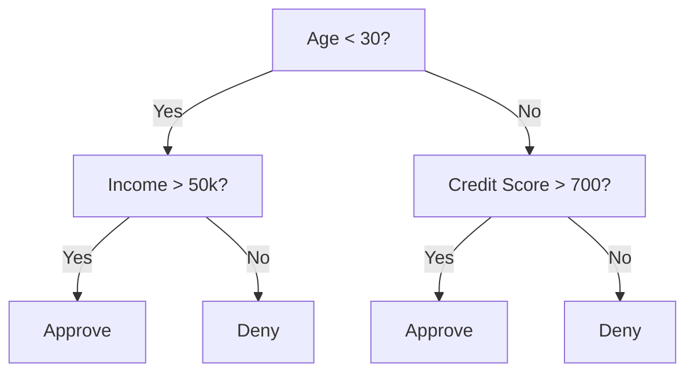
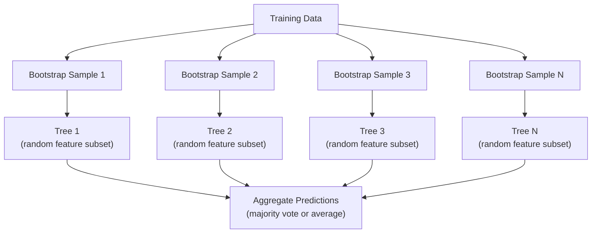

# Decision Trees and Random Forests

> A decision tree is just a flowchart. But a forest of them is one of the most powerful tools in ML.

**Type:** Build
**Language:** Python
**Prerequisites:** Phase 1 (Lessons 09 Information Theory, 06 Probability)
**Time:** ~90 minutes

## Learning Objectives

- Implement Gini impurity, entropy, and information gain calculations to find optimal decision tree splits
- Build a decision tree classifier from scratch with pre-pruning controls (max depth, min samples)
- Construct a random forest using bootstrap sampling and feature randomization, and explain why it reduces variance
- Compare MDI feature importance with permutation importance and identify when MDI is biased

## The Problem

You have tabular data. Rows are samples, columns are features, and there is a target column you want to predict. You could throw a neural network at it. But for tabular data, tree-based models (decision trees, random forests, gradient boosted trees) consistently outperform deep learning. Kaggle competitions on structured data are dominated by XGBoost and LightGBM, not transformers.

Why? Trees handle mixed feature types (numeric and categorical) without preprocessing. They handle nonlinear relationships without feature engineering. They are interpretable: you can look at the tree and see exactly why a prediction was made. And random forests, which average many trees, are highly resistant to overfitting on moderate-sized datasets.

This lesson builds decision trees from scratch using recursive splitting, then builds a random forest on top. You will implement the math behind split criteria (Gini impurity, entropy, information gain) and understand why an ensemble of weak learners becomes a strong one.

## The Concept

### What a decision tree does

A decision tree partitions the feature space into rectangular regions by asking a sequence of yes/no questions.



Each internal node tests a feature against a threshold. Each leaf node makes a prediction. To classify a new data point, you start at the root and follow the branches until you reach a leaf.

The tree is built top-down by choosing, at each node, the feature and threshold that best separate the data. "Best" is defined by a split criterion.

### Split criteria: measuring impurity

At each node, we have a set of samples. We want to split them so that the resulting child nodes are as "pure" as possible, meaning each child contains mostly one class.

**Gini impurity** measures the probability that a randomly chosen sample would be misclassified if it were labeled according to the class distribution at that node.

```
Gini(S) = 1 - sum(p_k^2)

where p_k is the proportion of class k in set S.
```

For a pure node (all one class), Gini = 0. For a binary split with 50/50 classes, Gini = 0.5. Lower is better.

```
Example: 6 cats, 4 dogs

Gini = 1 - (0.6^2 + 0.4^2) = 1 - (0.36 + 0.16) = 0.48
```

**Entropy** measures the information content (disorder) in a node. Covered in Phase 1 Lesson 09.

```
Entropy(S) = -sum(p_k * log2(p_k))
```

For a pure node, entropy = 0. For a 50/50 binary split, entropy = 1.0. Lower is better.

```
Example: 6 cats, 4 dogs

Entropy = -(0.6 * log2(0.6) + 0.4 * log2(0.4))
 = -(0.6 * -0.737 + 0.4 * -1.322)
 = 0.442 + 0.529
 = 0.971 bits
```

**Information gain** is the reduction in impurity (entropy or Gini) after a split.

```
IG(S, feature, threshold) = Impurity(S) - weighted_avg(Impurity(S_left), Impurity(S_right))

where the weights are the proportions of samples in each child.
```

The greedy algorithm at each node: try every feature and every possible threshold. Pick the (feature, threshold) pair that maximizes information gain.

### How splitting works

For a dataset with n features and m samples at the current node:

1. For each feature j (j = 1 to n):
 - Sort the samples by feature j
 - Try every midpoint between consecutive distinct values as a threshold
 - Compute the information gain for each threshold
2. Select the feature and threshold with the highest information gain
3. Split the data into left (feature <= threshold) and right (feature > threshold)
4. Recurse on each child

This greedy approach does not guarantee the globally optimal tree. Finding the optimal tree is NP-hard. But greedy splitting works well in practice.

### Stopping conditions

Without stopping conditions, the tree grows until every leaf is pure (one sample per leaf). This perfectly memorizes the training data and generalizes terribly.

**Pre-pruning** stops the tree before it fully grows:
- Maximum depth: stop splitting when the tree reaches a set depth
- Minimum samples per leaf: stop if a node has fewer than k samples
- Minimum information gain: stop if the best split improves impurity by less than a threshold
- Maximum leaf nodes: limit the total number of leaves

**Post-pruning** grows the full tree, then trims it back:
- Cost-complexity pruning (used by scikit-learn): adds a penalty proportional to the number of leaves. Increase the penalty to get smaller trees
- Reduced error pruning: remove a subtree if the validation error does not increase

Pre-pruning is simpler and faster. Post-pruning often produces better trees because it does not prematurely stop splits that might lead to useful further splits.

### Decision trees for regression

For regression, the leaf prediction is the mean of the target values in that leaf. The split criterion changes too:

**Variance reduction** replaces information gain:

```
VR(S, feature, threshold) = Var(S) - weighted_avg(Var(S_left), Var(S_right))
```

Pick the split that reduces variance the most. The tree partitions the input space into regions, and predicts a constant (the mean) in each region.

### Random forests: the power of ensembles

A single decision tree is high variance. Small changes in the data can produce completely different trees. Random forests fix this by averaging many trees.



Two sources of randomness make the trees diverse:

**Bagging (bootstrap aggregating):** Each tree is trained on a bootstrap sample, a random sample with replacement from the training data. About 63% of the original samples appear in each bootstrap (the rest are out-of-bag samples that can be used for validation).

**Feature randomization:** At each split, only a random subset of features is considered. For classification, the default is sqrt(n_features). For regression, n_features/3. This prevents all trees from splitting on the same dominant feature.

The key insight: averaging many decorrelated trees reduces variance without increasing bias. Each individual tree may be mediocre. The ensemble is strong.

### Feature importance

Random forests naturally provide feature importance scores. The most common method:

**Mean Decrease in Impurity (MDI):** For each feature, sum the total reduction in impurity across all trees and all nodes where that feature is used. Features that produce bigger impurity reductions at earlier splits are more important.

```
importance(feature_j) = sum over all nodes where feature_j is used:
 (n_samples_at_node / n_total_samples) * impurity_decrease
```

This is fast (computed during training) but biased toward high-cardinality features and features with many possible split points.

**Permutation importance** is the alternative: shuffle one feature's values and measure how much the model's accuracy drops. More reliable but slower.

### When trees beat neural networks

Trees and forests dominate neural networks on tabular data. Several reasons:

| Factor | Trees | Neural networks |
|--------|-------|----------------|
| Mixed types (numeric + categorical) | Native support | Need encoding |
| Small datasets (< 10k rows) | Work well | Overfit |
| Feature interactions | Found by splitting | Need architecture design |
| Interpretability | Full transparency | Black box |
| Training time | Minutes | Hours |
| Hyperparameter sensitivity | Low | High |

Neural networks win when the data has spatial or sequential structure (images, text, audio). For flat tables of features, trees are the default.

## Build It

### Step 1: Gini impurity and entropy

Build both split criteria from scratch and verify they agree on which splits are good.

```python
import math

def gini_impurity(labels):
 n = len(labels)
 if n == 0:
 return 0.0
 counts = {}
 for label in labels:
 counts[label] = counts.get(label, 0) + 1
 return 1.0 - sum((c / n) ** 2 for c in counts.values())

def entropy(labels):
 n = len(labels)
 if n == 0:
 return 0.0
 counts = {}
 for label in labels:
 counts[label] = counts.get(label, 0) + 1
 return -sum(
 (c / n) * math.log2(c / n) for c in counts.values() if c > 0
 )
```

### Step 2: Find the best split

Try every feature and every threshold. Return the one with the highest information gain.

```python
def information_gain(parent_labels, left_labels, right_labels, criterion="gini"):
 measure = gini_impurity if criterion == "gini" else entropy
 n = len(parent_labels)
 n_left = len(left_labels)
 n_right = len(right_labels)
 if n_left == 0 or n_right == 0:
 return 0.0
 parent_impurity = measure(parent_labels)
 child_impurity = (
 (n_left / n) * measure(left_labels) +
 (n_right / n) * measure(right_labels)
 )
 return parent_impurity - child_impurity
```

### Step 3: Build the DecisionTree class

Recursive splitting, prediction, and feature importance tracking.

```python
class DecisionTree:
 def __init__(self, max_depth=None, min_samples_split=2,
 min_samples_leaf=1, criterion="gini",
 max_features=None):
 self.max_depth = max_depth
 self.min_samples_split = min_samples_split
 self.min_samples_leaf = min_samples_leaf
 self.criterion = criterion
 self.max_features = max_features
 self.tree = None
 self.feature_importances_ = None

 def fit(self, X, y):
 self.n_features = len(X[0])
 self.feature_importances_ = [0.0] * self.n_features
 self.n_samples = len(X)
 self.tree = self._build(X, y, depth=0)
 total = sum(self.feature_importances_)
 if total > 0:
 self.feature_importances_ = [
 fi / total for fi in self.feature_importances_
 ]

 def predict(self, X):
 return [self._predict_one(x, self.tree) for x in X]
```

### Step 4: Build the RandomForest class

Bootstrap sampling, feature randomization, and majority voting.

```python
class RandomForest:
 def __init__(self, n_trees=100, max_depth=None,
 min_samples_split=2, max_features="sqrt",
 criterion="gini"):
 self.n_trees = n_trees
 self.max_depth = max_depth
 self.min_samples_split = min_samples_split
 self.max_features = max_features
 self.criterion = criterion
 self.trees = []

 def fit(self, X, y):
 n = len(X)
 for _ in range(self.n_trees):
 indices = [random.randint(0, n - 1) for _ in range(n)]
 X_boot = [X[i] for i in indices]
 y_boot = [y[i] for i in indices]
 tree = DecisionTree(
 max_depth=self.max_depth,
 min_samples_split=self.min_samples_split,
 max_features=self.max_features,
 criterion=self.criterion,
 )
 tree.fit(X_boot, y_boot)
 self.trees.append(tree)

 def predict(self, X):
 all_preds = [tree.predict(X) for tree in self.trees]
 predictions = []
 for i in range(len(X)):
 votes = {}
 for preds in all_preds:
 v = preds[i]
 votes[v] = votes.get(v, 0) + 1
 predictions.append(max(votes, key=votes.get))
 return predictions
```

See `code/trees.py` for the complete implementation with all helper methods.

## Use It

With scikit-learn, training a random forest is three lines:

```python
from sklearn.ensemble import RandomForestClassifier
from sklearn.datasets import load_iris
from sklearn.model_selection import train_test_split

X, y = load_iris(return_X_y=True)
X_train, X_test, y_train, y_test = train_test_split(X, y, random_state=42)

rf = RandomForestClassifier(n_estimators=100, random_state=42)
rf.fit(X_train, y_train)
print(f"Accuracy: {rf.score(X_test, y_test):.4f}")
print(f"Feature importances: {rf.feature_importances_}")
```

In practice, gradient boosted trees (XGBoost, LightGBM, CatBoost) are often stronger than random forests because they build trees sequentially, with each tree correcting the errors of the previous ones. But random forests are harder to misconfigure and require almost no hyperparameter tuning.

## Ship It

This lesson produces `outputs/prompt-tree-interpreter.md` -- a prompt that interprets decision tree splits for business stakeholders. Feed it a trained tree's structure (depth, features, split thresholds, accuracy) and it translates the model into plain-language rules, ranks feature importance, flags overfitting or leakage, and recommends next steps. Use it any time you need to explain a tree-based model to someone who does not read code.

## Exercises

1. Train a single decision tree on a 2D dataset with 3 classes. Manually trace the splits and draw the rectangular decision boundaries. Compare the boundaries at max_depth=2 vs max_depth=10.

2. Implement variance reduction splitting for regression trees. Generate y = sin(x) + noise for 200 points and fit your regression tree. Plot the tree's piecewise-constant predictions against the true curve.

3. Build a random forest with 1, 5, 10, 50, and 200 trees. Plot training accuracy and test accuracy vs number of trees. Observe that test accuracy plateaus but does not decrease (forests resist overfitting).

4. Compare Gini impurity vs entropy as split criteria on 5 different datasets. Measure accuracy and tree depth. In most cases, they produce nearly identical results. Explain why.

5. Implement permutation importance. Compare it with MDI importance on a dataset where one feature is random noise but has high cardinality. MDI will rank the noise feature highly. Permutation importance will not.

## Key Terms

| Term | What people say | What it actually means |
|------|----------------|----------------------|
| Decision tree | "A flowchart for predictions" | A model that partitions feature space into rectangular regions by learning a sequence of if/else splits |
| Gini impurity | "How mixed the node is" | Probability of misclassifying a random sample at a node. 0 = pure, 0.5 = maximum impurity for binary |
| Entropy | "The disorder in a node" | Information content at a node. 0 = pure, 1.0 = maximum uncertainty for binary. From information theory |
| Information gain | "How good a split is" | Reduction in impurity after a split. The greedy criterion for choosing splits |
| Pre-pruning | "Stop the tree early" | Stopping tree growth early by setting max depth, min samples, or min gain thresholds |
| Post-pruning | "Trim the tree after" | Growing the full tree, then removing subtrees that do not improve validation performance |
| Bagging | "Train on random subsets" | Bootstrap aggregating. Train each model on a different random sample with replacement |
| Random forest | "A bunch of trees" | Ensemble of decision trees, each trained on a bootstrap sample with random feature subsets at each split |
| Feature importance (MDI) | "Which features matter" | Total impurity decrease contributed by each feature, summed across all trees and nodes |
| Permutation importance | "Shuffle and check" | Accuracy drop when a feature's values are randomly shuffled. More reliable than MDI for noisy features |
| Variance reduction | "The regression version of info gain" | The regression tree analogue of information gain. Picks the split that reduces target variance the most |
| Bootstrap sample | "Random sample with repeats" | A random sample drawn with replacement from the original dataset. Same size, but with duplicates |

## Further Reading

- [Breiman: Random Forests (2001)](https://link.springer.com/article/10.1023/A:1010933404324) - the original random forest paper
- [Grinsztajn et al.: Why do tree-based models still outperform deep learning on tabular data? (2022)](https://arxiv.org/abs/2207.08815) - rigorous comparison of trees vs neural networks on tabular tasks
- [scikit-learn Decision Trees documentation](https://scikit-learn.org/stable/modules/tree.html) - practical guide with visualization tools
- [XGBoost: A Scalable Tree Boosting System (Chen & Guestrin, 2016)](https://arxiv.org/abs/1603.02754) - the gradient boosting paper that dominates Kaggle
