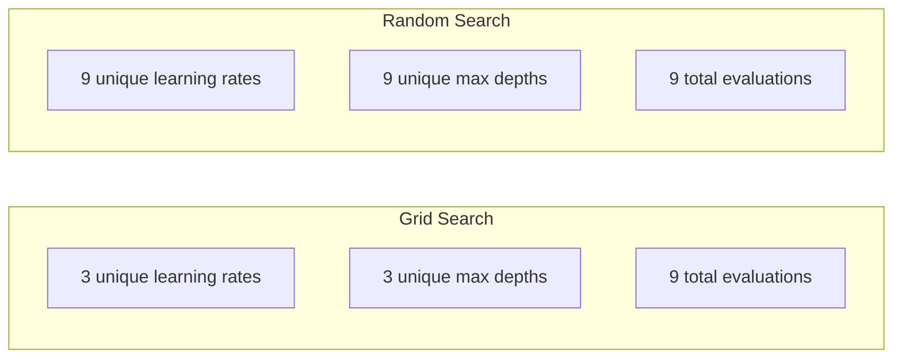
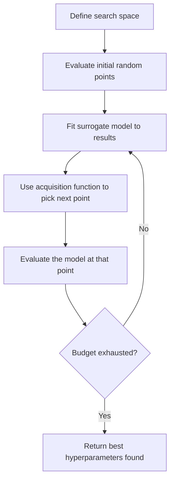
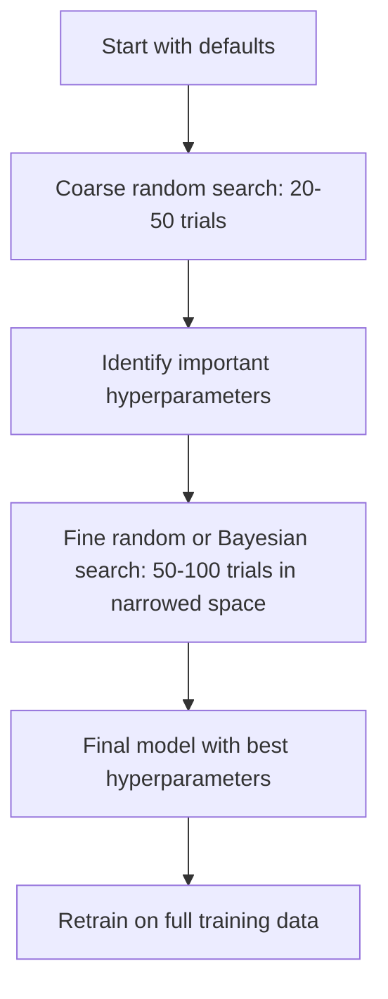

# Hyperparameter Tuning

> Hyperparameters are the knobs you turn before training starts. Turning them well is the difference between a mediocre model and a great one.

**Type:** Build
**Language:** Python
**Prerequisites:** Phase 2, Lesson 11 (Ensemble Methods)
**Time:** ~90 minutes

## The Problem

Your gradient boosting model has a learning rate, number of trees, max depth, min samples per leaf, subsample ratio, and column sample ratio. That is six hyperparameters. If each has 5 reasonable values, the grid has 5^6 = 15,625 combinations. Training each takes 10 seconds. That is 43 hours of compute to try them all.

Grid search is the obvious approach and the worst one at scale. Random search does better with less compute. Bayesian optimization does even better by learning from past evaluations. Knowing which strategy to use, and which hyperparameters actually matter, saves days of wasted GPU time.

## The Concept

### Parameters vs Hyperparameters

Parameters are learned during training (weights, biases, split thresholds). Hyperparameters are set before training starts and control how learning happens.

| Hyperparameter | What it controls | Typical range |
|---------------|-----------------|---------------|
| Learning rate | Step size per update | 0.001 to 1.0 |
| Number of trees/epochs | How long to train | 10 to 10,000 |
| Max depth | Model complexity | 1 to 30 |
| Regularization (lambda) | Overfitting prevention | 0.0001 to 100 |
| Batch size | Gradient estimation noise | 16 to 512 |
| Dropout rate | Fraction of neurons dropped | 0.0 to 0.5 |

### Grid Search

Grid search evaluates every combination of specified values. It is exhaustive and easy to understand, but scales exponentially with the number of hyperparameters.

```
Grid for 2 hyperparameters:

  learning_rate: [0.01, 0.1, 1.0]
  max_depth:     [3, 5, 7]

  Evaluations: 3 x 3 = 9 combinations

  (0.01, 3)  (0.01, 5)  (0.01, 7)
  (0.1,  3)  (0.1,  5)  (0.1,  7)
  (1.0,  3)  (1.0,  5)  (1.0,  7)
```

Grid search has a fundamental flaw: if one hyperparameter matters and the other does not, most evaluations are wasted. You get only 3 unique values of the important parameter from 9 evaluations.

### Random Search

Random search samples hyperparameters from distributions instead of a grid. With the same budget of 9 evaluations, you get 9 unique values of each hyperparameter.



Why random beats grid (Bergstra & Bengio, 2012):

- Most hyperparameters have low effective dimensionality. Only 1-2 of 6 hyperparameters usually matter for a given problem.
- Grid search wastes evaluations on unimportant dimensions.
- Random search covers the important dimensions more densely for the same budget.
- At 60 random trials, you have a 95% chance of finding a point within 5% of the optimum (if one exists in the search space).

### Bayesian Optimization

Random search ignores results. It does not learn that high learning rates cause divergence or that depth 3 consistently outperforms depth 10. Bayesian optimization uses past evaluations to decide where to search next.



The two key components:

**Surrogate model:** A cheap-to-evaluate model (usually a Gaussian process) that approximates the expensive objective function. It gives both a prediction and an uncertainty estimate at any point in the search space.

**Acquisition function:** Decides where to evaluate next by balancing exploitation (search near known good points) and exploration (search where uncertainty is high). Common choices:

- **Expected Improvement (EI):** How much improvement over the current best do we expect at this point?
- **Upper Confidence Bound (UCB):** Prediction plus a multiple of uncertainty. Higher UCB means either promising or unexplored.
- **Probability of Improvement (PI):** What is the probability this point beats the current best?

Bayesian optimization typically finds better hyperparameters than random search with 2-5x fewer evaluations. The overhead of fitting the surrogate model is negligible compared to training the actual model.

### Early Stopping

Not every training run needs to finish. If a configuration is clearly bad after 10 epochs, stop it and move on. This is early stopping in the context of hyperparameter search.

Strategies:
- **Patience-based:** Stop if validation loss has not improved for N consecutive epochs
- **Median pruning:** Stop if the trial's intermediate result is worse than the median of completed trials at the same step
- **Hyperband:** Allocate small budgets to many configurations, then progressively increase budget for the best ones

Hyperband is particularly effective. It starts 81 configurations with 1 epoch each, keeps the top third, gives them 3 epochs, keeps the top third, and so on. This finds good configurations 10-50x faster than evaluating all configs for the full budget.

### Learning Rate Schedulers

The learning rate is almost always the most important hyperparameter. Rather than keeping it fixed, schedulers adjust it during training.

| Scheduler | Formula | When to use |
|-----------|---------|-------------|
| Step decay | Multiply by 0.1 every N epochs | Classic CNN training |
| Cosine annealing | lr * 0.5 * (1 + cos(pi * t / T)) | Modern default |
| Warmup + decay | Linear increase then cosine decay | Transformers |
| One-cycle | Increase then decrease over one cycle | Fast convergence |
| Reduce on plateau | Reduce by factor when metric stalls | Safe default |

### Hyperparameter Importance

Not all hyperparameters matter equally. Research on random forests (Probst et al., 2019) and gradient boosting shows consistent patterns:

**High importance:**
- Learning rate (always tune first)
- Number of estimators / epochs (use early stopping instead of tuning)
- Regularization strength

**Medium importance:**
- Max depth / number of layers
- Min samples per leaf / weight decay
- Subsample ratio

**Low importance:**
- Max features (for random forests)
- Specific activation function choice
- Batch size (within reasonable range)

Tune the important ones first, leave the rest at defaults.

### Practical Strategy



The concrete workflow:

1. **Start with library defaults.** They are chosen by experienced practitioners and are often 80% of the way there.
2. **Coarse random search.** Wide ranges, 20-50 trials. Use early stopping to kill bad runs fast.
3. **Analyze results.** Which hyperparameters correlate with performance? Narrow the search space.
4. **Fine search.** Bayesian optimization or focused random search in the narrowed space. 50-100 trials.
5. **Retrain on all training data** with the best hyperparameters found.

## Build It

### Step 1: Grid Search from Scratch

The code in `code/tuning.py` implements grid search, random search, and a simple Bayesian optimizer from scratch.

```python
def grid_search(model_fn, param_grid, X_train, y_train, X_val, y_val):
    keys = list(param_grid.keys())
    values = list(param_grid.values())
    best_score = -float("inf")
    best_params = None
    n_evals = 0

    for combo in itertools.product(*values):
        params = dict(zip(keys, combo))
        model = model_fn(**params)
        model.fit(X_train, y_train)
        score = evaluate(model, X_val, y_val)
        n_evals += 1

        if score > best_score:
            best_score = score
            best_params = params

    return best_params, best_score, n_evals
```

### Step 2: Random Search from Scratch

```python
def random_search(model_fn, param_distributions, X_train, y_train,
                  X_val, y_val, n_iter=50, seed=42):
    rng = np.random.RandomState(seed)
    best_score = -float("inf")
    best_params = None

    for _ in range(n_iter):
        params = {k: sample(v, rng) for k, v in param_distributions.items()}
        model = model_fn(**params)
        model.fit(X_train, y_train)
        score = evaluate(model, X_val, y_val)

        if score > best_score:
            best_score = score
            best_params = params

    return best_params, best_score, n_iter
```

### Step 3: Bayesian Optimization (Simplified)

The code implements a simplified Bayesian optimizer using a Gaussian process surrogate with the Expected Improvement acquisition function. It demonstrates the core idea: use past results to decide where to look next.

### Step 4: Compare All Methods

The code runs all three methods on the same problem and compares:
- Best score achieved
- Number of evaluations needed
- How quickly each method finds a good solution

It also demonstrates Optuna, the most practical Bayesian optimization library for real projects.

## Use It

### Optuna in Practice

Optuna is the recommended library for serious hyperparameter tuning. It supports pruning, distributed search, and visualization out of the box.

```python
import optuna

def objective(trial):
    lr = trial.suggest_float("learning_rate", 1e-4, 1e-1, log=True)
    n_est = trial.suggest_int("n_estimators", 50, 500)
    max_depth = trial.suggest_int("max_depth", 2, 10)

    model = GradientBoostingRegressor(
        learning_rate=lr,
        n_estimators=n_est,
        max_depth=max_depth,
    )
    model.fit(X_train, y_train)
    return mean_squared_error(y_val, model.predict(X_val))

study = optuna.create_study(direction="minimize")
study.optimize(objective, n_trials=100)

print(f"Best params: {study.best_params}")
print(f"Best MSE: {study.best_value:.4f}")
```

Key Optuna features:
- `suggest_float(..., log=True)` for parameters best searched on log scale (learning rate, regularization)
- `suggest_int` for integer parameters
- `suggest_categorical` for discrete choices
- Built-in MedianPruner for early stopping of bad trials
- `study.trials_dataframe()` for analysis

## Exercises

1. Run grid search and random search with the same total budget (e.g., 50 evaluations). Compare the best scores found. Run the experiment 10 times with different seeds. How often does random search win?

2. Implement Hyperband from scratch. Start with 81 configurations, each trained for 1 epoch. Keep the top 1/3 at each round and triple their budget. Compare total compute (sum of all epochs across all configs) to running 81 configs for the full budget.

3. Add a learning rate scheduler (cosine annealing) to the gradient boosting implementation from Lesson 11. Does it help compared to a fixed learning rate?

4. Use Optuna to tune a RandomForestClassifier on a real dataset (e.g., sklearn's breast cancer dataset). Use `optuna.visualization.plot_param_importances(study)` to see which hyperparameters matter most. Does it match the importance ranking from this lesson?

5. Implement a simple acquisition function (Expected Improvement) and demonstrate exploration vs exploitation. Plot the surrogate model's mean and uncertainty, and show where EI chooses to evaluate next.

## Key Terms

| Term | What people say | What it actually means |
|------|----------------|----------------------|
| Hyperparameter | "A setting you choose" | A value set before training that controls the learning process, not learned from data |
| Grid search | "Try every combination" | Exhaustive search over a specified parameter grid. Exponential cost. |
| Random search | "Just sample randomly" | Sample hyperparameters from distributions. Covers important dimensions better than grid search. |
| Bayesian optimization | "Smart search" | Uses a surrogate model of the objective to decide where to evaluate next, balancing exploration and exploitation |
| Surrogate model | "A cheap approximation" | A model (usually Gaussian process) that approximates the expensive objective function from observed evaluations |
| Acquisition function | "Where to look next" | Scores candidate points by balancing expected improvement with uncertainty. EI and UCB are common choices. |
| Early stopping | "Stop wasting time" | Terminate training early when validation performance stops improving |
| Hyperband | "Tournament bracket for configs" | Adaptive resource allocation: start many configs with small budgets, keep the best and increase their budgets |
| Learning rate scheduler | "Change lr during training" | A function that adjusts the learning rate over the course of training for better convergence |

## Further Reading

- [Bergstra & Bengio: Random Search for Hyper-Parameter Optimization (2012)](https://jmlr.org/papers/v13/bergstra12a.html) -- the paper that showed random beats grid
- [Snoek et al., Practical Bayesian Optimization of Machine Learning Algorithms (2012)](https://arxiv.org/abs/1206.2944) -- Bayesian optimization for ML
- [Li et al., Hyperband: A Novel Bandit-Based Approach (2018)](https://jmlr.org/papers/v18/16-558.html) -- the Hyperband paper
- [Optuna: A Next-generation Hyperparameter Optimization Framework](https://arxiv.org/abs/1907.10902) -- the Optuna paper
- [Probst et al., Tunability: Importance of Hyperparameters (2019)](https://jmlr.org/papers/v20/18-444.html) -- which hyperparameters matter
