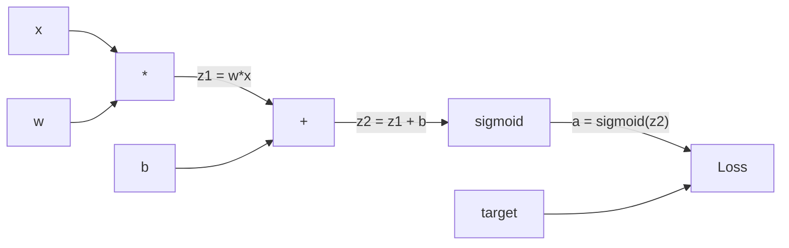
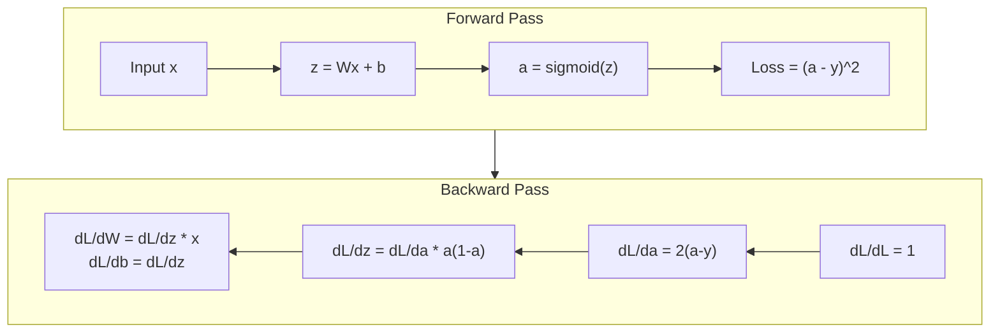
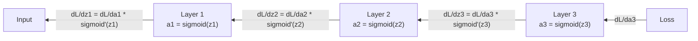

# Backpropagation from Scratch

> Backpropagation is the algorithm that makes learning possible. Without it, neural networks are just expensive random number generators.

**Type:** Build
**Languages:** Python
**Prerequisites:** Lesson 03.02 (Multi-Layer Networks)
**Time:** ~120 minutes

## Learning Objectives

- Implement a Value-based autograd engine that builds a computational graph and computes gradients via topological sort
- Derive the backward pass for addition, multiplication, and sigmoid using the chain rule
- Train a multi-layer network on XOR and circle classification using only your from-scratch backpropagation engine
- Identify the vanishing gradient problem in deep sigmoid networks and explain why gradients shrink exponentially

## The Problem

Your network has a single hidden layer with 768 inputs and 3072 outputs. That's 2,359,296 weights. It made a wrong prediction. Which weights caused the error? Testing each weight individually means 2.3 million forward passes. Backpropagation computes all 2.3 million gradients in a single backward pass. That's not an optimization. That's the difference between trainable and impossible.

The naive approach: take one weight, nudge it by a tiny amount, run the forward pass again, measure whether the loss went up or down. That gives you the gradient for that weight. Now do it for every weight in the network. Multiply by thousands of training steps and millions of data points. You'd need geological time to train anything useful.

Backpropagation solves this. One forward pass, one backward pass, all gradients computed. The trick is the chain rule from calculus, applied systematically to a computational graph. This is the algorithm that made deep learning practical. Without it, we'd still be stuck on toy problems.

## The Concept

### The Chain Rule, Applied to Networks

You saw the chain rule in Phase 01, Lesson 05. Quick recap: if y = f(g(x)), then dy/dx = f'(g(x)) * g'(x). You multiply derivatives along the chain.

In a neural network, the "chain" is the sequence of operations from input to loss. Each layer applies weights, adds biases, passes through an activation. The loss function compares the final output to the target. Backpropagation traces this chain backward, computing how each operation contributed to the error.

### Computational Graphs

Every forward pass builds a graph. Each node is an operation (multiply, add, sigmoid). Each edge carries a value forward and a gradient backward.



Forward pass: values flow left to right. x and w produce z1 = w*x. Add b to get z2. Sigmoid gives activation a. Compare a to target y using the loss function.

Backward pass: gradients flow right to left. Start with dL/da (how loss changes with the activation). Multiply by da/dz2 (sigmoid derivative). That gives dL/dz2. Split into dL/db (which equals dL/dz2, since z2 = z1 + b) and dL/dz1. Then dL/dw = dL/dz1 * x and dL/dx = dL/dz1 * w.

Every node in the graph has one job during the backward pass: take the gradient coming from above, multiply by its local derivative, and pass it down.

### Forward vs Backward



The forward pass stores every intermediate value: z, a, the inputs to each layer. The backward pass needs these stored values to compute gradients. This is the memory-computation tradeoff at the heart of backprop. You trade memory (storing activations) for speed (one pass instead of millions).

### Gradient Flow Through a Network

For a 3-layer network, gradients chain through every layer:



At each layer, the gradient gets multiplied by the sigmoid derivative. The sigmoid derivative is a * (1 - a), which maxes out at 0.25 (when a = 0.5). Three layers deep, the gradient has been multiplied by at most 0.25^3 = 0.0156. Ten layers deep: 0.25^10 = 0.000001.

### Vanishing Gradients

This is the vanishing gradient problem. Sigmoid squashes its output between 0 and 1. Its derivative is always less than 0.25. Stack enough sigmoid layers and gradients shrink to nothing. Early layers barely learn because they receive near-zero gradients.

```
sigmoid(z): Output range [0, 1]
sigmoid'(z): Max value 0.25 (at z = 0)

After 5 layers: gradient * 0.25^5 = 0.001x original
After 10 layers: gradient * 0.25^10 = 0.000001x original
```

This is why deep sigmoid networks are nearly impossible to train. The fix -- ReLU and its variants -- is the subject of Lesson 04. For now, understand that backprop works perfectly. The problem is what it's working through.

### Deriving Gradients for a 2-Layer Network

Concrete math for a network with input x, hidden layer with sigmoid, output layer with sigmoid, and MSE loss.

Forward pass:
```
z1 = W1 * x + b1
a1 = sigmoid(z1)
z2 = W2 * a1 + b2
a2 = sigmoid(z2)
L = (a2 - y)^2
```

Backward pass (applying chain rule step by step):
```
dL/da2 = 2(a2 - y)
da2/dz2 = a2 * (1 - a2)
dL/dz2 = dL/da2 * da2/dz2 = 2(a2 - y) * a2 * (1 - a2)

dL/dW2 = dL/dz2 * a1
dL/db2 = dL/dz2

dL/da1 = dL/dz2 * W2
da1/dz1 = a1 * (1 - a1)
dL/dz1 = dL/da1 * da1/dz1

dL/dW1 = dL/dz1 * x
dL/db1 = dL/dz1
```

Every gradient is a product of local derivatives traced back from the loss. That's all backpropagation is.

## Build It

### Step 1: The Value Node

Every number in our computation becomes a Value. It stores its data, its gradient, and how it was created (so it knows how to compute gradients backward).

```python
class Value:
 def __init__(self, data, children=(), op=''):
 self.data = data
 self.grad = 0.0
 self._backward = lambda: None
 self._children = set(children)
 self._op = op

 def __repr__(self):
 return f"Value(data={self.data:.4f}, grad={self.grad:.4f})"
```

No gradient yet (0.0). No backward function yet (no-op). The `_children` track which Values produced this one, so we can topologically sort the graph later.

### Step 2: Operations with Backward Functions

Each operation creates a new Value and defines how gradients flow backward through it.

```python
def __add__(self, other):
 other = other if isinstance(other, Value) else Value(other)
 out = Value(self.data + other.data, (self, other), '+')

 def _backward():
 self.grad += out.grad
 other.grad += out.grad

 out._backward = _backward
 return out

def __mul__(self, other):
 other = other if isinstance(other, Value) else Value(other)
 out = Value(self.data * other.data, (self, other), '*')

 def _backward():
 self.grad += other.data * out.grad
 other.grad += self.data * out.grad

 out._backward = _backward
 return out
```

For addition: d(a+b)/da = 1, d(a+b)/db = 1. So both inputs get the output's gradient directly.

For multiplication: d(a*b)/da = b, d(a*b)/db = a. Each input gets the other's value times the output gradient.

The `+=` is critical. A Value might be used in multiple operations. Its gradient is the sum of gradients from all paths.

### Step 3: Sigmoid and Loss

```python
import math

def sigmoid(self):
 x = self.data
 x = max(-500, min(500, x))
 s = 1.0 / (1.0 + math.exp(-x))
 out = Value(s, (self,), 'sigmoid')

 def _backward():
 self.grad += (s * (1 - s)) * out.grad

 out._backward = _backward
 return out
```

Sigmoid derivative: sigmoid(x) * (1 - sigmoid(x)). We computed sigmoid(x) = s during the forward pass. Reuse it. No extra work.

```python
def mse_loss(predicted, target):
 diff = predicted + Value(-target)
 return diff * diff
```

MSE for a single output: (predicted - target)^2. We express subtraction as addition with a negated Value.

### Step 4: Backward Pass

Topological sort ensures we process nodes in the right order -- a node's gradient is fully accumulated before we propagate through it.

```python
def backward(self):
 topo = []
 visited = set()

 def build_topo(v):
 if v not in visited:
 visited.add(v)
 for child in v._children:
 build_topo(child)
 topo.append(v)

 build_topo(self)
 self.grad = 1.0
 for v in reversed(topo):
 v._backward()
```

Start at the loss (gradient = 1.0, since dL/dL = 1). Walk backward through the sorted graph. Each node's `_backward` pushes gradients to its children.

### Step 5: Layer and Network

```python
import random

class Neuron:
 def __init__(self, n_inputs):
 scale = (2.0 / n_inputs) ** 0.5
 self.weights = [Value(random.uniform(-scale, scale)) for _ in range(n_inputs)]
 self.bias = Value(0.0)

 def __call__(self, x):
 act = sum((wi * xi for wi, xi in zip(self.weights, x)), self.bias)
 return act.sigmoid()

 def parameters(self):
 return self.weights + [self.bias]


class Layer:
 def __init__(self, n_inputs, n_outputs):
 self.neurons = [Neuron(n_inputs) for _ in range(n_outputs)]

 def __call__(self, x):
 out = [n(x) for n in self.neurons]
 return out[0] if len(out) == 1 else out

 def parameters(self):
 params = []
 for n in self.neurons:
 params.extend(n.parameters())
 return params


class Network:
 def __init__(self, sizes):
 self.layers = []
 for i in range(len(sizes) - 1):
 self.layers.append(Layer(sizes[i], sizes[i + 1]))

 def __call__(self, x):
 for layer in self.layers:
 x = layer(x)
 if not isinstance(x, list):
 x = [x]
 return x[0] if len(x) == 1 else x

 def parameters(self):
 params = []
 for layer in self.layers:
 params.extend(layer.parameters())
 return params

 def zero_grad(self):
 for p in self.parameters():
 p.grad = 0.0
```

A Neuron takes inputs, computes weighted sum + bias, and applies sigmoid. Weight initialization scales by sqrt(2/n_inputs) to prevent sigmoid saturation in deeper networks. A Layer is a list of Neurons. A Network is a list of Layers. The `parameters()` method collects all learnable Values so we can update them.

### Step 6: Train on XOR

```python
random.seed(42)
net = Network([2, 4, 1])

xor_data = [
 ([0.0, 0.0], 0.0),
 ([0.0, 1.0], 1.0),
 ([1.0, 0.0], 1.0),
 ([1.0, 1.0], 0.0),
]

learning_rate = 1.0

for epoch in range(1000):
 total_loss = Value(0.0)
 for inputs, target in xor_data:
 x = [Value(i) for i in inputs]
 pred = net(x)
 loss = mse_loss(pred, target)
 total_loss = total_loss + loss

 net.zero_grad()
 total_loss.backward()

 for p in net.parameters():
 p.data -= learning_rate * p.grad

 if epoch % 100 == 0:
 print(f"Epoch {epoch:4d} | Loss: {total_loss.data:.6f}")

print("\nXOR Results:")
for inputs, target in xor_data:
 x = [Value(i) for i in inputs]
 pred = net(x)
 print(f" {inputs} -> {pred.data:.4f} (expected {target})")
```

Watch the loss decrease. From random predictions to correct XOR outputs, driven entirely by backpropagation computing gradients and nudging weights in the right direction.

### Step 7: Circle Classification

In Lesson 02, you hand-tuned weights for circle classification. Now let the network learn them.

```python
random.seed(7)

def generate_circle_data(n=100):
 data = []
 for _ in range(n):
 x1 = random.uniform(-1.5, 1.5)
 x2 = random.uniform(-1.5, 1.5)
 label = 1.0 if x1 * x1 + x2 * x2 < 1.0 else 0.0
 data.append(([x1, x2], label))
 return data

circle_data = generate_circle_data(80)

circle_net = Network([2, 8, 1])
learning_rate = 0.5

for epoch in range(2000):
 random.shuffle(circle_data)
 total_loss_val = 0.0
 for inputs, target in circle_data:
 x = [Value(i) for i in inputs]
 pred = circle_net(x)
 loss = mse_loss(pred, target)
 circle_net.zero_grad()
 loss.backward()
 for p in circle_net.parameters():
 p.data -= learning_rate * p.grad
 total_loss_val += loss.data

 if epoch % 200 == 0:
 correct = 0
 for inputs, target in circle_data:
 x = [Value(i) for i in inputs]
 pred = circle_net(x)
 predicted_class = 1.0 if pred.data > 0.5 else 0.0
 if predicted_class == target:
 correct += 1
 accuracy = correct / len(circle_data) * 100
 print(f"Epoch {epoch:4d} | Loss: {total_loss_val:.4f} | Accuracy: {accuracy:.1f}%")
```

We use online SGD here -- update weights after each sample instead of accumulating the full batch. This breaks symmetry faster and avoids sigmoid saturation on the full loss landscape. Shuffling the data each epoch prevents the network from memorizing the order.

No hand-tuning. The network discovers the circular decision boundary on its own. That's the power of backpropagation: you define the architecture, the loss function, and the data. The algorithm figures out the weights.

## Use It

PyTorch does everything above in a few lines. The core idea is identical -- autograd builds a computational graph during the forward pass and traces it backward to compute gradients.

```python
import torch
import torch.nn as nn

model = nn.Sequential(
 nn.Linear(2, 4),
 nn.Sigmoid(),
 nn.Linear(4, 1),
 nn.Sigmoid(),
)
optimizer = torch.optim.SGD(model.parameters(), lr=1.0)
criterion = nn.MSELoss()

X = torch.tensor([[0,0],[0,1],[1,0],[1,1]], dtype=torch.float32)
y = torch.tensor([[0],[1],[1],[0]], dtype=torch.float32)

for epoch in range(1000):
 pred = model(X)
 loss = criterion(pred, y)
 optimizer.zero_grad()
 loss.backward()
 optimizer.step()

print("PyTorch XOR Results:")
with torch.no_grad():
 for i in range(4):
 pred = model(X[i])
 print(f" {X[i].tolist()} -> {pred.item():.4f} (expected {y[i].item()})")
```

`loss.backward()` is your `total_loss.backward()`. `optimizer.step()` is your manual `p.data -= lr * p.grad`. `optimizer.zero_grad()` is your `net.zero_grad()`. Same algorithm, industrial-strength implementation. PyTorch handles GPU acceleration, mixed precision, gradient checkpointing, and hundreds of layer types. But the backward pass is the same chain rule applied to the same computational graph.

Training runs the forward pass, then the backward pass, then updates weights. Inference runs only the forward pass. No gradients, no updates. This distinction matters because inference is what happens in production. When you call an API like Claude or GPT, you're running inference -- your prompt flows forward through the network, and tokens come out the other end. No weights change. Understanding backprop matters because it shaped every weight in that network.

## Ship It

This lesson produces:
- `outputs/prompt-gradient-debugger.md` -- a reusable prompt for diagnosing gradient problems (vanishing, exploding, NaN) in any neural network

## Exercises

1. Add a `__sub__` method to the Value class (a - b = a + (-1 * b)). Then implement a `__neg__` method. Verify that the gradients are correct by comparing with manual calculation for a simple expression like (a - b)^2.

2. Add a `relu` method to Value (output max(0, x), derivative is 1 if x > 0, else 0). Replace sigmoid with relu in the hidden layers and train on XOR again. Compare convergence speed. You should see faster training -- this previews Lesson 04.

3. Implement a `__pow__` method on Value for integer powers. Use it to replace `mse_loss` with a proper `(predicted - target) ** 2` expression. Verify gradients match the original implementation.

4. Add gradient clipping to the training loop: after calling `backward()`, clip all gradients to [-1, 1]. Train a deeper network (4+ layers with sigmoid) and compare loss curves with and without clipping. This is your first defense against exploding gradients.

5. Build a visualization: after training on XOR, print the gradient of every parameter in the network. Identify which layer has the smallest gradients. This demonstrates the vanishing gradient problem you read about in the Concept section.

## Key Terms

| Term | What people say | What it actually means |
|------|----------------|----------------------|
| Backpropagation | "The network learns" | An algorithm that computes dL/dw for every weight by applying the chain rule backward through the computational graph |
| Computational graph | "The network structure" | A directed acyclic graph where nodes are operations and edges carry values (forward) and gradients (backward) |
| Chain rule | "Multiply the derivatives" | If y = f(g(x)), then dy/dx = f'(g(x)) * g'(x) -- the mathematical foundation of backpropagation |
| Gradient | "The direction of steepest ascent" | The partial derivative of the loss with respect to a parameter -- tells you how to change that parameter to reduce the loss |
| Vanishing gradient | "Deep networks don't learn" | Gradients shrink exponentially as they propagate through layers with saturating activations like sigmoid |
| Forward pass | "Running the network" | Computing the output from inputs by sequentially applying each layer's operations and storing intermediate values |
| Backward pass | "Computing gradients" | Traversing the computational graph in reverse, accumulating gradients at each node using the chain rule |
| Learning rate | "How fast it learns" | A scalar that controls the step size when updating weights: w_new = w_old - lr * gradient |
| Topological sort | "The right order" | An ordering of graph nodes where each node appears after all nodes it depends on -- ensures gradients are fully accumulated before propagation |
| Autograd | "Automatic differentiation" | A system that builds computational graphs during forward computation and automatically computes gradients -- what PyTorch's engine does |

## Further Reading

- Rumelhart, Hinton & Williams, "Learning representations by back-propagating errors" (1986) -- the paper that made backpropagation mainstream and unlocked multi-layer network training
- 3Blue1Brown, "Neural Networks" series (https://www.youtube.com/playlist?list=PLZHQObOWTQDNU6R1_67000Dx_ZCJB-3pi) -- the best visual explanation of backpropagation and gradient flow through networks
