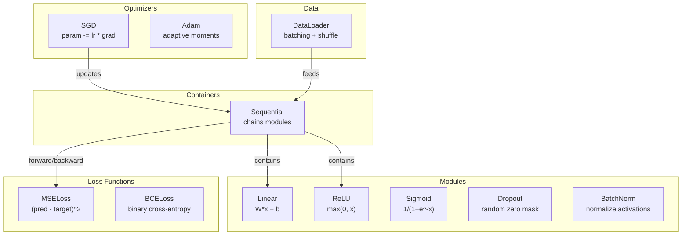
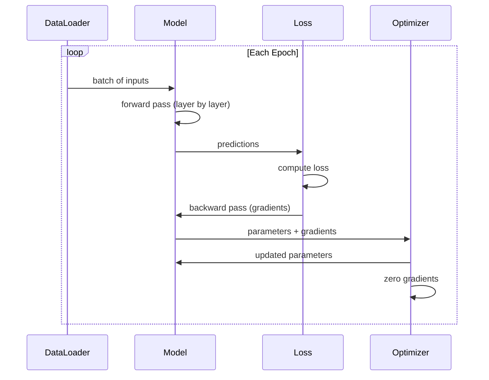
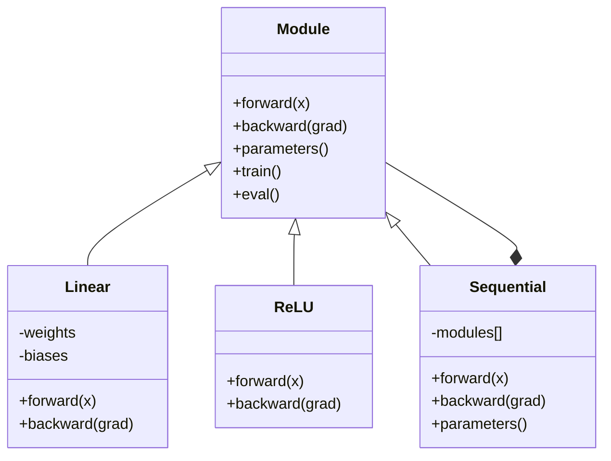

# Build Your Own Mini Framework

> You have built neurons, layers, networks, backprop, activations, loss functions, optimizers, regularization, initialization, and LR schedules. All as separate pieces. Now wire them together into a framework. Not PyTorch. Not TensorFlow. Yours.

**Type:** Build
**Languages:** Python
**Prerequisites:** All of Phase 03 (Lessons 01-09)
**Time:** ~120 minutes

## Learning Objectives

- Build a complete deep learning framework (~500 lines) with Module, Linear, ReLU, Sigmoid, Dropout, BatchNorm, Sequential, loss functions, optimizers, and DataLoader
- Explain the Module abstraction (forward, backward, parameters) and why train/eval mode toggling is necessary
- Wire all components into a working training loop that trains a 4-layer network on circle classification
- Map each component of your framework to its PyTorch equivalent (nn.Module, nn.Sequential, optim.Adam, DataLoader)

## The Problem

You have ten lessons of building blocks scattered across separate files. A `Value` class here, a training loop there, weight initialization in another file, learning rate schedules in yet another. To train a network, you copy-paste from five different lessons and wire them together by hand.

That is what frameworks solve. PyTorch gives you `nn.Module`, `nn.Sequential`, `optim.Adam`, `DataLoader`, and a training loop pattern that ties them together. TensorFlow gives you `keras.Layer`, `keras.Sequential`, `keras.optimizers.Adam`. These are not magic. They are organizational patterns that make it possible to define, train, and evaluate networks without reinventing the plumbing every time.

You are going to build the same thing in ~500 lines of Python. No numpy. No external dependencies. A framework that can define any feedforward network, train it with SGD or Adam, batch the data, apply dropout and batch normalization, use any activation, and schedule the learning rate.

When you finish, you will understand exactly what happens when you write `model = nn.Sequential(...)` in PyTorch. You will understand why `model.train()` and `model.eval()` exist. You will understand why `optimizer.zero_grad()` is a separate call. You will understand all of it, because you built all of it.

## The Concept

### The Module Abstraction

Every layer in PyTorch inherits from `nn.Module`. A Module has three responsibilities:

1. **forward()** -- compute the output given inputs
2. **parameters()** -- return all trainable weights
3. **backward()** -- compute gradients (handled by autograd in PyTorch, explicit in ours)

A Linear layer is a Module. A ReLU activation is a Module. A dropout layer is a Module. A batch normalization layer is a Module. They all have the same interface.

### Sequential Container

`nn.Sequential` chains Modules. Forward pass: feed data through Module 1, then Module 2, then Module 3. Backward pass: reverse the chain. The container itself is a Module -- it has forward(), parameters(), and backward(). This is the composite pattern: a sequence of Modules is itself a Module.

### Training vs Evaluation Mode

Dropout randomly zeroes neurons during training but passes everything through during evaluation. Batch normalization uses batch statistics during training but running averages during evaluation. The `train()` and `eval()` methods toggle this behavior. Every Module has a `training` flag.

### Optimizer

The optimizer updates parameters using their gradients. SGD: `param -= lr * grad`. Adam: maintains momentum and variance estimates, then updates. The optimizer does not know about the network architecture -- it only sees a flat list of parameters and their gradients.

### DataLoader

Batching matters for two reasons. First, you cannot fit the entire dataset in memory for large problems. Second, mini-batch gradient descent provides noise that helps escape local minima. The DataLoader splits data into batches and optionally shuffles between epochs.

### Framework Architecture



### Training Loop



### Module Hierarchy



## Build It

### Step 1: Module Base Class

The abstract interface that every layer implements.

```python
class Module:
 def __init__(self):
 self.training = True

 def forward(self, x):
 raise NotImplementedError

 def backward(self, grad):
 raise NotImplementedError

 def parameters(self):
 return []

 def train(self):
 self.training = True

 def eval(self):
 self.training = False
```

### Step 2: Linear Layer

The fundamental building block. Stores weights and biases, computes Wx + b forward, and weight/input gradients backward.

```python
import math
import random


class Linear(Module):
 def __init__(self, fan_in, fan_out):
 super().__init__()
 std = math.sqrt(2.0 / fan_in)
 self.weights = [[random.gauss(0, std) for _ in range(fan_in)] for _ in range(fan_out)]
 self.biases = [0.0] * fan_out
 self.weight_grads = [[0.0] * fan_in for _ in range(fan_out)]
 self.bias_grads = [0.0] * fan_out
 self.fan_in = fan_in
 self.fan_out = fan_out
 self.input = None

 def forward(self, x):
 self.input = x
 output = []
 for i in range(self.fan_out):
 val = self.biases[i]
 for j in range(self.fan_in):
 val += self.weights[i][j] * x[j]
 output.append(val)
 return output

 def backward(self, grad):
 input_grad = [0.0] * self.fan_in
 for i in range(self.fan_out):
 self.bias_grads[i] += grad[i]
 for j in range(self.fan_in):
 self.weight_grads[i][j] += grad[i] * self.input[j]
 input_grad[j] += grad[i] * self.weights[i][j]
 return input_grad

 def parameters(self):
 params = []
 for i in range(self.fan_out):
 for j in range(self.fan_in):
 params.append((self.weights, i, j, self.weight_grads))
 params.append((self.biases, i, None, self.bias_grads))
 return params
```

### Step 3: Activation Modules

ReLU, Sigmoid, and Tanh as Modules. Each caches what it needs for the backward pass.

```python
class ReLU(Module):
 def __init__(self):
 super().__init__()
 self.mask = None

 def forward(self, x):
 self.mask = [1.0 if v > 0 else 0.0 for v in x]
 return [max(0.0, v) for v in x]

 def backward(self, grad):
 return [g * m for g, m in zip(grad, self.mask)]


class Sigmoid(Module):
 def __init__(self):
 super().__init__()
 self.output = None

 def forward(self, x):
 self.output = []
 for v in x:
 v = max(-500, min(500, v))
 self.output.append(1.0 / (1.0 + math.exp(-v)))
 return self.output

 def backward(self, grad):
 return [g * o * (1 - o) for g, o in zip(grad, self.output)]


class Tanh(Module):
 def __init__(self):
 super().__init__()
 self.output = None

 def forward(self, x):
 self.output = [math.tanh(v) for v in x]
 return self.output

 def backward(self, grad):
 return [g * (1 - o * o) for g, o in zip(grad, self.output)]
```

### Step 4: Dropout Module

Randomly zeroes elements during training. Scales remaining elements by 1/(1-p) so expected values stay the same. Does nothing during eval.

```python
class Dropout(Module):
 def __init__(self, p=0.5):
 super().__init__()
 self.p = p
 self.mask = None

 def forward(self, x):
 if not self.training:
 return x
 self.mask = [0.0 if random.random() < self.p else 1.0 / (1 - self.p) for _ in x]
 return [v * m for v, m in zip(x, self.mask)]

 def backward(self, grad):
 if self.mask is None:
 return grad
 return [g * m for g, m in zip(grad, self.mask)]
```

### Step 5: BatchNorm Module

Normalizes activations to zero mean and unit variance per feature across the batch. Maintains running statistics for eval mode.

```python
class BatchNorm(Module):
 def __init__(self, size, momentum=0.1, eps=1e-5):
 super().__init__()
 self.size = size
 self.gamma = [1.0] * size
 self.beta = [0.0] * size
 self.gamma_grads = [0.0] * size
 self.beta_grads = [0.0] * size
 self.running_mean = [0.0] * size
 self.running_var = [1.0] * size
 self.momentum = momentum
 self.eps = eps
 self.x_norm = None
 self.std_inv = None
 self.batch_input = None

 def forward_batch(self, batch):
 batch_size = len(batch)
 output_batch = []

 if self.training:
 mean = [0.0] * self.size
 for sample in batch:
 for j in range(self.size):
 mean[j] += sample[j]
 mean = [m / batch_size for m in mean]

 var = [0.0] * self.size
 for sample in batch:
 for j in range(self.size):
 var[j] += (sample[j] - mean[j]) ** 2
 var = [v / batch_size for v in var]

 self.std_inv = [1.0 / math.sqrt(v + self.eps) for v in var]

 self.x_norm = []
 self.batch_input = batch
 for sample in batch:
 normed = [(sample[j] - mean[j]) * self.std_inv[j] for j in range(self.size)]
 self.x_norm.append(normed)
 output = [self.gamma[j] * normed[j] + self.beta[j] for j in range(self.size)]
 output_batch.append(output)

 for j in range(self.size):
 self.running_mean[j] = (1 - self.momentum) * self.running_mean[j] + self.momentum * mean[j]
 self.running_var[j] = (1 - self.momentum) * self.running_var[j] + self.momentum * var[j]
 else:
 std_inv = [1.0 / math.sqrt(v + self.eps) for v in self.running_var]
 for sample in batch:
 normed = [(sample[j] - self.running_mean[j]) * std_inv[j] for j in range(self.size)]
 output = [self.gamma[j] * normed[j] + self.beta[j] for j in range(self.size)]
 output_batch.append(output)

 return output_batch

 def forward(self, x):
 result = self.forward_batch([x])
 return result[0]

 def backward(self, grad):
 if self.x_norm is None:
 return grad
 for j in range(self.size):
 self.gamma_grads[j] += self.x_norm[0][j] * grad[j]
 self.beta_grads[j] += grad[j]
 return [grad[j] * self.gamma[j] * self.std_inv[j] for j in range(self.size)]

 def parameters(self):
 params = []
 for j in range(self.size):
 params.append((self.gamma, j, None, self.gamma_grads))
 params.append((self.beta, j, None, self.beta_grads))
 return params
```

### Step 6: Sequential Container

Chains modules. Forward goes left-to-right, backward goes right-to-left.

```python
class Sequential(Module):
 def __init__(self, *modules):
 super().__init__()
 self.modules = list(modules)

 def forward(self, x):
 for module in self.modules:
 x = module.forward(x)
 return x

 def backward(self, grad):
 for module in reversed(self.modules):
 grad = module.backward(grad)
 return grad

 def parameters(self):
 params = []
 for module in self.modules:
 params.extend(module.parameters())
 return params

 def train(self):
 self.training = True
 for module in self.modules:
 module.train()

 def eval(self):
 self.training = False
 for module in self.modules:
 module.eval()
```

### Step 7: Loss Functions

MSE and Binary Cross-Entropy. Each returns the loss value and provides a backward() that returns the gradient.

```python
class MSELoss:
 def __call__(self, predicted, target):
 self.predicted = predicted
 self.target = target
 n = len(predicted)
 self.loss = sum((p - t) ** 2 for p, t in zip(predicted, target)) / n
 return self.loss

 def backward(self):
 n = len(self.predicted)
 return [2 * (p - t) / n for p, t in zip(self.predicted, self.target)]


class BCELoss:
 def __call__(self, predicted, target):
 self.predicted = predicted
 self.target = target
 eps = 1e-7
 n = len(predicted)
 self.loss = 0
 for p, t in zip(predicted, target):
 p = max(eps, min(1 - eps, p))
 self.loss += -(t * math.log(p) + (1 - t) * math.log(1 - p))
 self.loss /= n
 return self.loss

 def backward(self):
 eps = 1e-7
 n = len(self.predicted)
 grads = []
 for p, t in zip(self.predicted, self.target):
 p = max(eps, min(1 - eps, p))
 grads.append((-t / p + (1 - t) / (1 - p)) / n)
 return grads
```

### Step 8: SGD and Adam Optimizers

Both take a parameter list and update weights using gradients.

```python
class SGD:
 def __init__(self, parameters, lr=0.01):
 self.params = parameters
 self.lr = lr

 def step(self):
 for container, i, j, grad_container in self.params:
 if j is not None:
 container[i][j] -= self.lr * grad_container[i][j]
 else:
 container[i] -= self.lr * grad_container[i]

 def zero_grad(self):
 for container, i, j, grad_container in self.params:
 if j is not None:
 grad_container[i][j] = 0.0
 else:
 grad_container[i] = 0.0


class Adam:
 def __init__(self, parameters, lr=0.001, beta1=0.9, beta2=0.999, eps=1e-8):
 self.params = parameters
 self.lr = lr
 self.beta1 = beta1
 self.beta2 = beta2
 self.eps = eps
 self.t = 0
 self.m = [0.0] * len(parameters)
 self.v = [0.0] * len(parameters)

 def step(self):
 self.t += 1
 for idx, (container, i, j, grad_container) in enumerate(self.params):
 if j is not None:
 g = grad_container[i][j]
 else:
 g = grad_container[i]

 self.m[idx] = self.beta1 * self.m[idx] + (1 - self.beta1) * g
 self.v[idx] = self.beta2 * self.v[idx] + (1 - self.beta2) * g * g

 m_hat = self.m[idx] / (1 - self.beta1 ** self.t)
 v_hat = self.v[idx] / (1 - self.beta2 ** self.t)

 update = self.lr * m_hat / (math.sqrt(v_hat) + self.eps)

 if j is not None:
 container[i][j] -= update
 else:
 container[i] -= update

 def zero_grad(self):
 for container, i, j, grad_container in self.params:
 if j is not None:
 grad_container[i][j] = 0.0
 else:
 grad_container[i] = 0.0
```

### Step 9: DataLoader

Splits data into batches, optionally shuffles each epoch.

```python
class DataLoader:
 def __init__(self, data, batch_size=32, shuffle=True):
 self.data = data
 self.batch_size = batch_size
 self.shuffle = shuffle

 def __iter__(self):
 indices = list(range(len(self.data)))
 if self.shuffle:
 random.shuffle(indices)
 for start in range(0, len(indices), self.batch_size):
 batch_indices = indices[start:start + self.batch_size]
 batch = [self.data[i] for i in batch_indices]
 inputs = [item[0] for item in batch]
 targets = [item[1] for item in batch]
 yield inputs, targets

 def __len__(self):
 return (len(self.data) + self.batch_size - 1) // self.batch_size
```

### Step 10: Train a 4-Layer Network on Circle Classification

Wire everything together. Define a model, pick a loss, pick an optimizer, run the training loop.

```python
def make_circle_data(n=500, seed=42):
 random.seed(seed)
 data = []
 for _ in range(n):
 x = random.uniform(-2, 2)
 y = random.uniform(-2, 2)
 label = 1.0 if x * x + y * y < 1.5 else 0.0
 data.append(([x, y], [label]))
 return data


def train():
 random.seed(42)

 model = Sequential(
 Linear(2, 16),
 ReLU(),
 Linear(16, 16),
 ReLU(),
 Linear(16, 8),
 ReLU(),
 Linear(8, 1),
 Sigmoid(),
 )

 criterion = BCELoss()
 optimizer = Adam(model.parameters(), lr=0.01)

 data = make_circle_data(500)
 split = int(len(data) * 0.8)
 train_data = data[:split]
 test_data = data[split:]

 loader = DataLoader(train_data, batch_size=16, shuffle=True)

 model.train()

 for epoch in range(100):
 total_loss = 0
 total_correct = 0
 total_samples = 0

 for batch_inputs, batch_targets in loader:
 batch_loss = 0
 for x, t in zip(batch_inputs, batch_targets):
 pred = model.forward(x)
 loss = criterion(pred, t)
 batch_loss += loss

 optimizer.zero_grad()
 grad = criterion.backward()
 model.backward(grad)
 optimizer.step()

 predicted_class = 1.0 if pred[0] >= 0.5 else 0.0
 if predicted_class == t[0]:
 total_correct += 1
 total_samples += 1

 total_loss += batch_loss

 avg_loss = total_loss / total_samples
 accuracy = total_correct / total_samples * 100

 if epoch % 10 == 0 or epoch == 99:
 print(f"Epoch {epoch:3d} | Loss: {avg_loss:.6f} | Train Accuracy: {accuracy:.1f}%")

 model.eval()
 correct = 0
 for x, t in test_data:
 pred = model.forward(x)
 predicted_class = 1.0 if pred[0] >= 0.5 else 0.0
 if predicted_class == t[0]:
 correct += 1
 test_accuracy = correct / len(test_data) * 100
 print(f"\nTest Accuracy: {test_accuracy:.1f}% ({correct}/{len(test_data)})")

 return model, test_accuracy
```

## Use It

Here is the PyTorch equivalent of what you just built:

```python
import torch
import torch.nn as nn
from torch.utils.data import DataLoader, TensorDataset

model = nn.Sequential(
 nn.Linear(2, 16),
 nn.ReLU(),
 nn.Linear(16, 16),
 nn.ReLU(),
 nn.Linear(16, 8),
 nn.ReLU(),
 nn.Linear(8, 1),
 nn.Sigmoid(),
)

criterion = nn.BCELoss()
optimizer = torch.optim.Adam(model.parameters(), lr=0.01)

for epoch in range(100):
 model.train()
 for inputs, targets in dataloader:
 optimizer.zero_grad()
 predictions = model(inputs)
 loss = criterion(predictions, targets)
 loss.backward()
 optimizer.step()

 model.eval()
 with torch.no_grad():
 test_predictions = model(test_inputs)
```

The structure is identical. `Sequential`, `Linear`, `ReLU`, `Sigmoid`, `BCELoss`, `Adam`, `zero_grad`, `backward`, `step`, `train`, `eval`. Every concept maps one-to-one. The difference is that PyTorch handles autograd automatically (no need to implement backward() in each module), runs on GPU, and has been optimized for years. But the bones are the same.

Now when you see PyTorch code, you know exactly what is happening at every line. That understanding is the whole point.

## Ship It

This lesson produces:
- `outputs/prompt-framework-architect.md` -- a prompt for designing neural network architectures using framework abstractions

## Exercises

1. Add a `SoftmaxCrossEntropyLoss` class for multi-class classification. Softmax the predictions, compute cross-entropy loss, and handle the combined backward pass. Test it on a 3-class spiral dataset.

2. Implement learning rate scheduling in the optimizer: add a `set_lr()` method and wire in the cosine schedule from Lesson 09. Train the circle classifier with warmup + cosine and compare to constant LR.

3. Add a `save()` and `load()` method to Sequential that serializes all weights to a JSON file and loads them back. Verify that a loaded model produces the same predictions as the original.

4. Implement weight decay (L2 regularization) in the Adam optimizer. Add a `weight_decay` parameter that shrinks weights toward zero each step. Compare training with decay=0 vs decay=0.01.

5. Replace the per-sample training loop with proper mini-batch gradient accumulation: accumulate gradients across all samples in a batch, then divide by batch size and take one optimizer step. Measure whether this changes convergence speed.

## Key Terms

| Term | What people say | What it actually means |
|------|----------------|----------------------|
| Module | "A layer" | The base abstraction in a framework -- anything with forward(), backward(), and parameters() |
| Sequential | "Stack layers in order" | A container that chains modules, applying them in sequence for forward and reverse for backward |
| Forward pass | "Run the network" | Computing the output by passing input through each module in order |
| Backward pass | "Compute gradients" | Propagating the loss gradient through each module in reverse to compute parameter gradients |
| Parameters | "The trainable weights" | All values in the network that the optimizer can update -- weights and biases |
| Optimizer | "The thing that updates weights" | An algorithm that uses gradients to update parameters, implementing SGD, Adam, or other rules |
| DataLoader | "The thing that feeds data" | An iterator that splits a dataset into batches, optionally shuffling between epochs |
| Training mode | "model.train()" | A flag that enables stochastic behavior like dropout and batch normalization with batch stats |
| Evaluation mode | "model.eval()" | A flag that disables dropout and uses running statistics for batch normalization |
| Zero grad | "Clear the gradients" | Resetting all parameter gradients to zero before computing the next batch's gradients |

## Further Reading

- Paszke et al., "PyTorch: An Imperative Style, High-Performance Deep Learning Library" (2019) -- the paper describing PyTorch's design decisions
- Chollet, "Deep Learning with Python, Second Edition" (2021) -- Chapter 3 covers Keras internals with the same module/layer abstraction
- Johnson, "Tiny-DNN" (https://github.com/tiny-dnn/tiny-dnn) -- a header-only C++ deep learning framework for understanding framework internals
