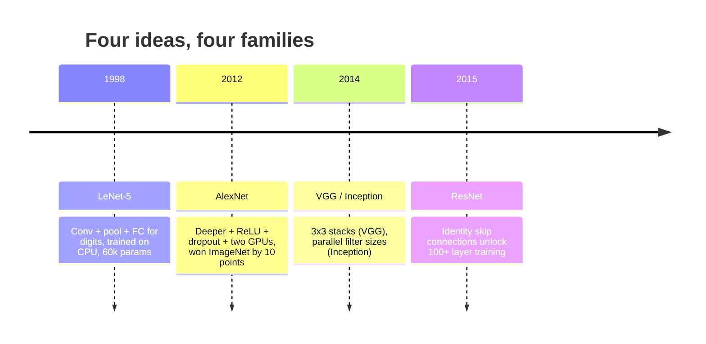
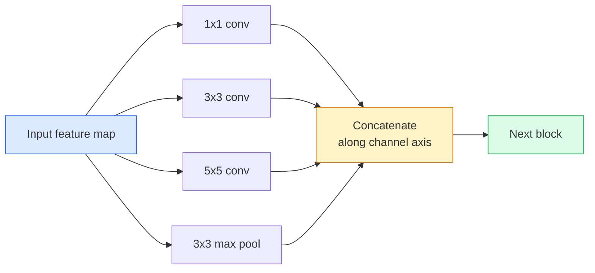
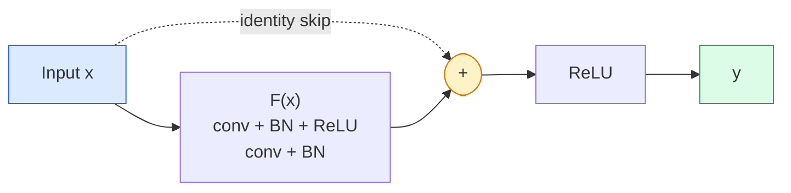

# CNNs — LeNet to ResNet

> Every major CNN of the last thirty years is the same conv–nonlinearity–downsample recipe with one new idea bolted on. Learn the ideas in order.

**Type:** Learn + Build
**Languages:** Python
**Prerequisites:** Phase 3 Lesson 11 (PyTorch), Phase 4 Lesson 01 (Image Fundamentals), Phase 4 Lesson 02 (Convolutions from Scratch)
**Time:** ~75 minutes

## Learning Objectives

- Trace the architectural lineage LeNet-5 -> AlexNet -> VGG -> Inception -> ResNet and state the single new idea each family contributed
- Implement LeNet-5, a VGG-style block, and a ResNet BasicBlock in PyTorch, each under 40 lines
- Explain why residual connections turn a 1,000-layer network from untrainable into state-of-the-art
- Read a modern backbone (ResNet-18, ResNet-50) and predict its output shape, receptive field, and parameter count before looking at the source

## The Problem

In 2011, the best ImageNet classifier scored around 74% top-5 accuracy. In 2012 AlexNet scored 85%. In 2015 ResNet scored 96%. No new data. No new GPU generation. The gains came from architecture ideas. A working vision engineer has to know which idea came from which paper because every production backbone you ship in 2026 is a recombination of those same pieces — and because the ideas keep transferring: grouped convs went from CNNs to transformers, residual connections went from ResNet to every LLM in existence, batch normalisation lives in diffusion models.

Studying these networks in order also immunises you against a common mistake: reaching for the biggest available model when a LeNet-sized network would solve the problem. MNIST does not need a ResNet. Knowing the scaling curve of each family tells you where to sit on it.

## The Concept

### The four ideas that changed vision



Nothing else in classical vision mattered as much as these four jumps.

### LeNet-5 (1998)

Yann LeCun's digit recogniser. 60,000 parameters. Two conv-pool blocks, two fully connected layers, tanh activations. It defined the template every CNN inherits:

```
input (1, 32, 32)
 conv 5x5 -> (6, 28, 28)
 avg pool 2x2 -> (6, 14, 14)
 conv 5x5 -> (16, 10, 10)
 avg pool 2x2 -> (16, 5, 5)
 flatten -> 400
 dense -> 120
 dense -> 84
 dense -> 10
```

Everything the modern world calls a CNN — alternating convolutions and downsampling feeding a small classifier head — is LeNet with more layers, bigger channels, and better activations.

### AlexNet (2012)

Three changes that together broke ImageNet:

1. **ReLU** instead of tanh. Gradients stop vanishing. Training speeds up by a factor of six.
2. **Dropout** in the fully connected head. Regularisation becomes a layer, not a trick.
3. **Depth and width**. Five conv layers, three dense layers, 60M parameters, trained on two GPUs with the model split across them.

The paper's Figure 2 still shows the GPU split as two parallel streams. That parallelism was a hardware workaround, not an architectural insight — but the three ideas above are still in every model you use.

### VGG (2014)

VGG asked: what happens if you only use 3x3 convolutions and you go deep?

```
stack: conv 3x3 -> conv 3x3 -> pool 2x2
repeat: 16 or 19 conv layers
```

Two 3x3 convs see the same 5x5 input area as one 5x5 conv but with fewer parameters (2*9*C^2 = 18C^2 vs 25*C^2) and an extra ReLU in between. VGG turned this observation into an entire architecture. The simplicity — one block type, repeated — made it the reference point for everything that came after.

Cost: 138M parameters, slow to train, expensive at inference.

### Inception (2014, same year)

Google's answer to "what kernel size should I use?" was: all of them, in parallel.



Each branch specialises — 1x1 for channel mixing, 3x3 for local texture, 5x5 for larger patterns, pooling for shift-invariant features — and the concat lets the next layer pick whichever branch is useful. Inception v1 used 1x1 convolutions inside each branch as a bottleneck to keep parameter counts sane.

### The degradation problem

By 2015, VGG-19 worked and VGG-32 did not. Depth was supposed to help, but past ~20 layers both training and test loss got worse. That is not overfitting. That is the optimiser failing to find useful weights because gradients shrink multiplicatively through every layer.

```
Plain deep network:
 y = f_L( f_{L-1}(... f_1(x)... ) )

Gradient wrt early layer:
 dL/dW_1 = dL/dy * df_L/df_{L-1} *... * df_2/df_1 * df_1/dW_1

Each multiplicative term has magnitude roughly (weight magnitude) * (activation gain).
Stack 100 of them with gains < 1 and the gradient is effectively zero.
```

VGG worked at 19 layers because batch norm (published simultaneously) kept activations well-scaled. But even batch norm could not rescue depth beyond 30-ish layers.

### ResNet (2015)

He, Zhang, Ren, Sun proposed one change that fixed everything:

```
standard block: y = F(x)
residual block: y = F(x) + x
```

The `+ x` means the layer can always choose to do nothing by driving `F(x)` to zero. A 1,000-layer ResNet is now at most as bad as a 1-layer network, because every extra block has a trivial escape hatch. With that guarantee, the optimiser is willing to make every block *slightly* useful — and slightly useful, stacked 100 times, is state-of-the-art.



Two variants of the block show up everywhere:

- **BasicBlock** (ResNet-18, ResNet-34): two 3x3 convs, skip around both.
- **Bottleneck** (ResNet-50, -101, -152): 1x1 down, 3x3 middle, 1x1 up, skip around the trio. Cheaper when channel counts are high.

When the skip has to cross a downsample (stride=2), the identity path is replaced with a 1x1 stride=2 conv to match shapes.

### Why residuals matter beyond vision

The idea was not really about image classification. It was about turning deep networks from "cross-your-fingers and hope gradients survive" into a reliable, scalable engineering tool. Every transformer you will read about next phase has the exact same skip connection in every block. Without ResNet, there is no GPT.

## Build It

### Step 1: LeNet-5

A minimal, faithful LeNet. Tanh activations, average pooling. The only concession to modernity is that we use `nn.CrossEntropyLoss` downstream instead of the original Gaussian connections.

```python
import torch
import torch.nn as nn
import torch.nn.functional as F

class LeNet5(nn.Module):
 def __init__(self, num_classes=10):
 super().__init__()
 self.conv1 = nn.Conv2d(1, 6, kernel_size=5)
 self.conv2 = nn.Conv2d(6, 16, kernel_size=5)
 self.pool = nn.AvgPool2d(2)
 self.fc1 = nn.Linear(16 * 5 * 5, 120)
 self.fc2 = nn.Linear(120, 84)
 self.fc3 = nn.Linear(84, num_classes)

 def forward(self, x):
 x = self.pool(torch.tanh(self.conv1(x)))
 x = self.pool(torch.tanh(self.conv2(x)))
 x = torch.flatten(x, 1)
 x = torch.tanh(self.fc1(x))
 x = torch.tanh(self.fc2(x))
 return self.fc3(x)

net = LeNet5()
x = torch.randn(1, 1, 32, 32)
print(f"output: {net(x).shape}")
print(f"params: {sum(p.numel() for p in net.parameters()):,}")
```

Expected output: `output: torch.Size([1, 10])`, `params: 61,706`. That is the entire digit classifier that started modern vision.

### Step 2: A VGG block

One reusable block: two 3x3 convs, ReLU, batch norm, max pool.

```python
class VGGBlock(nn.Module):
 def __init__(self, in_c, out_c):
 super().__init__()
 self.conv1 = nn.Conv2d(in_c, out_c, kernel_size=3, padding=1)
 self.bn1 = nn.BatchNorm2d(out_c)
 self.conv2 = nn.Conv2d(out_c, out_c, kernel_size=3, padding=1)
 self.bn2 = nn.BatchNorm2d(out_c)
 self.pool = nn.MaxPool2d(2)

 def forward(self, x):
 x = F.relu(self.bn1(self.conv1(x)))
 x = F.relu(self.bn2(self.conv2(x)))
 return self.pool(x)

class MiniVGG(nn.Module):
 def __init__(self, num_classes=10):
 super().__init__()
 self.stack = nn.Sequential(
 VGGBlock(3, 32),
 VGGBlock(32, 64),
 VGGBlock(64, 128),
 )
 self.head = nn.Sequential(
 nn.AdaptiveAvgPool2d(1),
 nn.Flatten(),
 nn.Linear(128, num_classes),
 )

 def forward(self, x):
 return self.head(self.stack(x))

net = MiniVGG()
x = torch.randn(1, 3, 32, 32)
print(f"output: {net(x).shape}")
print(f"params: {sum(p.numel() for p in net.parameters()):,}")
```

Three VGG blocks on CIFAR-sized input, an adaptive pool, one linear layer. ~290k parameters. Plenty for CIFAR-10.

### Step 3: A ResNet BasicBlock

The core building block of ResNet-18 and ResNet-34.

```python
class BasicBlock(nn.Module):
 def __init__(self, in_c, out_c, stride=1):
 super().__init__()
 self.conv1 = nn.Conv2d(in_c, out_c, kernel_size=3, stride=stride, padding=1, bias=False)
 self.bn1 = nn.BatchNorm2d(out_c)
 self.conv2 = nn.Conv2d(out_c, out_c, kernel_size=3, stride=1, padding=1, bias=False)
 self.bn2 = nn.BatchNorm2d(out_c)
 if stride != 1 or in_c != out_c:
 self.shortcut = nn.Sequential(
 nn.Conv2d(in_c, out_c, kernel_size=1, stride=stride, bias=False),
 nn.BatchNorm2d(out_c),
 )
 else:
 self.shortcut = nn.Identity()

 def forward(self, x):
 out = F.relu(self.bn1(self.conv1(x)))
 out = self.bn2(self.conv2(out))
 out = out + self.shortcut(x)
 return F.relu(out)
```

`bias=False` on conv layers is a batch-norm convention — BN's beta parameter already handles the bias, so carrying conv bias as well is a waste. The `shortcut` only needs a real conv when stride or channel count changes; otherwise it is a no-op identity.

### Step 4: A tiny ResNet

Stack four groups of BasicBlocks to get a working ResNet for CIFAR-sized inputs.

```python
class TinyResNet(nn.Module):
 def __init__(self, num_classes=10):
 super().__init__()
 self.stem = nn.Sequential(
 nn.Conv2d(3, 32, kernel_size=3, stride=1, padding=1, bias=False),
 nn.BatchNorm2d(32),
 nn.ReLU(inplace=True),
 )
 self.layer1 = self._make_group(32, 32, num_blocks=2, stride=1)
 self.layer2 = self._make_group(32, 64, num_blocks=2, stride=2)
 self.layer3 = self._make_group(64, 128, num_blocks=2, stride=2)
 self.layer4 = self._make_group(128, 256, num_blocks=2, stride=2)
 self.head = nn.Sequential(
 nn.AdaptiveAvgPool2d(1),
 nn.Flatten(),
 nn.Linear(256, num_classes),
 )

 def _make_group(self, in_c, out_c, num_blocks, stride):
 blocks = [BasicBlock(in_c, out_c, stride=stride)]
 for _ in range(num_blocks - 1):
 blocks.append(BasicBlock(out_c, out_c, stride=1))
 return nn.Sequential(*blocks)

 def forward(self, x):
 x = self.stem(x)
 x = self.layer1(x)
 x = self.layer2(x)
 x = self.layer3(x)
 x = self.layer4(x)
 return self.head(x)

net = TinyResNet()
x = torch.randn(1, 3, 32, 32)
print(f"output: {net(x).shape}")
print(f"params: {sum(p.numel() for p in net.parameters()):,}")
```

Four groups of two blocks each. Stride 2 at the start of groups 2, 3, 4. Channel count doubles at every downsample. Roughly 2.8M parameters. That is the standard recipe that scales cleanly up to ResNet-152.

### Step 5: Compare parameter-to-feature efficiency

Run the same input through all three networks and compare parameter counts.

```python
def summary(name, net, x):
 y = net(x)
 params = sum(p.numel() for p in net.parameters())
 print(f"{name:12s} input {tuple(x.shape)} -> output {tuple(y.shape)} params {params:>10,}")

x = torch.randn(1, 3, 32, 32)
summary("LeNet5", LeNet5(), torch.randn(1, 1, 32, 32))
summary("MiniVGG", MiniVGG(), x)
summary("TinyResNet", TinyResNet(), x)
```

Three models, three eras, three orders of magnitude in parameter count. For CIFAR-10 accuracy, you need roughly: LeNet 60%, MiniVGG 89%, TinyResNet 93% after a few epochs of training.

## Use It

`torchvision.models` gives you pretrained versions of all of the above. The call signature is identical across families, which is exactly the point of the backbone abstraction.

```python
from torchvision.models import resnet18, ResNet18_Weights, vgg16, VGG16_Weights

r18 = resnet18(weights=ResNet18_Weights.IMAGENET1K_V1)
r18.eval()

print(f"ResNet-18 params: {sum(p.numel() for p in r18.parameters()):,}")
print(r18.layer1[0])
print()

v16 = vgg16(weights=VGG16_Weights.IMAGENET1K_V1)
v16.eval()
print(f"VGG-16 params: {sum(p.numel() for p in v16.parameters()):,}")
```

ResNet-18 has 11.7M parameters. VGG-16 has 138M. Similar ImageNet top-1 accuracy (69.8% vs 71.6%). Residual connections buy you a 12x parameter efficiency win. That is why ResNet variants dominated from 2016 until ViT arrived in 2021 — and still dominate real-world deployments where compute is the constraint.

For transfer learning, the recipe is always the same: load pretrained, freeze the backbone, replace the classifier head.

```python
for p in r18.parameters():
 p.requires_grad = False
r18.fc = nn.Linear(r18.fc.in_features, 10)
```

Three lines. You now have a 10-class CIFAR classifier that inherits the representations ImageNet paid for.

## Ship It

This lesson produces:

- `outputs/prompt-backbone-selector.md` — a prompt that picks the right CNN family (LeNet/VGG/ResNet/MobileNet/ConvNeXt) given task, dataset size, and compute budget.
- `outputs/skill-residual-block-reviewer.md` — a skill that reads a PyTorch module and flags skip-connection mistakes (missing shortcut on stride change, shortcut activation order, BN placement relative to addition).

## Exercises

1. **(Easy)** Count parameters by hand for `TinyResNet` layer by layer. Compare against `sum(p.numel() for p in net.parameters())`. Where does the majority of the parameter budget go — convs, BN, or the classifier head?
2. **(Medium)** Implement the Bottleneck block (1x1 -> 3x3 -> 1x1 with skip) and use it to build a ResNet-50-style network for CIFAR. Compare params against `TinyResNet`.
3. **(Hard)** Remove the skip connection from `BasicBlock`, train a 34-block "plain" network and a 34-block ResNet on CIFAR-10 for 10 epochs each. Plot training loss vs epoch for both. Reproduce the He et al. Figure 1 result where the plain deep network converges to higher loss than its shallower twin.

## Key Terms

| Term | What people say | What it actually means |
|------|----------------|----------------------|
| Backbone | "The model" | The stack of convolutional blocks that produces the feature map fed to the task head |
| Residual connection | "Skip connection" | `y = F(x) + x`; lets the optimiser learn identity by setting F to zero, which makes arbitrary depth trainable |
| BasicBlock | "Two 3x3 convs with a skip" | The ResNet-18/34 building block: conv-BN-ReLU-conv-BN-add-ReLU |
| Bottleneck | "1x1 down, 3x3, 1x1 up" | The ResNet-50/101/152 block; cheap at high channel counts because the 3x3 runs on a reduced width |
| Degradation problem | "Deeper is worse" | Past ~20 plain conv layers, both training and test error increase; solved by residual connections, not by more data |
| Stem | "The first layer" | The initial conv that converts 3-channel input into the base feature width; usually 7x7 stride 2 for ImageNet, 3x3 stride 1 for CIFAR |
| Head | "The classifier" | The layers after the final backbone block: adaptive pool, flatten, linear(s) |
| Transfer learning | "Pretrained weights" | Loading a backbone trained on ImageNet and fine-tuning only the head on your task |

## Further Reading

- [Deep Residual Learning for Image Recognition (He et al., 2015)](https://arxiv.org/abs/1512.03385) — the ResNet paper; every figure is worth studying
- [Very Deep Convolutional Networks (Simonyan & Zisserman, 2014)](https://arxiv.org/abs/1409.1556) — the VGG paper; still the best reference for "why 3x3"
- [ImageNet Classification with Deep CNNs (Krizhevsky et al., 2012)](https://papers.nips.cc/paper_files/paper/2012/hash/c399862d3b9d6b76c8436e924a68c45b-Abstract.html) — AlexNet; the paper that ended the hand-crafted-feature era
- [Going Deeper with Convolutions (Szegedy et al., 2014)](https://arxiv.org/abs/1409.4842) — Inception v1; the parallel-filter idea that still shows up in vision transformers
