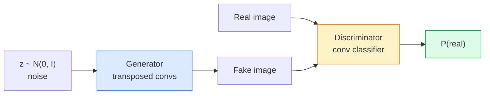
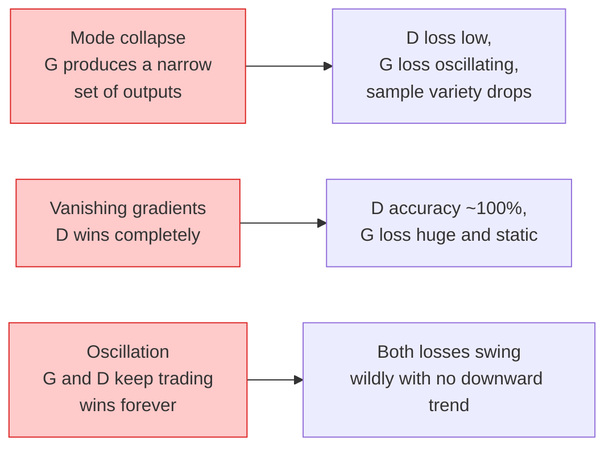

# Image Generation — GANs

> A GAN is two neural networks in a fixed game. One draws, one critiques. They get better together until the drawings fool the critic.

**Type:** Build
**Languages:** Python
**Prerequisites:** Phase 4 Lesson 03 (CNNs), Phase 3 Lesson 06 (Optimizers), Phase 3 Lesson 07 (Regularization)
**Time:** ~75 minutes

## Learning Objectives

- Explain the minimax game between generator and discriminator and why the equilibrium corresponds to p_model = p_data
- Implement a DCGAN in PyTorch and get it to generate coherent 32x32 synthetic images in under 60 lines
- Stabilise GAN training with the three standard tricks: non-saturating loss, spectral norm, TTUR (two-timescale update rule)
- Read training curves that distinguish healthy convergence from mode collapse, oscillation, and discriminator-wins-completely

## The Problem

Classification teaches a network to map images to labels. Generation inverts the problem: sample new images that look like they came from the same distribution. There is no "correct" output you can diff against; there is only a distribution you want to mimic.

The standard loss functions (MSE, cross-entropy) cannot measure "did this sample come from the real distribution." Minimising per-pixel error produces blurry averages, not realistic samples. The breakthrough was to learn the loss: train a second network whose job is to tell real from fake, and use its judgement to push the generator.

GANs (Goodfellow et al., 2014) defined that framework. By 2018 StyleGAN was producing 1024x1024 faces indistinguishable from photographs. Diffusion models have since taken the throne on quality and controllability, but every trick that makes diffusion practical — normalisation choices, latent spaces, feature losses — was first understood on GANs.

## The Concept

### The two networks



The **generator** G takes a vector of noise `z` and outputs an image. The **discriminator** D takes an image and outputs a single scalar: the probability that the image is real.

### The game

G wants D to be wrong. D wants to be right. Formally:

```
min_G max_D E_x[log D(x)] + E_z[log(1 - D(G(z)))]
```

Read right to left: D is maximising accuracy on real (`log D(real)`) and fake (`log (1 - D(fake))`) images. G is minimising D's accuracy on fakes — it wants `D(G(z))` to be high.

Goodfellow proved that this minimax has a global equilibrium where `p_G = p_data`, D outputs 0.5 everywhere, and the Jensen-Shannon divergence between generated and real distributions is zero. The hard part is getting there.

### Non-saturating loss

The form above is numerically unstable. Early in training, `D(G(z))` is near zero for every fake, so `log(1 - D(G(z)))` has vanishing gradients with respect to G. The fix: flip G's loss.

```
L_D = -E_x[log D(x)] - E_z[log(1 - D(G(z)))]
L_G = -E_z[log D(G(z))] # non-saturating
```

Now when `D(G(z))` is near zero, G's loss is large and its gradient is informative. Every modern GAN trains with this variant.

### DCGAN architecture rules

Radford, Metz, Chintala (2015) distilled years of failed experiments into five rules that make GAN training stable:

1. Replace pooling with strided convs (both nets).
2. Use batch norm in both generator and discriminator, except output of G and input of D.
3. Remove fully connected layers on deeper architectures.
4. G uses ReLU on all layers except output (tanh for output in [-1, 1]).
5. D uses LeakyReLU (negative_slope=0.2) on all layers.

Every modern conv-based GAN (StyleGAN, BigGAN, GigaGAN) still starts from these rules and replaces pieces one at a time.

### Failure modes and their signatures



- **Mode collapse**: G finds one image that fools D and produces only that. Fix: add minibatch discrimination, spectral norm, or label-conditioning.
- **Discriminator wins**: D becomes too strong too fast, G's gradients vanish. Fix: smaller D, lower D learning rate, or apply label smoothing on the real labels.
- **Oscillation**: the two nets trade wins without ever approaching equilibrium. Fix: TTUR (D learns faster than G by a factor of 2-4), or switch to Wasserstein loss.

### Evaluation

GANs have no ground truth, so how do you know they are working?

- **Sample inspection** — just look at 64 samples at the end of every epoch. Non-negotiable.
- **FID (Fréchet Inception Distance)** — distance between Inception-v3 feature distributions of real and generated sets. Lower is better. Community standard.
- **Inception Score** — older, more brittle; prefer FID.
- **Precision/Recall for generative models** — measures quality (precision) and coverage (recall) separately. More informative than FID alone.

For a small synthetic-data run, sample inspection is enough.

## Build It

### Step 1: Generator

A small DCGAN generator that takes 64-dim noise and produces a 32x32 image.

```python
import torch
import torch.nn as nn

class Generator(nn.Module):
 def __init__(self, z_dim=64, img_channels=3, feat=64):
 super().__init__()
 self.net = nn.Sequential(
 nn.ConvTranspose2d(z_dim, feat * 4, kernel_size=4, stride=1, padding=0, bias=False),
 nn.BatchNorm2d(feat * 4),
 nn.ReLU(inplace=True),
 nn.ConvTranspose2d(feat * 4, feat * 2, kernel_size=4, stride=2, padding=1, bias=False),
 nn.BatchNorm2d(feat * 2),
 nn.ReLU(inplace=True),
 nn.ConvTranspose2d(feat * 2, feat, kernel_size=4, stride=2, padding=1, bias=False),
 nn.BatchNorm2d(feat),
 nn.ReLU(inplace=True),
 nn.ConvTranspose2d(feat, img_channels, kernel_size=4, stride=2, padding=1, bias=False),
 nn.Tanh(),
 )

 def forward(self, z):
 return self.net(z.view(z.size(0), -1, 1, 1))
```

Four transposed convs, each with `kernel_size=4, stride=2, padding=1` so they cleanly double spatial size. Output activations in [-1, 1] via tanh.

### Step 2: Discriminator

Mirror of the generator. LeakyReLU, strided convs, ends with a scalar logit.

```python
class Discriminator(nn.Module):
 def __init__(self, img_channels=3, feat=64):
 super().__init__()
 self.net = nn.Sequential(
 nn.Conv2d(img_channels, feat, kernel_size=4, stride=2, padding=1),
 nn.LeakyReLU(0.2, inplace=True),
 nn.Conv2d(feat, feat * 2, kernel_size=4, stride=2, padding=1, bias=False),
 nn.BatchNorm2d(feat * 2),
 nn.LeakyReLU(0.2, inplace=True),
 nn.Conv2d(feat * 2, feat * 4, kernel_size=4, stride=2, padding=1, bias=False),
 nn.BatchNorm2d(feat * 4),
 nn.LeakyReLU(0.2, inplace=True),
 nn.Conv2d(feat * 4, 1, kernel_size=4, stride=1, padding=0),
 )

 def forward(self, x):
 return self.net(x).view(-1)
```

The last conv reduces a `4x4` feature map to `1x1`. Output is a single scalar per image; apply sigmoid only during loss computation.

### Step 3: Training step

Alternate: update D once, then G once, every batch.

```python
import torch.nn.functional as F

def train_step(G, D, real, z, opt_g, opt_d, device):
 real = real.to(device)
 bs = real.size(0)

 # D step
 opt_d.zero_grad()
 d_real = D(real)
 d_fake = D(G(z).detach())
 loss_d = (F.binary_cross_entropy_with_logits(d_real, torch.ones_like(d_real))
 + F.binary_cross_entropy_with_logits(d_fake, torch.zeros_like(d_fake)))
 loss_d.backward()
 opt_d.step()

 # G step
 opt_g.zero_grad()
 d_fake = D(G(z))
 loss_g = F.binary_cross_entropy_with_logits(d_fake, torch.ones_like(d_fake))
 loss_g.backward()
 opt_g.step()

 return loss_d.item(), loss_g.item()
```

`G(z).detach()` in the D step is critical: we do not want gradients flowing into G during its update. Forgetting that is the classic beginner bug.

### Step 4: Full training loop on synthetic shapes

```python
from torch.utils.data import DataLoader, TensorDataset
import numpy as np

def synthetic_images(num=2000, size=32, seed=0):
 rng = np.random.default_rng(seed)
 imgs = np.zeros((num, 3, size, size), dtype=np.float32) - 1.0
 for i in range(num):
 r = rng.uniform(6, 12)
 cx, cy = rng.uniform(r, size - r, size=2)
 yy, xx = np.meshgrid(np.arange(size), np.arange(size), indexing="ij")
 mask = (xx - cx) ** 2 + (yy - cy) ** 2 < r ** 2
 color = rng.uniform(-0.5, 1.0, size=3)
 for c in range(3):
 imgs[i, c][mask] = color[c]
 return torch.from_numpy(imgs)

device = "cuda" if torch.cuda.is_available() else "cpu"
data = synthetic_images()
loader = DataLoader(TensorDataset(data), batch_size=64, shuffle=True)

G = Generator(z_dim=64, img_channels=3, feat=32).to(device)
D = Discriminator(img_channels=3, feat=32).to(device)
opt_g = torch.optim.Adam(G.parameters(), lr=2e-4, betas=(0.5, 0.999))
opt_d = torch.optim.Adam(D.parameters(), lr=2e-4, betas=(0.5, 0.999))

for epoch in range(10):
 for (batch,) in loader:
 z = torch.randn(batch.size(0), 64, device=device)
 ld, lg = train_step(G, D, batch, z, opt_g, opt_d, device)
 print(f"epoch {epoch} D {ld:.3f} G {lg:.3f}")
```

`Adam(lr=2e-4, betas=(0.5, 0.999))` is the DCGAN default — the low beta1 keeps the momentum term from stabilising the adversarial game too much.

### Step 5: Sampling

```python
@torch.no_grad()
def sample(G, n=16, z_dim=64, device="cpu"):
 G.eval()
 z = torch.randn(n, z_dim, device=device)
 imgs = G(z)
 imgs = (imgs + 1) / 2
 return imgs.clamp(0, 1)
```

Always switch to eval mode before sampling. For DCGAN this matters because batch norm running stats are used instead of the batch's stats.

### Step 6: Spectral normalisation

A drop-in replacement for BN in the discriminator that guarantees the network is 1-Lipschitz. Fixes most "D wins too hard" failures.

```python
from torch.nn.utils import spectral_norm

def build_sn_discriminator(img_channels=3, feat=64):
 return nn.Sequential(
 spectral_norm(nn.Conv2d(img_channels, feat, 4, 2, 1)),
 nn.LeakyReLU(0.2, inplace=True),
 spectral_norm(nn.Conv2d(feat, feat * 2, 4, 2, 1)),
 nn.LeakyReLU(0.2, inplace=True),
 spectral_norm(nn.Conv2d(feat * 2, feat * 4, 4, 2, 1)),
 nn.LeakyReLU(0.2, inplace=True),
 spectral_norm(nn.Conv2d(feat * 4, 1, 4, 1, 0)),
 )
```

Swap `Discriminator` for `build_sn_discriminator()` and you often do not need the TTUR trick. Spectral norm is the easiest single robustness upgrade you can apply.

## Use It

For serious generation, use pretrained weights or switch to diffusion. Two standard libraries:

- `torch_fidelity` computes FID / IS on your generator without writing custom eval code.
- `pytorch-gan-zoo` (legacy) and `StudioGAN` ship tested implementations of DCGAN, WGAN-GP, SN-GAN, StyleGAN, and BigGAN.

In 2026, GANs are still the best choice for: real-time image generation (latency <10 ms), style transfer, image-to-image translation with precise control (Pix2Pix, CycleGAN). Diffusion wins on photorealism and text conditioning.

## Ship It

This lesson produces:

- `outputs/prompt-gan-training-triage.md` — a prompt that reads a training curve description and picks the failure mode (mode collapse, D-wins, oscillation) plus the single recommended fix.
- `outputs/skill-dcgan-scaffold.md` — a skill that writes a DCGAN scaffold from `z_dim`, target `image_size`, and `num_channels`, including training loop and sample saver.

## Exercises

1. **(Easy)** Train the DCGAN above on the synthetic circle dataset and save a grid of 16 samples at the end of each epoch. By which epoch do the generated circles become clearly circular?
2. **(Medium)** Replace the discriminator's batch norm with spectral norm. Train both versions side by side. Which one converges faster? Which one has lower variance across three seeds?
3. **(Hard)** Implement a conditional DCGAN: feed the class label into both G and D (concat one-hot to the noise in G, concat a class embedding channel in D). Train on the synthetic "circles vs squares" dataset from lesson 7 and show that class conditioning works by sampling with specific labels.

## Key Terms

| Term | What people say | What it actually means |
|------|----------------|----------------------|
| Generator (G) | "The draws-stuff net" | Maps noise to images; trained to fool the discriminator |
| Discriminator (D) | "The critic" | Binary classifier; trained to distinguish real from generated images |
| Minimax | "The game" | min over G, max over D of an adversarial loss; equilibrium is p_G = p_data |
| Non-saturating loss | "The numerically sane version" | G's loss is -log(D(G(z))) instead of log(1 - D(G(z))) to avoid vanishing gradients early in training |
| Mode collapse | "Generator makes one thing" | G produces only a small subset of the data distribution; fix with SN, minibatch discrimination, or larger batch |
| TTUR | "Two learning rates" | D learns faster than G, typically by a factor of 2-4; stabilises training |
| Spectral norm | "1-Lipschitz layer" | A weight-normalisation that bounds each layer's Lipschitz constant; stops D from becoming arbitrarily steep |
| FID | "Fréchet Inception Distance" | Distance between Inception-v3 feature distributions of real and generated sets; the standard evaluation metric |

## Further Reading

- [Generative Adversarial Networks (Goodfellow et al., 2014)](https://arxiv.org/abs/1406.2661) — the paper that started it all
- [DCGAN (Radford, Metz, Chintala, 2015)](https://arxiv.org/abs/1511.06434) — the architecture rules that made GANs trainable
- [Spectral Normalization for GANs (Miyato et al., 2018)](https://arxiv.org/abs/1802.05957) — the single most useful stabilisation trick
- [StyleGAN3 (Karras et al., 2021)](https://arxiv.org/abs/2106.12423) — the SOTA GAN; reads like a greatest-hits album of every trick from the last decade
