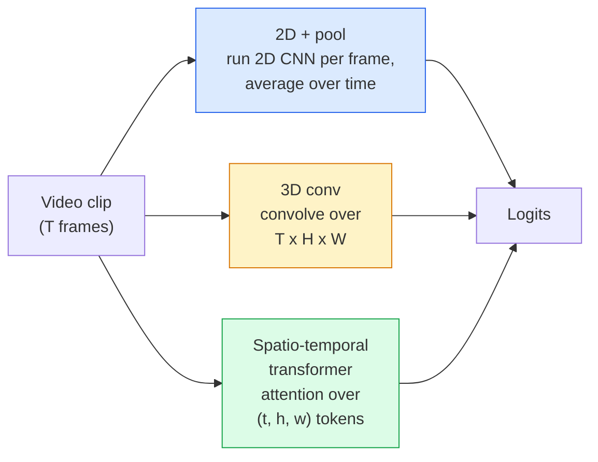

# Video Understanding — Temporal Modeling

> A video is a sequence of images plus the physics that connects them. Every video model either treats time as an extra axis (3D conv), a sequence to attend over (transformer), or a feature to extract once and pool (2D+pool).

**Type:** Learn + Build
**Languages:** Python
**Prerequisites:** Phase 4 Lesson 03 (CNNs), Phase 4 Lesson 04 (Image Classification)
**Time:** ~45 minutes

## Learning Objectives

- Distinguish the three main video-modelling approaches (2D+pool, 3D conv, spatio-temporal transformer) and predict their cost and accuracy trade-offs
- Implement frame sampling, temporal pooling, and a 2D+pool baseline classifier in PyTorch
- Explain why I3D's "inflated" 3D kernels transfer well from ImageNet weights and what a factorised (2+1)D conv does differently
- Read the standard action-recognition datasets and metrics: Kinetics-400/600, UCF101, Something-Something V2; top-1 accuracy at the clip and video level

## The Problem

A 30-second video at 30 fps is 900 images. Naively, video classification is image classification run 900 times followed by some kind of aggregation. That works when the action is visible in almost every frame (sports, cooking, exercise videos) and fails badly when the action is defined by motion itself: "pushing something from left to right" looks like two still objects in every single frame.

The core question for every video architecture is: when does temporal structure get modelled, and how? The answer drives everything else — compute cost, pretraining strategy, whether you can reuse ImageNet weights, what datasets the model trains on.

This lesson is deliberately shorter than the static-image lessons. The core image machinery is already in place, and video understanding is mostly about the temporal story: sampling, modelling, and aggregating.

## The Concept

### The three architectural families



### 2D + pool

Take a 2D CNN (ResNet, EfficientNet, ViT). Run it independently on every sampled frame. Average (or max-pool, or attention-pool) the per-frame embeddings. Feed the pooled vector to a classifier.

Pros:
- ImageNet pretraining transfers directly.
- Simplest to implement.
- Cheap: T frames * single-image inference cost.

Cons:
- Cannot model motion. Action = aggregate of appearances.
- Temporal pooling is order-invariant; "open door" and "close door" look the same.

When to use: appearance-heavy tasks, transfer learning on small video datasets, initial baselines.

### 3D convolutions

Replace 2D (H, W) kernels with 3D (T, H, W) kernels. The network convolves over both space and time. Early family: C3D, I3D, SlowFast.

I3D trick: take a pretrained 2D ImageNet model, "inflate" each 2D kernel by copying it along a new time axis. A 3x3 2D conv becomes a 3x3x3 3D conv. This gives the 3D model strong pretrained weights instead of training from scratch.

Pros:
- Directly models motion.
- I3D inflation gives free transfer learning.

Cons:
- T/8 more FLOPs than the 2D counterpart (for temporal kernel of 3 stacked 3 times).
- Temporal kernels are small; long-range motion needs a pyramid or dual-stream approach.

When to use: action recognition where motion is the signal (Something-Something V2, Kinetics with motion-heavy classes).

### Spatio-temporal transformers

Tokenise the video into a grid of space-time patches and attend across all of them. TimeSformer, ViViT, Video Swin, VideoMAE.

Attention patterns that matter:
- **Joint** — one big attention over (t, h, w). Quadratic in `T*H*W`; expensive.
- **Divided** — two attentions per block: one over time, one over space. Linear-ish scaling.
- **Factorised** — time attention alternates with space attention across blocks.

Pros:
- SOTA accuracy on every major benchmark.
- Transfers from image transformers (ViT) via patch inflation.
- Supports long-context video via sparse attention.

Cons:
- Compute-hungry.
- Requires careful attention pattern choice or runtime balloons.

When to use: large datasets, high-fidelity video understanding, multi-modal video+text tasks.

### Frame sampling

A 10-second clip at 30 fps is 300 frames; feeding all 300 to any model is wasteful. Standard strategies:

- **Uniform sampling** — pick T frames evenly across the clip. Default for 2D+pool.
- **Dense sampling** — random contiguous T-frame window. Common for 3D convs because motion requires neighbouring frames.
- **Multi-clip** — sample multiple T-frame windows from the same video, classify each, average predictions at test time.

T is usually 8, 16, 32, or 64. Higher T = more temporal signal at more compute.

### Evaluation

Two levels:
- **Clip-level accuracy** — model sees one T-frame clip, reports top-k.
- **Video-level accuracy** — average clip-level predictions across multiple clips per video; higher and more stable.

Always report both. A model that scores 78% clip / 82% video is relying heavily on test-time averaging; one that scores 80% / 81% is more robust per-clip.

### Datasets you will meet

- **Kinetics-400 / 600 / 700** — the general-purpose action dataset. 400k clips; YouTube URLs (many now dead).
- **Something-Something V2** — motion-defined actions ("moving X from left to right"). Cannot be solved by 2D+pool.
- **UCF-101**, **HMDB-51** — older, smaller, still reported.
- **AVA** — action *localisation* in space and time; harder than classification.

## Build It

### Step 1: Frame sampler

Uniform and dense samplers that work on a list of frames (or a video tensor).

```python
import numpy as np

def sample_uniform(num_frames_total, T):
 if num_frames_total <= T:
 return list(range(num_frames_total)) + [num_frames_total - 1] * (T - num_frames_total)
 step = num_frames_total / T
 return [int(i * step) for i in range(T)]


def sample_dense(num_frames_total, T, rng=None):
 rng = rng or np.random.default_rng()
 if num_frames_total <= T:
 return list(range(num_frames_total)) + [num_frames_total - 1] * (T - num_frames_total)
 start = int(rng.integers(0, num_frames_total - T + 1))
 return list(range(start, start + T))
```

Both return `T` indices that you use to slice the video tensor.

### Step 2: A 2D+pool baseline

Run a 2D ResNet-18 over every frame, average-pool features, classify.

```python
import torch
import torch.nn as nn
from torchvision.models import resnet18, ResNet18_Weights

class FramePool(nn.Module):
 def __init__(self, num_classes=400, pretrained=True):
 super().__init__()
 weights = ResNet18_Weights.IMAGENET1K_V1 if pretrained else None
 backbone = resnet18(weights=weights)
 self.features = nn.Sequential(*(list(backbone.children())[:-1])) # global avg pool kept
 self.head = nn.Linear(512, num_classes)

 def forward(self, x):
 # x: (N, T, 3, H, W)
 N, T = x.shape[:2]
 x = x.view(N * T, *x.shape[2:])
 feats = self.features(x).view(N, T, -1)
 pooled = feats.mean(dim=1)
 return self.head(pooled)

model = FramePool(num_classes=10)
x = torch.randn(2, 8, 3, 224, 224)
print(f"output: {model(x).shape}")
print(f"params: {sum(p.numel() for p in model.parameters()):,}")
```

Eleven million parameters, ImageNet pretrained, runs per-frame, averages, classifies. This baseline is often within 5-10 points of proper 3D models on appearance-heavy tasks — sometimes better, because it reuses a stronger ImageNet backbone.

### Step 3: An I3D-style inflated 3D conv

Turn a single 2D conv into a 3D conv by repeating weights along a new time axis.

```python
def inflate_2d_to_3d(conv2d, time_kernel=3):
 out_c, in_c, kh, kw = conv2d.weight.shape
 weight_3d = conv2d.weight.data.unsqueeze(2) # (out, in, 1, kh, kw)
 weight_3d = weight_3d.repeat(1, 1, time_kernel, 1, 1) / time_kernel
 conv3d = nn.Conv3d(in_c, out_c, kernel_size=(time_kernel, kh, kw),
 padding=(time_kernel // 2, conv2d.padding[0], conv2d.padding[1]),
 stride=(1, conv2d.stride[0], conv2d.stride[1]),
 bias=False)
 conv3d.weight.data = weight_3d
 return conv3d

conv2d = nn.Conv2d(3, 64, kernel_size=3, padding=1, bias=False)
conv3d = inflate_2d_to_3d(conv2d, time_kernel=3)
print(f"2D weight shape: {tuple(conv2d.weight.shape)}")
print(f"3D weight shape: {tuple(conv3d.weight.shape)}")
x = torch.randn(1, 3, 8, 56, 56)
print(f"3D output shape: {tuple(conv3d(x).shape)}")
```

The division by `time_kernel` keeps the activation magnitudes roughly constant — important for not breaking batch-norm statistics on the first pass.

### Step 4: Factorised (2+1)D conv

Split a 3D conv into a 2D (spatial) and a 1D (temporal) conv. Same receptive field, fewer parameters, better accuracy on some benchmarks.

```python
class Conv2Plus1D(nn.Module):
 def __init__(self, in_c, out_c, kernel_size=3):
 super().__init__()
 mid_c = (in_c * out_c * kernel_size * kernel_size * kernel_size) \
 // (in_c * kernel_size * kernel_size + out_c * kernel_size)
 self.spatial = nn.Conv3d(in_c, mid_c, kernel_size=(1, kernel_size, kernel_size),
 padding=(0, kernel_size // 2, kernel_size // 2), bias=False)
 self.bn = nn.BatchNorm3d(mid_c)
 self.act = nn.ReLU(inplace=True)
 self.temporal = nn.Conv3d(mid_c, out_c, kernel_size=(kernel_size, 1, 1),
 padding=(kernel_size // 2, 0, 0), bias=False)

 def forward(self, x):
 return self.temporal(self.act(self.bn(self.spatial(x))))

c = Conv2Plus1D(3, 64)
x = torch.randn(1, 3, 8, 56, 56)
print(f"(2+1)D output: {tuple(c(x).shape)}")
```

A full R(2+1)D network is the same as a ResNet-18 with every 3x3 conv replaced by `Conv2Plus1D`.

## Use It

Two libraries cover production video work:

- `torchvision.models.video` — R(2+1)D, MViT, Swin3D with pretrained Kinetics weights. Same API as image models.
- `pytorchvideo` (Meta) — model zoo, data loaders for Kinetics / SSv2 / AVA, standard transforms.

For Vision-Language video models (video captioning, video QA), use `transformers` (`VideoMAE`, `VideoLLaMA`, `InternVideo`).

## Ship It

This lesson produces:

- `outputs/prompt-video-architecture-picker.md` — a prompt that picks 2D+pool / I3D / (2+1)D / transformer based on appearance-vs-motion, dataset size, and compute budget.
- `outputs/skill-frame-sampler-auditor.md` — a skill that inspects a video pipeline's sampler and flags common bugs: off-by-one index, uneven sampling when `num_frames < T`, lack of aspect-preserving crop, etc.

## Exercises

1. **(Easy)** Compute FLOPs (approximate) for FramePool with T=8 vs an I3D-style 3D ResNet with T=8. Justify why 2D+pool is 3-5x cheaper.
2. **(Medium)** Generate a synthetic video dataset: random balls moving in random directions, labelled by direction of motion ("left-to-right", "right-to-left", "diagonal-up"). Train FramePool on it. Show that it achieves near-chance accuracy, proving appearance alone is insufficient for motion tasks.
3. **(Hard)** Build an R(2+1)D-18 by replacing every Conv2d in a ResNet-18 with `Conv2Plus1D`. Inflate the first conv's weights from an ImageNet-pretrained ResNet-18. Train on the motion dataset from exercise 2 and beat FramePool.

## Key Terms

| Term | What people say | What it actually means |
|------|----------------|----------------------|
| 2D + pool | "Per-frame classifier" | Run a 2D CNN on every sampled frame, average-pool features across time, classify |
| 3D convolution | "Spatio-temporal kernel" | Kernel that convolves over (T, H, W); can model motion natively |
| Inflation | "Lift 2D weights to 3D" | Initialise 3D conv weights by repeating a 2D conv's weights along the new time axis, then divide by kernel_T to preserve activation scale |
| (2+1)D | "Factorised conv" | Split 3D into 2D spatial + 1D temporal; fewer parameters, extra non-linearity between |
| Divided attention | "Time then space" | Transformer block with two attentions per layer: one over tokens at the same frame, one over tokens at the same position |
| Clip | "T-frame window" | A sampled subsequence of T frames; the unit a video model consumes |
| Clip vs video accuracy | "Two eval settings" | Clip = one sample per video, video = average across multiple sampled clips |
| Kinetics | "The ImageNet of video" | 400-700 action classes, 300k+ YouTube clips, the standard video pretraining corpus |

## Further Reading

- [I3D: Quo Vadis, Action Recognition (Carreira & Zisserman, 2017)](https://arxiv.org/abs/1705.07750) — introduces inflation and the Kinetics dataset
- [R(2+1)D: A Closer Look at Spatiotemporal Convolutions (Tran et al., 2018)](https://arxiv.org/abs/1711.11248) — factorised conv, still a strong baseline
- [TimeSformer: Is Space-Time Attention All You Need? (Bertasius et al., 2021)](https://arxiv.org/abs/2102.05095) — the first strong video transformer
- [VideoMAE (Tong et al., 2022)](https://arxiv.org/abs/2203.12602) — masked autoencoder pretraining for video; current dominant pretraining recipe
