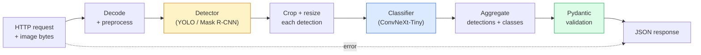

# Build a Complete Vision Pipeline — Capstone

> A production vision system is a chain of models and rules stitched with data contracts. The pieces are already in this phase; the capstone wires them together end-to-end.

**Type:** Build
**Languages:** Python
**Prerequisites:** Phase 4 Lessons 01-15
**Time:** ~120 minutes

## Learning Objectives

- Design a production vision pipeline that detects objects, classifies them, and emits structured JSON — with every failure path handled
- Plug a detector (Mask R-CNN or YOLO), a classifier (ConvNeXt-Tiny), and a data contract (Pydantic) into one service
- Benchmark the end-to-end pipeline and identify the first bottleneck (usually preprocessing, then the detector)
- Ship a minimal FastAPI service that accepts an image upload, runs the pipeline, and returns detections with classifications

## The Problem

Individual vision models are useful; vision products are chains of them. A retail shelf audit is a detector plus a product classifier plus a price-OCR pipeline. Autonomous driving is a 2D detector plus a 3D detector plus a segmenter plus a tracker plus a planner. A medical pre-screen is a segmenter plus a region classifier plus a clinician UI.

Wiring those chains is the part that separates a ML prototype from a product. Every interface between models is a new place for bugs. Every coordinate transform, every normalisation, every mask resize is a silent-failure candidate. A pipeline is as strong as its weakest interface.

This capstone sets up the minimum viable pipeline: detection + classification + structured output + a serving layer. Everything else in Phase 4 slots into this skeleton: swap Mask R-CNN for YOLOv8, add a OCR head, add a segmentation branch, add a tracker. The architecture is stable; the pieces are pluggable.

## The Concept

### The pipeline



Seven stages. The two model stages are expensive; the five other stages are where the bugs live.

### Data contracts with Pydantic

Every model boundary becomes a typed object. This turns silent failures into loud ones.

```
Detection(
 box: tuple[float, float, float, float], # (x1, y1, x2, y2), absolute pixels
 score: float, # [0, 1]
 class_id: int, # from detector's label map
 mask: Optional[list[list[int]]], # RLE-encoded if present
)

PipelineResult(
 image_id: str,
 detections: list[Detection],
 classifications: list[Classification],
 inference_ms: float,
)
```

When a detector returns boxes in `(cx, cy, w, h)` instead of `(x1, y1, x2, y2)`, Pydantic's validation fails at the boundary and you find out immediately instead of debugging a downstream crop that silently returns empty regions.

### Where latency goes

Three truths hold in nearly every vision pipeline:

1. **Preprocessing is often the biggest single block.** Decoding JPEGs, converting colour spaces, resizing — these are CPU-bound and easy to forget.
2. **The detector dominates GPU time.** 70-90% of GPU time is in the detection forward pass.
3. **Postprocessing (NMS, RLE encode/decode) is cheap on GPU, expensive on CPU.** Always profile with the actual target.

Knowing the distribution is what turns optimisation into a prioritised list.

### Failure modes

- **Empty detections** — return empty list, do not crash. Log.
- **Out-of-bounds boxes** — clamp to image size before cropping.
- **Tiny crops** — skip classification for boxes smaller than the classifier's minimum input.
- **Corrupt upload** — 400 response with a specific error code, not 500.
- **Model load failure** — fail at service startup, not at first request.

A production pipeline handles each of these without writing generic `try/except` that hides the failure. Every failure gets a named code and a response.

### Batching

A production service serves multiple clients. Batching detections and classifications across requests multiplies throughput. The trade-off: extra latency from waiting for a batch to fill. Typical setup: collect requests for up to 20ms, batch together, process, distribute responses. `torchserve` and `triton` do this natively; small services with predictable load roll their own micro-batcher.

## Build It

### Step 1: Data contracts

```python
from pydantic import BaseModel, Field
from typing import List, Optional, Tuple

class Detection(BaseModel):
 box: Tuple[float, float, float, float]
 score: float = Field(ge=0, le=1)
 class_id: int = Field(ge=0)
 mask_rle: Optional[str] = None


class Classification(BaseModel):
 detection_index: int
 class_id: int
 class_name: str
 score: float = Field(ge=0, le=1)


class PipelineResult(BaseModel):
 image_id: str
 detections: List[Detection]
 classifications: List[Classification]
 inference_ms: float
```

Five seconds of code saves an hour of debugging on any serious pipeline.

### Step 2: A minimal Pipeline class

```python
import time
import numpy as np
import torch
from PIL import Image

class VisionPipeline:
 def __init__(self, detector, classifier, class_names,
 device="cpu", min_crop=32):
 self.detector = detector.to(device).eval()
 self.classifier = classifier.to(device).eval()
 self.class_names = class_names
 self.device = device
 self.min_crop = min_crop

 def preprocess(self, image):
 """
 image: PIL.Image or np.ndarray (H, W, 3) uint8
 returns: CHW float tensor on device
 """
 if isinstance(image, Image.Image):
 image = np.asarray(image.convert("RGB"))
 tensor = torch.from_numpy(image).permute(2, 0, 1).float() / 255.0
 return tensor.to(self.device)

 @torch.no_grad()
 def detect(self, image_tensor):
 return self.detector([image_tensor])[0]

 @torch.no_grad()
 def classify(self, crops):
 if len(crops) == 0:
 return []
 batch = torch.stack(crops).to(self.device)
 logits = self.classifier(batch)
 probs = logits.softmax(-1)
 scores, cls = probs.max(-1)
 return list(zip(cls.tolist(), scores.tolist()))

 def run(self, image, image_id="anonymous"):
 t0 = time.perf_counter()
 tensor = self.preprocess(image)
 det = self.detect(tensor)

 crops = []
 detections = []
 valid_indices = []
 for i, (box, score, cls) in enumerate(zip(det["boxes"], det["scores"], det["labels"])):
 x1, y1, x2, y2 = [max(0, int(b)) for b in box.tolist()]
 x2 = min(x2, tensor.shape[-1])
 y2 = min(y2, tensor.shape[-2])
 detections.append(Detection(
 box=(x1, y1, x2, y2),
 score=float(score),
 class_id=int(cls),
 ))
 if (x2 - x1) < self.min_crop or (y2 - y1) < self.min_crop:
 continue
 crop = tensor[:, y1:y2, x1:x2]
 crop = torch.nn.functional.interpolate(
 crop.unsqueeze(0),
 size=(224, 224),
 mode="bilinear",
 align_corners=False,
 )[0]
 crops.append(crop)
 valid_indices.append(i)

 class_preds = self.classify(crops)

 classifications = []
 for valid_idx, (cls_id, cls_score) in zip(valid_indices, class_preds):
 classifications.append(Classification(
 detection_index=valid_idx,
 class_id=int(cls_id),
 class_name=self.class_names[cls_id],
 score=float(cls_score),
 ))

 return PipelineResult(
 image_id=image_id,
 detections=detections,
 classifications=classifications,
 inference_ms=(time.perf_counter() - t0) * 1000,
 )
```

Every interface is typed. Every failure path has a specific handling decision.

### Step 3: Wire a detector and a classifier

```python
from torchvision.models.detection import maskrcnn_resnet50_fpn_v2
from torchvision.models import convnext_tiny

# Use ImageNet-pretrained weights for a realistic pipeline without training
detector = maskrcnn_resnet50_fpn_v2(weights="DEFAULT")
classifier = convnext_tiny(weights="DEFAULT")
class_names = [f"imagenet_class_{i}" for i in range(1000)]

pipe = VisionPipeline(detector, classifier, class_names)

# Smoke test with a synthetic image
test_image = (np.random.rand(400, 600, 3) * 255).astype(np.uint8)
result = pipe.run(test_image, image_id="demo")
print(result.model_dump_json(indent=2)[:500])
```

### Step 4: FastAPI service

```python
from fastapi import FastAPI, UploadFile, HTTPException
from io import BytesIO

app = FastAPI()
pipe = None # initialised on startup

@app.on_event("startup")
def load():
 global pipe
 detector = maskrcnn_resnet50_fpn_v2(weights="DEFAULT").eval()
 classifier = convnext_tiny(weights="DEFAULT").eval()
 pipe = VisionPipeline(detector, classifier, class_names=[f"c{i}" for i in range(1000)])

@app.post("/detect")
async def detect_endpoint(file: UploadFile):
 if file.content_type not in {"image/jpeg", "image/png", "image/webp"}:
 raise HTTPException(status_code=400, detail="unsupported image type")
 data = await file.read()
 try:
 img = Image.open(BytesIO(data)).convert("RGB")
 except Exception:
 raise HTTPException(status_code=400, detail="cannot decode image")
 result = pipe.run(img, image_id=file.filename or "upload")
 return result.model_dump()
```

Run with `uvicorn main:app --host 0.0.0.0 --port 8000`. Test with `curl -F 'file=@dog.jpg' http://localhost:8000/detect`.

### Step 5: Benchmark the pipeline

```python
import time

def benchmark(pipe, num_runs=20, image_size=(400, 600)):
 img = (np.random.rand(*image_size, 3) * 255).astype(np.uint8)
 pipe.run(img) # warm up

 stages = {"preprocess": [], "detect": [], "classify": [], "total": []}
 for _ in range(num_runs):
 t0 = time.perf_counter()
 tensor = pipe.preprocess(img)
 t1 = time.perf_counter()
 det = pipe.detect(tensor)
 t2 = time.perf_counter()
 crops = []
 for box in det["boxes"]:
 x1, y1, x2, y2 = [max(0, int(b)) for b in box.tolist()]
 x2 = min(x2, tensor.shape[-1])
 y2 = min(y2, tensor.shape[-2])
 if (x2 - x1) >= pipe.min_crop and (y2 - y1) >= pipe.min_crop:
 crop = tensor[:, y1:y2, x1:x2]
 crop = torch.nn.functional.interpolate(
 crop.unsqueeze(0), size=(224, 224), mode="bilinear", align_corners=False
 )[0]
 crops.append(crop)
 pipe.classify(crops)
 t3 = time.perf_counter()
 stages["preprocess"].append((t1 - t0) * 1000)
 stages["detect"].append((t2 - t1) * 1000)
 stages["classify"].append((t3 - t2) * 1000)
 stages["total"].append((t3 - t0) * 1000)

 for stage, times in stages.items():
 times.sort()
 print(f"{stage:12s} p50={times[len(times)//2]:7.1f} ms p95={times[int(len(times)*0.95)]:7.1f} ms")
```

Typical output on CPU: preprocess ~3 ms, detect 300-500 ms, classify 20-40 ms, total 350-550 ms. On GPU, detect is 20-40 ms and the preprocess + classify start to matter more in relative terms.

## Use It

Production templates converge to the same structure, plus:

- **Model versioning** — always log the model name and weights hash in the response.
- **Per-request trace IDs** — log every stage timing for every request so you can correlate slow responses with stages.
- **Fallback path** — if the classifier times out, return detections without classifications rather than failing the whole request.
- **Safety filters** — NSFW / PII filters run after classification, before the response leaves the service.
- **Batch endpoint** — a `/detect_batch` accepting a list of image URLs for bulk processing.

For production serving, `torchserve`, `Triton Inference Server`, and `BentoML` handle batching, versioning, metrics, and health checks out of the box. Running `FastAPI` directly is fine for prototypes and small-scale products.

## Ship It

This lesson produces:

- `outputs/prompt-vision-service-shape-reviewer.md` — a prompt that reviews a vision service's code for contract/response shape violations and names the first breaking bug.
- `outputs/skill-pipeline-budget-planner.md` — a skill that, given target latency and throughput, assigns a time budget to every pipeline stage and flags which stage will miss its budget first.

## Exercises

1. **(Easy)** Run the pipeline on 10 images from any open dataset. Report the average time per stage and the distribution of detection counts per image.
2. **(Medium)** Add a mask output field to `Detection` and encode it as RLE. Verify the JSON stays under 1MB even for a 10-object image.
3. **(Hard)** Add a micro-batcher in front of the classifier: collect crops for up to 10 ms, classify them all in one GPU call, return results per request. Measure the throughput gain at 5 concurrent requests per second and the latency added.

## Key Terms

| Term | What people say | What it actually means |
|------|----------------|----------------------|
| Pipeline | "The system" | An ordered chain of preprocessing, inference, and postprocessing steps with a typed interface between each pair |
| Data contract | "The schema" | Pydantic / dataclass definitions that every stage input and output conforms to; catches integration bugs at the boundary |
| Preprocessing | "Before the model" | Decoding, colour conversion, resizing, normalising; usually the biggest CPU time sink |
| Postprocessing | "After the model" | NMS, mask resize, threshold, RLE encode; cheap on GPU, expensive on CPU |
| Microbatcher | "Collect then forward" | Aggregator that waits a fixed window for multiple requests, runs a single batched forward pass |
| Trace ID | "Request id" | Per-request identifier logged at every stage so slow requests can be traced end-to-end |
| Failure code | "Named error" | Specific error code per failure class instead of generic 500; enables client retry logic |
| Health check | "Readiness probe" | Cheap endpoint that reports whether the service can answer; loadbalancers rely on this |

## Further Reading

- [Full Stack Deep Learning — Deploying Models](https://fullstackdeeplearning.com/course/2022/lecture-5-deployment/) — the canonical overview of production ML deployment
- [BentoML docs](https://docs.bentoml.com) — serving framework with batching, versioning, and metrics
- [torchserve docs](https://pytorch.org/serve/) — PyTorch's official serving library
- [NVIDIA Triton Inference Server](https://developer.nvidia.com/triton-inference-server) — high-throughput serving with batching and multi-model support
