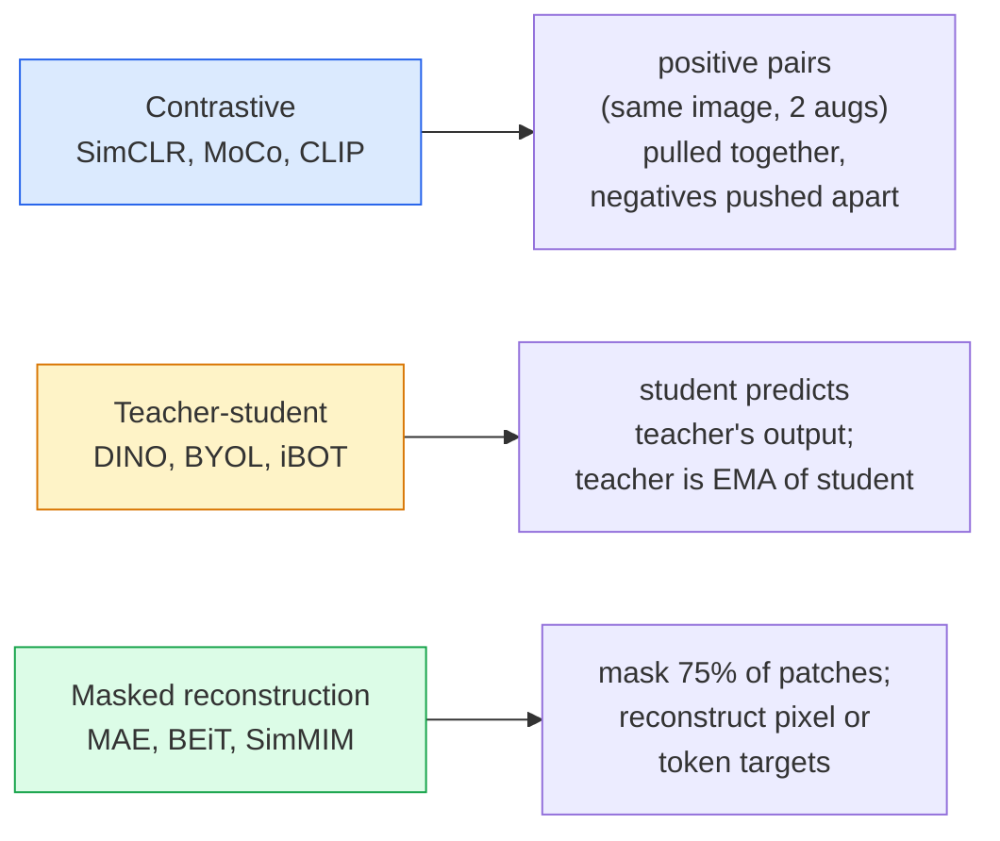

# Self-Supervised Vision — SimCLR, DINO, MAE

> Labels are the bottleneck of supervised vision. Self-supervised pretraining removes them: learn visual features from 100M unlabelled images, fine-tune on 10k labelled ones.

**Type:** Learn + Build
**Languages:** Python
**Prerequisites:** Phase 4 Lesson 04 (Image Classification), Phase 4 Lesson 14 (ViT)
**Time:** ~75 minutes

## Learning Objectives

- Trace the three major self-supervised families — contrastive (SimCLR), teacher-student (DINO), masked reconstruction (MAE) — and state what each one optimises
- Implement an InfoNCE loss from scratch and explain why a batch of 512 works but a batch of 32 fails
- Explain why MAE's 75% masking ratio is not arbitrary and how it differs from BERT's 15% for text
- Use DINOv2 or MAE ImageNet checkpoints for linear probing and zero-shot retrieval

## The Problem

Supervised ImageNet has 1.3M labelled images, which cost an estimated $10M to annotate. Medical and industrial datasets are smaller and even more expensive to label. Every vision team asks: can we pretrain on cheap unlabelled data — YouTube frames, web crawls, webcam footage, satellite sweeps — and then fine-tune on a small labelled set?

Self-supervised learning is the answer. A modern self-supervised ViT trained on LAION or JFT reaches or beats supervised ImageNet accuracy when fine-tuned. It also transfers better to downstream tasks (detection, segmentation, depth) than supervised pretraining. DINOv2 (Meta, 2023) and MAE (Meta, 2022) are the current production defaults for transferable vision features.

The conceptual shift is that the pretext task — the thing the model is trained to do — does not have to be the downstream task. What matters is that it forces the model to learn useful features. Predict the colour of grayscale images, rotate images and ask the model to classify the rotation, mask patches and reconstruct them — all have worked. The three approaches that scale are contrastive learning, teacher-student distillation, and masked reconstruction.

## The Concept

### Three families



### Contrastive learning (SimCLR)

Take one image, apply two random augmentations, get two views. Feed both through the same encoder plus a projection head. Minimise a loss that says "these two embeddings should be close" and "this embedding should be far from every other image's embeddings in the batch."

```
Loss for positive pair (z_i, z_j) among 2N views per batch:

 L_ij = -log( exp(sim(z_i, z_j) / tau) / sum_k in batch \ {i} exp(sim(z_i, z_k) / tau) )

sim = cosine similarity
tau = temperature (0.1 standard)
```

This is the InfoNCE loss. It requires many negatives per positive, so batch size matters — SimCLR needs 512-8192. MoCo introduced a momentum queue of past batches to decouple negative count from batch size.

### Teacher-student (DINO)

Two networks with the same architecture: student and teacher. The teacher is an exponential moving average (EMA) of the student's weights. Both see augmented views of the image. The student's output is trained to match the teacher's — no explicit negatives.

```
loss = CE( student_output(view_1), teacher_output(view_2) )
 + CE( student_output(view_2), teacher_output(view_1) )

teacher_weights = m * teacher_weights + (1 - m) * student_weights (m ≈ 0.996)
```

Why it does not collapse to "predict a constant": the teacher's output is centred (subtract per-dimension mean) and sharpened (divide by small temperature). Centering prevents one dimension from dominating; sharpening prevents output collapse to uniform.

DINO is what DINOv2 scales up, on 142M curated images. The resulting features are the current SOTA for zero-shot visual retrieval and dense prediction.

### Masked reconstruction (MAE)

Mask 75% of patches of a ViT input. Pass only the visible 25% through the encoder. A small decoder receives the encoder's output plus mask tokens at masked positions, and is trained to reconstruct the pixels of the masked patches.

```
Encoder: visible 25% of patches -> features
Decoder: features + mask tokens at masked positions -> reconstructed pixels
Loss: MSE between reconstructed and original pixels on masked patches only
```

Key design choices that make MAE work:

- **75% mask ratio** — high. Forces the encoder to learn semantic features; reconstructing 25% would be near-trivial (neighbouring pixels are so correlated that a CNN could nail it).
- **Asymmetric encoder/decoder** — the big ViT encoder only sees visible patches; a small decoder (8-layer, 512-dim) handles reconstruction. 3x faster pretraining than naive BEiT.
- **Pixel-space reconstruction target** — simpler than BEiT's tokenised target and works better on ViT.

After pretraining, discard the decoder. The encoder is the feature extractor.

### Why 75% and not 15%

BERT masks 15% of tokens. MAE masks 75%. The difference is information density.

- Natural language has high entropy per token. Predicting 15% of tokens is still hard because each masked position has many plausible completions.
- Image patches have low entropy — an unmasked neighbourhood often determines the masked patch's pixels almost exactly. To make prediction require semantic understanding, you have to mask aggressively.

75% is high enough that simple spatial extrapolation cannot solve the task; the encoder must represent the image content.

### Linear-probe evaluation

After self-supervised pretraining, the standard evaluation is a **linear probe**: freeze the encoder, train a single linear classifier on top on ImageNet labels. Reports top-1 accuracy.

- SimCLR ResNet-50: ~71% (2020)
- DINO ViT-S/16: ~77% (2021)
- MAE ViT-L/16: ~76% (2022)
- DINOv2 ViT-g/14: ~86% (2023)

Linear probe is a pure measure of feature quality; fine-tuning typically adds 2-5 points but also mixes in the effect of head retraining.

## Build It

### Step 1: Two-view augmentation pipeline

```python
import torch
import torchvision.transforms as T

two_view_train = lambda: T.Compose([
 T.RandomResizedCrop(96, scale=(0.2, 1.0)),
 T.RandomHorizontalFlip(),
 T.ColorJitter(0.4, 0.4, 0.4, 0.1),
 T.RandomGrayscale(p=0.2),
 T.ToTensor(),
])


class TwoViewDataset(torch.utils.data.Dataset):
 def __init__(self, base):
 self.base = base
 self.aug = two_view_train()

 def __len__(self):
 return len(self.base)

 def __getitem__(self, i):
 img, _ = self.base[i]
 v1 = self.aug(img)
 v2 = self.aug(img)
 return v1, v2
```

Each __getitem__ returns two augmented views of the same image; labels are not needed.

### Step 2: InfoNCE loss

```python
import torch.nn.functional as F

def info_nce(z1, z2, tau=0.1):
 """
 z1, z2: (N, D) L2-normalised embeddings of paired views
 """
 N, D = z1.shape
 z = torch.cat([z1, z2], dim=0) # (2N, D)
 sim = z @ z.T / tau # (2N, 2N)

 mask = torch.eye(2 * N, dtype=torch.bool, device=z.device)
 sim = sim.masked_fill(mask, float("-inf"))

 targets = torch.cat([torch.arange(N, 2 * N), torch.arange(0, N)]).to(z.device)
 return F.cross_entropy(sim, targets)
```

L2-normalise embeddings before calling. `tau=0.1` is the SimCLR default; lower makes the loss sharper and requires more negatives.

### Step 3: Sanity check InfoNCE

```python
z1 = F.normalize(torch.randn(16, 32), dim=-1)
z2 = z1.clone()
loss_same = info_nce(z1, z2, tau=0.1).item()
z2_random = F.normalize(torch.randn(16, 32), dim=-1)
loss_random = info_nce(z1, z2_random, tau=0.1).item()
print(f"InfoNCE with identical pairs: {loss_same:.3f}")
print(f"InfoNCE with random pairs: {loss_random:.3f}")
```

Identical pairs should give a low loss (close to 0 for a large batch and cold temperature). Random pairs should give log(2N-1) = ~log(31) = ~3.4 with a 16-pair batch.

### Step 4: MAE-style masking

```python
def random_mask_indices(num_patches, mask_ratio=0.75, seed=0):
 g = torch.Generator().manual_seed(seed)
 n_keep = int(num_patches * (1 - mask_ratio))
 perm = torch.randperm(num_patches, generator=g)
 visible = perm[:n_keep]
 masked = perm[n_keep:]
 return visible.sort().values, masked.sort().values


num_patches = 196
visible, masked = random_mask_indices(num_patches, mask_ratio=0.75)
print(f"visible: {len(visible)} / {num_patches}")
print(f"masked: {len(masked)} / {num_patches}")
```

Simple, fast, and deterministic for a given seed. Real MAE implementations batch this and keep per-sample masks.

## Use It

DINOv2 is the production standard in 2026:

```python
import torch
from transformers import AutoImageProcessor, AutoModel

processor = AutoImageProcessor.from_pretrained("facebook/dinov2-base")
model = AutoModel.from_pretrained("facebook/dinov2-base")
model.eval()

# Per-image embeddings for zero-shot retrieval
with torch.no_grad():
 inputs = processor(images=[pil_image], return_tensors="pt")
 outputs = model(**inputs)
 embedding = outputs.last_hidden_state[:, 0] # CLS token
```

The resulting 768-dim embedding is the backbone of modern image retrieval, dense correspondence, and zero-shot transfer pipelines. Fine-tuning on a downstream task rarely needs more than a linear head.

For image-text embeddings, SigLIP or OpenCLIP is the equivalent; for MAE-style fine-tuning, the `timm` repo ships every MAE checkpoint.

## Ship It

This lesson produces:

- `outputs/prompt-ssl-pretraining-picker.md` — a prompt that picks SimCLR / MAE / DINOv2 given dataset size, compute, and downstream task.
- `outputs/skill-linear-probe-runner.md` — a skill that writes the linear-probe evaluation for any frozen encoder + labelled dataset.

## Exercises

1. **(Easy)** Verify that InfoNCE loss drops when you decrease temperature for well-aligned embeddings and rises when you decrease temperature for random embeddings. Produce a plot `tau in [0.05, 0.1, 0.2, 0.5]` vs loss.
2. **(Medium)** Implement a DINO-style centre buffer. Show that without the centring, the student collapses to a constant vector within a few epochs.
3. **(Hard)** Train MAE on CIFAR-100 using the TinyUNet from Lesson 10 as the backbone. Report linear-probe accuracy at 10, 50, and 200 epochs. Show that a MAE-pretrained linear probe beats a from-scratch supervised linear probe on the same 1,000-image subset.

## Key Terms

| Term | What people say | What it actually means |
|------|----------------|----------------------|
| Self-supervised | "Label-free" | A pretext task that produces useful representations from unlabelled data |
| Pretext task | "The fake task" | The objective used during SSL (reconstruct patches, match views); discarded after pretraining |
| Linear probe | "Frozen encoder + linear head" | Standard SSL evaluation: train only a linear classifier on top of frozen features |
| InfoNCE | "Contrastive loss" | softmax over cosine similarities; positive pair is the target class, all others are negatives |
| EMA teacher | "Moving-average teacher" | Teacher whose weights are an exponential moving average of the student's; used by BYOL, MoCo, DINO |
| Mask ratio | "% of patches hidden" | Fraction of patches masked during MAE; 75% for vision, 15% for text |
| Representation collapse | "Constant output" | SSL failure where the encoder outputs a constant vector for all inputs; prevented by centring, sharpening, or negatives |
| DINOv2 | "Production SSL backbone" | Meta's 2023 self-supervised ViT; strongest general-purpose image features in 2026 |

## Further Reading

- [SimCLR (Chen et al., 2020)](https://arxiv.org/abs/2002.05709) — contrastive learning reference
- [DINO (Caron et al., 2021)](https://arxiv.org/abs/2104.14294) — teacher-student with momentum, centring, sharpening
- [MAE (He et al., 2022)](https://arxiv.org/abs/2111.06377) — masked autoencoder pretraining for ViT
- [DINOv2 (Oquab et al., 2023)](https://arxiv.org/abs/2304.07193) — scaling self-supervised ViT to production features
