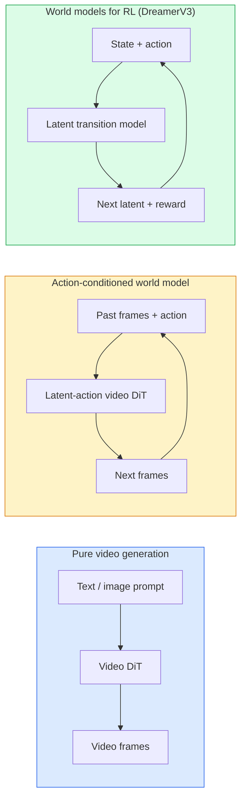

# World Models & Video Diffusion

> A video model that predicts the next seconds of a scene is a world simulator. Condition that prediction on actions and you have a learned game engine.

**Type:** Learn + Build
**Languages:** Python
**Prerequisites:** Phase 4 Lesson 10 (Diffusion), Phase 4 Lesson 12 (Video Understanding), Phase 4 Lesson 23 (DiT + Rectified Flow)
**Time:** ~75 minutes

## Learning Objectives

- Explain the difference between a pure video generation model (Sora 2) and an action-conditioned world model (Genie 3, DreamerV3)
- Describe a video DiT: spatio-temporal patches, 3D position encoding, joint attention across (T, H, W) tokens
- Trace how a world model plugs into robotics: VLM plans → video model simulates → inverse dynamics emits actions
- Pick between Sora 2, Genie 3, Runway GWM-1 Worlds, Wan-Video, and HunyuanVideo for a given use case (creative video, interactive sim, autonomous-driving synthesis)

## The Problem

Video generation and world modelling converged in 2026. A model that can generate a coherent minute of video has, in some sense, learned how the world moves: object permanence, gravity, causality, style. If you condition that prediction on actions (walk left, open the door), the video model becomes a learnable simulator that can replace a game engine, a driving simulator, or a robotics environment.

The stakes are concrete. Genie 3 generates playable environments from a single image. Runway GWM-1 Worlds synthesises infinite explorable scenes. Sora 2 produces minute-long videos with synchronised audio and modelled physics. NVIDIA Cosmos-Drive, Wayve Gaia-2, and Tesla DrivingWorld generate realistic driving video for autonomous-vehicle training data. The world-model paradigm is quietly taking over sim-to-real for robotics.

This lesson is the "big picture" lesson for Phase 4. It connects image generation, video understanding, and agentic reasoning into the architecture pattern dominant research is moving toward.

## The Concept

### Three families of world-modelling



- **Sora 2** is pure video generation conditioned on prompts. No action interface. You cannot "steer" it mid-rollout.
- **Genie 3**, **GWM-1 Worlds**, **Mirage / Magica** are action-conditioned world models. Infer latent actions from observed video, then condition future frame predictions on actions. Interactive — you press keys or move a camera and the scene responds.
- **DreamerV3** and the classic RL world-model family predict in a latent space with explicit action conditioning, trained on a reward signal. Less visual; more useful for sample-efficient RL.

### Video DiT architecture

```
Video latent: (C, T, H, W)
Patchify (spatial): grid of P_h x P_w patches per frame
Patchify (temporal): group P_t frames into a temporal patch
Resulting tokens: (T / P_t) * (H / P_h) * (W / P_w) tokens
```

Positional encoding is 3D: a rotary or learned embedding per (t, h, w) coordinate. Attention can be:

- **Full joint** — all tokens attend to all tokens. O(N^2) with N tokens. Prohibitive for long videos.
- **Divided** — alternate temporal attention (same spatial position, across time: `(H*W) * T^2`) and spatial attention (same timestep, across space: `T * (H*W)^2`). Used by TimeSformer and most video DiTs.
- **Window** — local windows in (t, h, w). Used by Video Swin.

Every 2026 video diffusion model uses one of these three patterns plus AdaLN conditioning (Lesson 23) and rectified flow.

### Conditioning on actions: latent action models

Genie learns a **latent action** per frame by discriminatively predicting the action between a pair of consecutive frames. The model's decoder then conditions on the inferred latent action — not on explicit keyboard keys. At inference, a user can specify a latent action (or sample one from a fresh prior) and the model generates the next frame consistent with that action.

Sora skips the action interface entirely. Its decoder predicts next spacetime tokens from past spacetime tokens. Prompt conditions the start; nothing steers it mid-generation.

### Physical plausibility

Sora 2's 2026 release explicitly advertised **physical plausibility**: weight, balance, object permanence, cause-and-effect. Measured by the team via hand-rated plausibility scores; the model visibly improves on dropped objects, characters colliding, and failures-on-purpose (a missed jump) versus Sora 1.

Plausibility remains the dominant failure mode. 2024-2025 videos of people eating spaghetti or drinking from glasses revealed the model's lack of persistent object representation. 2026 models (Sora 2, Runway Gen-5, HunyuanVideo) reduce but do not eliminate these.

### Autonomous driving world models

Driving world models generate realistic road scenes conditioned on trajectories, bounding boxes, or navigation maps. Usage:

- **Cosmos-Drive-Dreams** (NVIDIA) — generates minutes of driving video for RL training.
- **Gaia-2** (Wayve) — trajectory-conditioned scene synthesis for policy evaluation.
- **DrivingWorld** (Tesla) — simulates varied weather, time-of-day, traffic conditions.
- **Vista** (ByteDance) — reactive driving scene synthesis.

They replace expensive real-world data collection for corner cases — pedestrian jaywalks at night, icy intersections, unusual vehicle types — that would otherwise require millions of miles of driving.

### Robotics stack: VLM + video model + inverse dynamics

The emerging three-component robotics loop:

1. **VLM** parses the goal ("pick up the red cup"), plans a high-level action sequence.
2. **Video generation model** simulates what executing each action would look like — predicts observations N frames ahead.
3. **Inverse dynamics model** extracts the concrete motor commands that would produce those observations.

This replaces reward shaping and sample-heavy RL. The world model does the imagination; the inverse dynamics closes the loop on actuation. Genie Envisioner is one instantiation; many research groups are converging on this structure.

### Evaluation

- **Visual quality** — FVD (Fréchet Video Distance), user studies.
- **Prompt alignment** — CLIPScore per frame, VQA-style evaluation.
- **Physical plausibility** — hand-rated on a benchmark suite (Sora 2's internal benchmark, VBench).
- **Controllability** (for interactive world models) — action → observation consistency; can you go back to a prior state?

### Model landscape in 2026

| Model | Use | Parameters | Output | License |
|-------|-----|------------|--------|---------|
| Sora 2 | text-to-video, audio | — | 1-min 1080p + audio | API only |
| Runway Gen-5 | text/image-to-video | — | 10s clips | API |
| Runway GWM-1 Worlds | interactive world | — | infinite 3D rollout | API |
| Genie 3 | interactive world from image | 11B+ | playable frames | research preview |
| Wan-Video 2.1 | open text-to-video | 14B | high-quality clips | non-commercial |
| HunyuanVideo | open text-to-video | 13B | 10s clips | permissive |
| Cosmos / Cosmos-Drive | autonomous driving sim | 7-14B | driving scenes | NVIDIA open |
| Magica / Mirage 2 | AI-native game engine | — | modifiable worlds | product |

## Build It

### Step 1: 3D patchify for video

```python
import torch
import torch.nn as nn


class VideoPatch3D(nn.Module):
 def __init__(self, in_channels=4, dim=64, patch_t=2, patch_h=2, patch_w=2):
 super().__init__()
 self.proj = nn.Conv3d(
 in_channels, dim,
 kernel_size=(patch_t, patch_h, patch_w),
 stride=(patch_t, patch_h, patch_w),
 )
 self.patch_t = patch_t
 self.patch_h = patch_h
 self.patch_w = patch_w

 def forward(self, x):
 # x: (N, C, T, H, W)
 x = self.proj(x)
 n, c, t, h, w = x.shape
 tokens = x.reshape(n, c, t * h * w).transpose(1, 2)
 return tokens, (t, h, w)
```

A 3D conv with stride equal to kernel acts as the spatio-temporal patchifier. `(T, H, W) -> (T/2, H/2, W/2)` grid of tokens.

### Step 2: 3D rotary position encoding

Rotary Position Embeddings (RoPE) separately applied along `t`, `h`, `w` axes:

```python
def rope_3d(tokens, t_dim, h_dim, w_dim, grid):
 """
 tokens: (N, T*H*W, D)
 grid: (T, H, W) sizes
 t_dim + h_dim + w_dim == D
 """
 T, H, W = grid
 n, seq, d = tokens.shape
 if t_dim + h_dim + w_dim != d:
 raise ValueError(f"t_dim+h_dim+w_dim ({t_dim}+{h_dim}+{w_dim}) must equal D={d}")
 assert seq == T * H * W
 t_idx = torch.arange(T, device=tokens.device).repeat_interleave(H * W)
 h_idx = torch.arange(H, device=tokens.device).repeat_interleave(W).repeat(T)
 w_idx = torch.arange(W, device=tokens.device).repeat(T * H)
 # Simplified: just scale channels by frequencies. Real RoPE rotates pairs.
 freqs_t = torch.exp(-torch.log(torch.tensor(10000.0)) * torch.arange(t_dim // 2, device=tokens.device) / (t_dim // 2))
 freqs_h = torch.exp(-torch.log(torch.tensor(10000.0)) * torch.arange(h_dim // 2, device=tokens.device) / (h_dim // 2))
 freqs_w = torch.exp(-torch.log(torch.tensor(10000.0)) * torch.arange(w_dim // 2, device=tokens.device) / (w_dim // 2))
 emb_t = torch.cat([torch.sin(t_idx[:, None] * freqs_t), torch.cos(t_idx[:, None] * freqs_t)], dim=-1)
 emb_h = torch.cat([torch.sin(h_idx[:, None] * freqs_h), torch.cos(h_idx[:, None] * freqs_h)], dim=-1)
 emb_w = torch.cat([torch.sin(w_idx[:, None] * freqs_w), torch.cos(w_idx[:, None] * freqs_w)], dim=-1)
 return tokens + torch.cat([emb_t, emb_h, emb_w], dim=-1)
```

Simplified additive form. Real RoPE rotates paired channels at frequencies; the positional information is the same.

### Step 3: Divided attention block

```python
class DividedAttentionBlock(nn.Module):
 def __init__(self, dim=64, heads=2):
 super().__init__()
 self.time_attn = nn.MultiheadAttention(dim, heads, batch_first=True)
 self.space_attn = nn.MultiheadAttention(dim, heads, batch_first=True)
 self.ln1 = nn.LayerNorm(dim)
 self.ln2 = nn.LayerNorm(dim)
 self.ln3 = nn.LayerNorm(dim)
 self.mlp = nn.Sequential(nn.Linear(dim, 4 * dim), nn.GELU(), nn.Linear(4 * dim, dim))

 def forward(self, x, grid):
 T, H, W = grid
 n, seq, d = x.shape
 # time attention: same (h, w), across t
 xt = x.view(n, T, H * W, d).permute(0, 2, 1, 3).reshape(n * H * W, T, d)
 a, _ = self.time_attn(self.ln1(xt), self.ln1(xt), self.ln1(xt), need_weights=False)
 xt = (xt + a).reshape(n, H * W, T, d).permute(0, 2, 1, 3).reshape(n, seq, d)
 # space attention: same t, across (h, w)
 xs = xt.view(n, T, H * W, d).reshape(n * T, H * W, d)
 a, _ = self.space_attn(self.ln2(xs), self.ln2(xs), self.ln2(xs), need_weights=False)
 xs = (xs + a).reshape(n, T, H * W, d).reshape(n, seq, d)
 xs = xs + self.mlp(self.ln3(xs))
 return xs
```

The time attention attends within each spatial position across time; the space attention attends within each frame across positions. Two O(T^2 + (HW)^2) operations instead of one O((THW)^2). This is the core of TimeSformer and every modern video DiT.

### Step 4: Compose a tiny video DiT

```python
class TinyVideoDiT(nn.Module):
 def __init__(self, in_channels=4, dim=64, depth=2, heads=2):
 super().__init__()
 self.patch = VideoPatch3D(in_channels=in_channels, dim=dim, patch_t=2, patch_h=2, patch_w=2)
 self.blocks = nn.ModuleList([DividedAttentionBlock(dim, heads) for _ in range(depth)])
 self.out = nn.Linear(dim, in_channels * 2 * 2 * 2)

 def forward(self, x):
 tokens, grid = self.patch(x)
 for blk in self.blocks:
 tokens = blk(tokens, grid)
 return self.out(tokens), grid
```

Not a working video generator; a structural demo that every piece shapes correctly.

### Step 5: Check shapes

```python
vid = torch.randn(1, 4, 8, 16, 16) # (N, C, T, H, W)
model = TinyVideoDiT()
out, grid = model(vid)
print(f"input {tuple(vid.shape)}")
print(f"tokens grid {grid}")
print(f"output {tuple(out.shape)}")
```

Expect `grid = (4, 8, 8)` and `out = (1, 256, 32)` after patching; the head then projects to per-token spatio-temporal patches, ready to be un-patchified back into a video.

## Use It

Production access patterns for 2026:

- **Sora 2 API** (OpenAI) — text-to-video, synchronized audio. Premium pricing.
- **Runway Gen-5 / GWM-1** (Runway) — image-to-video, interactive worlds.
- **Wan-Video 2.1 / HunyuanVideo** — open-source self-host.
- **Cosmos / Cosmos-Drive** (NVIDIA) — driving simulation open weights.
- **Genie 3** — research preview, request access.

For building an interactive world-model demo: start with Wan-Video for quality, layer on a latent-action adapter for interactivity. For autonomous driving simulation: Cosmos-Drive is the 2026 open reference.

For robotics, the stack in the wild:

1. Language goal -> VLM (Qwen3-VL) -> high-level plan.
2. Plan -> latent-action video model -> imagined rollout.
3. Rollout -> inverse dynamics model -> low-level actions.
4. Actions executed -> observation fed back into step 1.

## Ship It

This lesson produces:

- `outputs/prompt-video-model-picker.md` — picks between Sora 2 / Runway / Wan / HunyuanVideo / Cosmos given task, license, and latency.
- `outputs/skill-physical-plausibility-checks.md` — a skill that defines automated checks (object permanence, gravity, continuity) to run on any generated video before shipping.

## Exercises

1. **(Easy)** Compute the token count for a 5-second 360p video at patch-t=2, patch-h=8, patch-w=8. Reason about memory for attention at this size.
2. **(Medium)** Swap the divided attention block above for a full joint attention block and measure the shape and parameter count. Explain why divided attention is necessary for real video models.
3. **(Hard)** Build a minimal latent-action video model: take a dataset of (frame_t, action_t, frame_{t+1}) triples (any simple 2D game), train a tiny video DiT conditioned on action embeddings, and show that different actions produce different next frames.

## Key Terms

| Term | What people say | What it actually means |
|------|----------------|----------------------|
| World model | "Learned simulator" | A model that predicts future observations given state and action |
| Video DiT | "Spacetime transformer" | Diffusion transformer with 3D patchification and divided attention |
| Latent action | "Inferred control" | Discrete or continuous action latent inferred from frame pairs; used to condition next-frame generation |
| Divided attention | "Time then space" | Two attention operations per block — across time then across space — to keep O(N^2) manageable |
| Object permanence | "Things stay real" | Scene property that video models must learn; classic failure mode on food, glassware |
| FVD | "Fréchet Video Distance" | Video equivalent of FID; primary visual quality metric |
| Inverse dynamics model | "Observations to actions" | Given (state, next state), output the action that connects them; closes robotics loop |
| Cosmos-Drive | "NVIDIA driving sim" | Open-weights autonomous-driving world model for RL and evaluation |

## Further Reading

- [Sora technical report (OpenAI)](https://openai.com/index/video-generation-models-as-world-simulators/)
- [Genie: Generative Interactive Environments (Bruce et al., 2024)](https://arxiv.org/abs/2402.15391) — latent action world models
- [TimeSformer (Bertasius et al., 2021)](https://arxiv.org/abs/2102.05095) — divided attention for video transformers
- [DreamerV3 (Hafner et al., 2023)](https://arxiv.org/abs/2301.04104) — world models for RL
- [Cosmos-Drive-Dreams (NVIDIA, 2025)](https://research.nvidia.com/labs/toronto-ai/cosmos-drive-dreams/) — driving world model
- [Top 10 Video Generation Models 2026 (DataCamp)](https://www.datacamp.com/blog/top-video-generation-models)
- [From Video Generation to World Model — survey repo](https://github.com/ziqihuangg/Awesome-From-Video-Generation-to-World-Model/)
