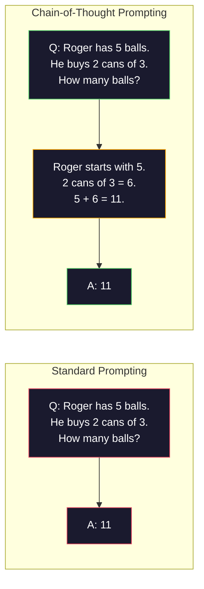
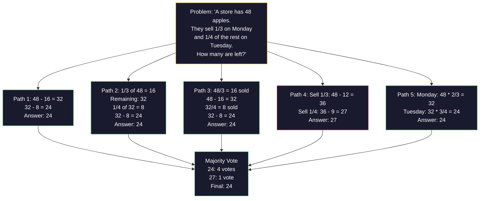
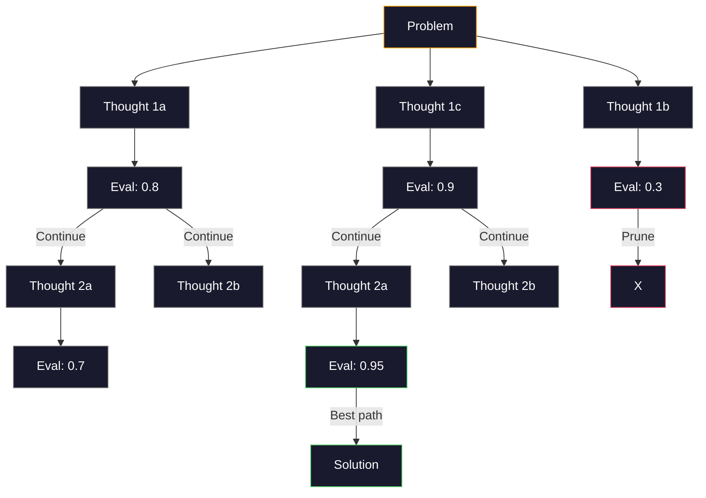

# Few-Shot, Chain-of-Thought, Tree-of-Thought

> Telling a model what to do is prompting. Showing it how to think is engineering. The gap between 78% and 91% accuracy on the same model, same task, same data is not a better model. It is a better reasoning strategy.

**Type:** Build
**Languages:** Python
**Prerequisites:** Lesson 11.01 (Prompt Engineering)
**Time:** ~45 minutes

## Learning Objectives

- Implement few-shot prompting by selecting and formatting example demonstrations that maximize task accuracy
- Apply chain-of-thought (CoT) reasoning to improve accuracy on multi-step problems like math word problems
- Build a tree-of-thought prompt that explores multiple reasoning paths and selects the best one
- Measure the accuracy improvement from zero-shot vs few-shot vs CoT on a standard benchmark

## The Problem

You build a math tutoring app. Your prompt says: "Solve this word problem." GPT-4o gets it right 78% of the time on GSM8K, the standard grade-school math benchmark. You think you need a bigger model. You do not.

Add five words -- "Let's think step by step" -- and accuracy jumps to 91%. Add a few worked examples and it reaches 95%. Same model. Same temperature. Same API cost. The only difference is that you gave the model scratch paper.

This is not a hack. It is how reasoning works. Humans do not solve multi-step problems in one mental leap. Neither do transformers. When you force a model to generate intermediate tokens, those tokens become part of the context for the next token. Each reasoning step feeds the next. The model literally computes its way to the answer.

But "think step by step" is the beginning, not the end. What if you sampled five reasoning paths and took a majority vote? What if you let the model explore a tree of possibilities, evaluating and pruning branches? What if you interleaved reasoning with tool use? These are not hypotheticals. They are published techniques with measured improvements, and you will build all of them in this lesson.

## The Concept

### Zero-Shot vs Few-Shot: When Examples Beat Instructions

Zero-shot prompting gives the model a task and nothing else. Few-shot prompting gives it examples first.

Wei et al. (2022) measured this across 8 benchmarks. For simple tasks like sentiment classification, zero-shot and few-shot performed within 2% of each other. For complex tasks like multi-step arithmetic and symbolic reasoning, few-shot improved accuracy by 10-25%.

The intuition: examples are compressed instructions. Instead of describing the output format, you show it. Instead of explaining the reasoning process, you demonstrate it. The model pattern-matches on the examples more reliably than it interprets abstract instructions.


**When few-shot wins:** format-sensitive tasks, classification, structured extraction, domain-specific jargon, any task where the model needs to match a specific pattern.

**When zero-shot wins:** simple factual questions, creative tasks where examples constrain creativity, tasks where finding good examples is harder than writing good instructions.

### Example Selection: Similar Beats Random

Not all examples are equal. Choosing examples similar to the target input outperforms random selection by 5-15% on classification tasks (Liu et al., 2022). Three principles:

1. **Semantic similarity**: pick examples closest to the input in embedding space
2. **Label diversity**: cover all output categories in your examples
3. **Difficulty matching**: match the complexity level of the target problem

The optimal number of examples for most tasks is 3-5. Below 3, the model does not have enough signal to extract the pattern. Above 5, you hit diminishing returns and waste context window tokens. For classification with many labels, use one example per label.

### Chain-of-Thought: Giving Models Scratch Paper

Chain-of-Thought (CoT) prompting was introduced by Wei et al. (2022) at Google Brain. The idea is simple: instead of asking the model for just the answer, ask it to show its reasoning steps first.



Why does this work mechanically? Each token a transformer generates becomes context for the next token. Without CoT, the model must compress all reasoning into the hidden state of a single forward pass. With CoT, the model externalizes intermediate computations as tokens. Each reasoning token extends the effective computation depth.

**GSM8K benchmarks (grade-school math, 8.5K problems):**

| Model | Zero-Shot | Zero-Shot CoT | Few-Shot CoT |
|-------|-----------|---------------|--------------|
| GPT-3.5 Turbo | 57% | 74% | 80% |
| GPT-4o | 78% | 91% | 95% |
| Claude 3.5 Sonnet | 76% | 90% | 96% |
| Llama 3.1 70B | 56% | 73% | 83% |

Two flavors of CoT:

**Zero-shot CoT**: append "Let's think step by step" to the prompt. No examples needed. Kojima et al. (2022) showed this single sentence improves accuracy across arithmetic, commonsense, and symbolic reasoning tasks.

**Few-shot CoT**: provide examples that include reasoning steps. More effective than zero-shot CoT because the model sees the exact reasoning format you expect.

**When CoT hurts**: simple factual recall ("What is the capital of France?"), single-step classification, tasks where speed matters more than accuracy. CoT adds 50-200 tokens of reasoning overhead per query. For high-throughput, low-complexity tasks, that is wasted cost.

### Self-Consistency: Sample Many, Vote Once

Wang et al. (2023) introduced self-consistency. The insight: a single CoT path might contain reasoning errors. But if you sample N independent reasoning paths (using temperature > 0) and take the majority vote on the final answer, errors cancel out.



Self-consistency improved GSM8K accuracy from 56.5% (single CoT) to 74.4% with N=40 on the original PaLM 540B experiments. On GPT-4o, the improvement is smaller (95% to 97%) because the base accuracy is already high. The technique shines most on models with 60-85% base CoT accuracy -- the sweet spot where single-path errors are frequent but not systematic.

The tradeoff: N samples means Nx the API cost and latency. In practice, N=5 captures most of the benefit. N=3 is the minimum for a meaningful vote. N > 10 has diminishing returns for most tasks.

### Tree-of-Thought: Branching Exploration

Yao et al. (2023) introduced Tree-of-Thought (ToT). Where CoT follows one linear reasoning path, ToT explores multiple branches and evaluates which are most promising before continuing.



ToT has three components:

1. **Thought generation**: produce multiple candidate next-steps
2. **State evaluation**: score each candidate (can use the LLM itself as evaluator)
3. **Search algorithm**: BFS or DFS through the tree, pruning low-scoring branches

On the Game of 24 task (combine 4 numbers using arithmetic to make 24), GPT-4 with standard prompting solves 7.3% of problems. With CoT, 4.0% (CoT actually hurts here because the search space is wide). With ToT, 74%.

ToT is expensive. Each node in the tree requires an LLM call. A tree with branching factor 3 and depth 3 requires up to 39 LLM calls. Use it only for problems where the search space is large but evaluatable -- planning, puzzle solving, creative problem-solving with constraints.

### ReAct: Thinking + Doing

Yao et al. (2022) combined reasoning traces with actions. The model alternates between thinking (generating reasoning) and acting (calling tools, searching, computing).

```mermaid
graph LR
    Q["Question:\nWhat is the\npopulation of the\ncountry where\nthe Eiffel Tower\nis located?"]
    T1["Thought: I need to\nfind which country\nhas the Eiffel Tower"]
    A1["Action: search\n'Eiffel Tower location'"]
    O1["Observation:\nParis, France"]
    T2["Thought: Now I need\nFrance's population"]
    A2["Action: search\n'France population 2024'"]
    O2["Observation:\n68.4 million"]
    T3["Thought: I have\nthe answer"]
    F["Answer:\n68.4 million"]

    Q --> T1 --> A1 --> O1 --> T2 --> A2 --> O2 --> T3 --> F

    style Q fill:#1a1a2e,stroke:#ffa500,color:#fff
    style T1 fill:#1a1a2e,stroke:#51cf66,color:#fff
    style A1 fill:#1a1a2e,stroke:#e94560,color:#fff
    style O1 fill:#1a1a2e,stroke:#808080,color:#fff
    style T2 fill:#1a1a2e,stroke:#51cf66,color:#fff
    style A2 fill:#1a1a2e,stroke:#e94560,color:#fff
    style O2 fill:#1a1a2e,stroke:#808080,color:#fff
    style T3 fill:#1a1a2e,stroke:#51cf66,color:#fff
    style F fill:#1a1a2e,stroke:#51cf66,color:#fff
```



ReAct outperforms pure CoT on knowledge-intensive tasks because it can ground its reasoning in real data. On HotpotQA (multi-hop question answering), ReAct with GPT-4 achieves 35.1% exact match vs 29.4% for CoT alone. The real power is that reasoning errors get corrected by observations -- the model can update its plan mid-execution.

ReAct is the foundation of modern AI agents. Every agent framework (LangChain, CrewAI, AutoGen) implements some variant of the Thought-Action-Observation loop. You will build full agents in Phase 14. This lesson covers the prompting pattern.

### Structured Prompting: XML Tags, Delimiters, Headers

As prompts get complex, structure prevents the model from confusing sections. Three approaches:

**XML tags** (works best with Claude, solid everywhere):
```
<context>
You are reviewing a pull request.
The codebase uses TypeScript and React.
</context>

<task>
Review the following diff for bugs, security issues, and style violations.
</task>

<diff>
{diff_content}
</diff>

<output_format>
List each issue with: file, line, severity (critical/warning/info), description.
</output_format>
```

**Markdown headers** (universal):
```
## Role
Senior security engineer at a fintech company.

## Task
Analyze this API endpoint for vulnerabilities.

## Input
{api_code}

## Rules
- Focus on OWASP Top 10
- Rate each finding: critical, high, medium, low
- Include remediation steps
```

**Delimiters** (minimal but effective):
```
---INPUT---
{user_text}
---END INPUT---

---INSTRUCTIONS---
Summarize the above in 3 bullet points.
---END INSTRUCTIONS---
```

### Prompt Chaining: Sequential Decomposition

Some tasks are too complex for a single prompt. Prompt chaining breaks them into steps, where the output of one prompt becomes the input of the next.


Chaining beats single-prompt for three reasons:

1. **Each step is simpler**: the model handles one focused task instead of juggling everything
2. **Intermediate outputs are inspectable**: you can validate and correct between steps
3. **Different steps can use different models**: use a cheap model for extraction, an expensive one for reasoning

### Performance Comparison

| Technique | Best For | GSM8K Accuracy (GPT-4o) | API Calls | Token Overhead | Complexity |
|-----------|----------|------------------------|-----------|----------------|------------|
| Zero-Shot | Simple tasks | 78% | 1 | None | Trivial |
| Few-Shot | Format matching | 85% | 1 | 200-500 tokens | Low |
| Zero-Shot CoT | Quick reasoning boost | 91% | 1 | 50-200 tokens | Trivial |
| Few-Shot CoT | Maximum single-call accuracy | 95% | 1 | 300-600 tokens | Low |
| Self-Consistency (N=5) | High-stakes reasoning | 97% | 5 | 5x token cost | Medium |
| Tree-of-Thought | Search/planning problems | N/A (74% on Game of 24) | 10-40+ | 10-40x token cost | High |
| ReAct | Knowledge-grounded reasoning | N/A (35.1% on HotpotQA) | 3-10+ | Variable | High |
| Prompt Chaining | Complex multi-step tasks | 96% (pipeline) | 2-5 | 2-5x token cost | Medium |

The right technique depends on three factors: accuracy requirement, latency budget, and cost tolerance. For most production systems, few-shot CoT with a 3-sample self-consistency fallback covers 90% of use cases.

## Build It

We will build a math problem solver that combines few-shot prompting, chain-of-thought reasoning, and self-consistency voting into a single pipeline. Then we will add tree-of-thought for hard problems.

The full implementation is in `code/advanced_prompting.py`. Here are the key components.

### Step 1: Few-Shot Example Store

The first component manages few-shot examples and selects the most relevant ones for a given problem.

```python
GSM8K_EXAMPLES = [
    {
        "question": "Janet's ducks lay 16 eggs per day. She eats three for breakfast every morning and bakes muffins for her friends every day with four. She sells every egg at the farmers' market for $2. How much does she make every day at the farmers' market?",
        "reasoning": "Janet's ducks lay 16 eggs per day. She eats 3 and bakes 4, using 3 + 4 = 7 eggs. So she has 16 - 7 = 9 eggs left. She sells each for $2, so she makes 9 * 2 = $18 per day.",
        "answer": "18"
    },
    ...
]
```

Each example has three parts: the question, the reasoning chain, and the final answer. The reasoning chain is what transforms a regular few-shot example into a CoT few-shot example.

### Step 2: Chain-of-Thought Prompt Builder

The prompt builder assembles a system message, few-shot examples with reasoning chains, and the target question into a single prompt.

```python
def build_cot_prompt(question, examples, num_examples=3):
    system = (
        "You are a math problem solver. "
        "For each problem, show your step-by-step reasoning, "
        "then give the final numerical answer on the last line "
        "in the format: 'The answer is [number]'."
    )

    example_text = ""
    for ex in examples[:num_examples]:
        example_text += f"Q: {ex['question']}\n"
        example_text += f"A: {ex['reasoning']} The answer is {ex['answer']}.\n\n"

    user = f"{example_text}Q: {question}\nA:"
    return system, user
```

The format constraint ("The answer is [number]") is critical. Without it, self-consistency cannot extract and compare answers across samples.

### Step 3: Self-Consistency Voting

Sample N reasoning paths and take the majority answer.

```python
def self_consistency_solve(question, examples, client, model, n_samples=5):
    system, user = build_cot_prompt(question, examples)

    answers = []
    reasonings = []
    for _ in range(n_samples):
        response = client.chat.completions.create(
            model=model,
            messages=[
                {"role": "system", "content": system},
                {"role": "user", "content": user}
            ],
            temperature=0.7
        )
        text = response.choices[0].message.content
        reasonings.append(text)
        answer = extract_answer(text)
        if answer is not None:
            answers.append(answer)

    vote_counts = Counter(answers)
    best_answer = vote_counts.most_common(1)[0][0] if vote_counts else None
    confidence = vote_counts[best_answer] / len(answers) if best_answer else 0

    return best_answer, confidence, reasonings, vote_counts
```

Temperature 0.7 is important. At temperature 0.0, all N samples would be identical, defeating the purpose. You need enough randomness for diverse reasoning paths but not so much that the model produces gibberish.

### Step 4: Tree-of-Thought Solver

For problems where linear reasoning fails, ToT explores multiple approaches and evaluates which direction is most promising.

```python
def tree_of_thought_solve(question, client, model, breadth=3, depth=3):
    thoughts = generate_initial_thoughts(question, client, model, breadth)
    scored = [(t, evaluate_thought(t, question, client, model)) for t in thoughts]
    scored.sort(key=lambda x: x[1], reverse=True)

    for current_depth in range(1, depth):
        next_thoughts = []
        for thought, score in scored[:2]:
            extensions = extend_thought(thought, question, client, model, breadth)
            for ext in extensions:
                ext_score = evaluate_thought(ext, question, client, model)
                next_thoughts.append((ext, ext_score))
        scored = sorted(next_thoughts, key=lambda x: x[1], reverse=True)

    best_thought = scored[0][0] if scored else ""
    return extract_answer(best_thought), best_thought
```

The evaluator is itself an LLM call. You ask the model: "On a scale of 0.0 to 1.0, how promising is this reasoning path for solving the problem?" This is the key insight of ToT -- the model evaluates its own partial solutions.

### Step 5: Full Pipeline

The pipeline combines all techniques with an escalation strategy.

```python
def solve_with_escalation(question, examples, client, model):
    system, user = build_cot_prompt(question, examples)
    single_response = call_llm(client, model, system, user, temperature=0.0)
    single_answer = extract_answer(single_response)

    sc_answer, confidence, _, _ = self_consistency_solve(
        question, examples, client, model, n_samples=5
    )

    if confidence >= 0.8:
        return sc_answer, "self_consistency", confidence

    tot_answer, _ = tree_of_thought_solve(question, client, model)
    return tot_answer, "tree_of_thought", None
```

The escalation logic: try cheap (single CoT) first. If self-consistency confidence is below 0.8 (less than 4 of 5 samples agree), escalate to ToT. This balances cost and accuracy -- most problems are solved cheaply, hard problems get more compute.

## Use It

### With LangChain

LangChain provides built-in support for prompt templates and output parsing that simplify few-shot and CoT patterns:

```python
from langchain_core.prompts import FewShotPromptTemplate, PromptTemplate
from langchain_openai import ChatOpenAI

example_prompt = PromptTemplate(
    input_variables=["question", "reasoning", "answer"],
    template="Q: {question}\nA: {reasoning} The answer is {answer}."
)

few_shot_prompt = FewShotPromptTemplate(
    examples=examples,
    example_prompt=example_prompt,
    suffix="Q: {input}\nA: Let's think step by step.",
    input_variables=["input"]
)

llm = ChatOpenAI(model="gpt-4o", temperature=0.7)
chain = few_shot_prompt | llm
result = chain.invoke({"input": "If a train travels 120 km in 2 hours..."})
```

LangChain also has `ExampleSelector` classes for semantic similarity selection:

```python
from langchain_core.example_selectors import SemanticSimilarityExampleSelector
from langchain_openai import OpenAIEmbeddings

selector = SemanticSimilarityExampleSelector.from_examples(
    examples,
    OpenAIEmbeddings(),
    k=3
)
```

### With DSPy

DSPy treats prompting strategies as optimizable modules. Instead of handcrafting CoT prompts, you define a signature and let DSPy optimize the prompt:

```python
import dspy

dspy.configure(lm=dspy.LM("openai/gpt-4o", temperature=0.7))

class MathSolver(dspy.Module):
    def __init__(self):
        self.solve = dspy.ChainOfThought("question -> answer")

    def forward(self, question):
        return self.solve(question=question)

solver = MathSolver()
result = solver(question="Janet's ducks lay 16 eggs per day...")
```

DSPy's `ChainOfThought` automatically adds reasoning traces. `dspy.majority` implements self-consistency:

```python
result = dspy.majority(
    [solver(question=q) for _ in range(5)],
    field="answer"
)
```

### Comparison: From-Scratch vs Frameworks

| Feature | From-Scratch (this lesson) | LangChain | DSPy |
|---------|--------------------------|-----------|------|
| Control over prompt format | Full | Template-based | Automatic |
| Self-consistency | Manual voting | Manual | Built-in (`dspy.majority`) |
| Example selection | Custom logic | `ExampleSelector` | `dspy.BootstrapFewShot` |
| Tree-of-Thought | Custom tree search | Community chains | Not built-in |
| Prompt optimization | Manual iteration | Manual | Automatic compilation |
| Best for | Learning, custom pipelines | Standard workflows | Research, optimization |

## Ship It

This lesson produces two artifacts.

**1. Reasoning Chain Prompt** (`outputs/prompt-reasoning-chain.md`): a production-ready prompt template for few-shot CoT with self-consistency. Plug in your examples and problem domain.

**2. CoT Pattern Selection Skill** (`outputs/skill-cot-patterns.md`): a decision framework for choosing the right reasoning technique based on task type, accuracy requirements, and cost constraints.

## Exercises

1. **Measure the gap**: Take 10 GSM8K problems. Solve each with zero-shot, few-shot, zero-shot CoT, and few-shot CoT. Record accuracy for each. Which technique gives the biggest lift on your model?

2. **Example selection experiment**: For the same 10 problems, compare random example selection vs hand-picked similar examples. Measure accuracy difference. At what point does example quality matter more than example quantity?

3. **Self-consistency cost curve**: Run self-consistency with N=1, 3, 5, 7, 10 on 20 GSM8K problems. Plot accuracy vs cost (total tokens). Where is the knee of the curve for your model?

4. **Build a ReAct loop**: Extend the pipeline with a calculator tool. When the model generates a math expression, execute it with Python's `eval()` (in a sandbox) and feed the result back. Measure if tool-grounded reasoning outperforms pure CoT.

5. **ToT for creative tasks**: Adapt the Tree-of-Thought solver for a creative writing task: "Write a 6-word story that is both funny and sad." Use the LLM as evaluator. Does branching exploration produce better creative outputs than single-shot generation?

## Key Terms

| Term | What people say | What it actually means |
|------|----------------|----------------------|
| Few-shot prompting | "Give it some examples" | Including input-output demonstrations in the prompt to anchor the model's output format and behavior |
| Chain-of-Thought | "Make it think step by step" | Eliciting intermediate reasoning tokens that extend the model's effective computation before producing a final answer |
| Self-Consistency | "Run it multiple times" | Sampling N diverse reasoning paths at temperature > 0 and selecting the most common final answer by majority vote |
| Tree-of-Thought | "Let it explore options" | Structured search over reasoning branches where each partial solution is evaluated and only promising paths are expanded |
| ReAct | "Thinking + tool use" | Interleaving reasoning traces with external actions (search, compute, API calls) in a Thought-Action-Observation loop |
| Prompt chaining | "Break it into steps" | Decomposing a complex task into sequential prompts where each output feeds the next input |
| Zero-shot CoT | "Just add 'think step by step'" | Appending a reasoning trigger phrase to a prompt without any examples, relying on the model's latent reasoning capability |

## Further Reading

- [Chain-of-Thought Prompting Elicits Reasoning in Large Language Models](https://arxiv.org/abs/2201.11903) -- Wei et al. 2022. The original CoT paper from Google Brain. Read sections 2-3 for the core results.
- [Self-Consistency Improves Chain of Thought Reasoning in Language Models](https://arxiv.org/abs/2203.11171) -- Wang et al. 2023. The self-consistency paper. Table 1 has all the numbers you need.
- [Tree of Thoughts: Deliberate Problem Solving with Large Language Models](https://arxiv.org/abs/2305.10601) -- Yao et al. 2023. ToT paper. The Game of 24 results in section 4 are the highlight.
- [ReAct: Synergizing Reasoning and Acting in Language Models](https://arxiv.org/abs/2210.03629) -- Yao et al. 2022. The foundation of modern AI agents. Section 3 explains the Thought-Action-Observation loop.
- [Large Language Models are Zero-Shot Reasoners](https://arxiv.org/abs/2205.11916) -- Kojima et al. 2022. The "Let's think step by step" paper. Surprisingly effective for how simple it is.
- [DSPy: Compiling Declarative Language Model Calls into Self-Improving Pipelines](https://arxiv.org/abs/2310.03714) -- Khattab et al. 2023. Treats prompting as a compilation problem. Read if you want to move beyond manual prompt engineering.
