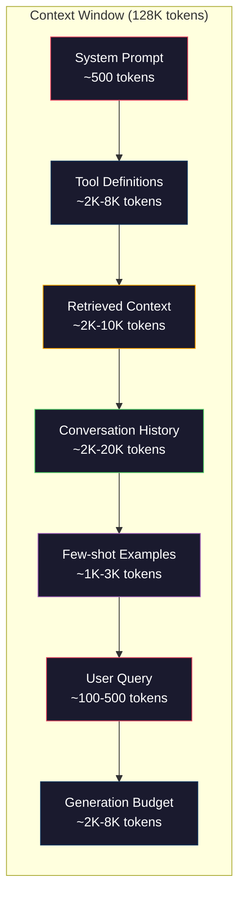
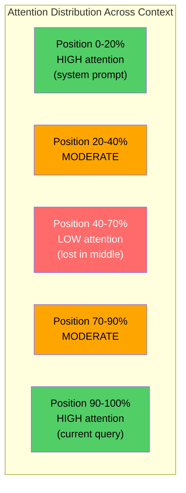
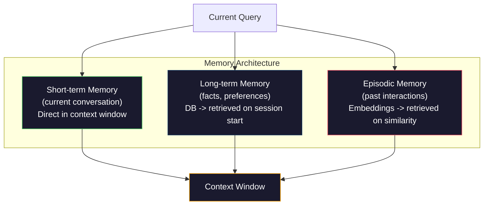

# Context Engineering: Windows, Budgets, Memory, and Retrieval

> Prompt engineering is a subset. Context engineering is the whole game. A prompt is a string you type. Context is everything that goes into the model's window: system instructions, retrieved documents, tool definitions, conversation history, few-shot examples, and the prompt itself. The best AI engineers in 2026 are context engineers. They decide what goes in, what stays out, and in what order.

**Type:** Build
**Languages:** Python
**Prerequisites:** Phase 10 (LLMs from Scratch), Phase 11 Lesson 01-02
**Time:** ~90 minutes

## Learning Objectives

- Calculate token budgets across all context window components (system prompt, tools, history, retrieved docs, generation headroom)
- Implement context window management strategies: truncation, summarization, and sliding window for conversation history
- Prioritize and order context components to maximize the model's attention on the most relevant information
- Build a context assembler that dynamically allocates tokens based on query type and available window space

## The Problem

Claude has a 200K token context window. GPT-4o has 128K. Gemini 1.5 has 1M. These numbers sound enormous until you fill them.

Here is a real breakdown for a coding assistant. System prompt: 500 tokens. Tool definitions for 50 tools: 8,000 tokens. Retrieved documentation: 4,000 tokens. Conversation history (10 turns): 6,000 tokens. Current user query: 200 tokens. Generation budget (max output): 4,000 tokens. Total: 22,700 tokens. That is only 18% of a 128K window.

But attention does not scale linearly with context length. A model with 128K tokens of context pays quadratic attention cost (O(n^2) in vanilla transformers, though most production models use efficient attention variants). More importantly, retrieval accuracy degrades. The "Needle in a Haystack" test shows that models struggle to find information placed in the middle of long contexts. Research by Liu et al. (2023) showed that LLMs retrieve information at the start and end of long contexts with near-perfect accuracy, but accuracy drops 10-20% for information placed in the middle (positions 40-70% of the context). This "lost-in-the-middle" effect varies by model but affects all current architectures.

The practical lesson: having 200K tokens available does not mean using 200K tokens is effective. A carefully curated 10K token context often outperforms a dumped 100K token context. Context engineering is the discipline of maximizing signal-to-noise ratio within the context window.

Every token you put in the window displaces a token that could carry more relevant information. Every irrelevant tool definition, every stale conversation turn, every chunk of retrieved text that does not answer the question -- each one makes the model slightly worse at the task.

## The Concept

### The Context Window is a Scarce Resource

Think of the context window as RAM, not disk. It is fast and directly accessible, but limited. You cannot fit everything. You must choose.



Each component competes for space. Adding more tool definitions means less room for conversation history. Adding more retrieved context means less room for few-shot examples. Context engineering is the art of allocating this budget to maximize task performance.

### Lost-in-the-Middle

The most important empirical finding in context engineering. Models attend better to information at the beginning and end of the context. Information in the middle gets lower attention scores and is more likely to be ignored.

Liu et al. (2023) tested this systematically. They placed a relevant document among 20 irrelevant documents at various positions and measured answer accuracy. When the relevant document was first or last, accuracy was 85-90%. When it was in the middle (position 10 of 20), accuracy dropped to 60-70%.

This has direct engineering implications:

- Put the most important information first (system prompt, critical instructions)
- Put the current query and most relevant context last (recency bias helps)
- Treat the middle of the context as the lowest-priority zone
- If you must include information in the middle, duplicate the key point at the end



### Context Components

**System prompt**: sets the persona, constraints, and behavioral rules. This goes first and stays constant across turns. Claude Code uses roughly 6,000 tokens for its system prompt including tool definitions and behavioral instructions. Keep it tight. Every word in the system prompt is repeated on every API call.

**Tool definitions**: each tool adds 50-200 tokens (name, description, parameter schema). 50 tools at 150 tokens each is 7,500 tokens before any conversation happens. Dynamic tool selection -- only including tools relevant to the current query -- can reduce this by 60-80%.

**Retrieved context**: documents from a vector database, search results, file contents. The quality of retrieval directly determines the quality of the response. Bad retrieval is worse than no retrieval -- it fills the window with noise and actively misleads the model.

**Conversation history**: every previous user message and assistant response. Grows linearly with conversation length. A 50-turn conversation at 200 tokens per turn is 10,000 tokens of history. Most of it is irrelevant to the current query.

**Few-shot examples**: input/output pairs that demonstrate the desired behavior. Two to three well-chosen examples often improve output quality more than thousands of tokens of instructions. But they cost space.

**Generation budget**: the tokens reserved for the model's response. If you fill the window to capacity, the model has no room to answer. Reserve at least 2,000-4,000 tokens for generation.

### Context Compression Strategies

**History summarization**: instead of keeping all previous turns verbatim, periodically summarize the conversation. "We discussed X, decided Y, and the user wants Z" in 100 tokens replaces 10 turns that took 2,000 tokens. Run summarization when history exceeds a threshold (e.g., 5,000 tokens).

**Relevance filtering**: score each retrieved document against the current query and drop documents below a threshold. If you retrieved 10 chunks but only 3 are relevant, discard the other 7. Better to have 3 highly relevant chunks than 10 mediocre ones.

**Tool pruning**: classify the user's query intent and only include tools relevant to that intent. A code question does not need calendar tools. A scheduling question does not need file system tools. This can reduce tool definitions from 8,000 tokens to 1,000.

**Recursive summarization**: for very long documents, summarize in stages. First summarize each section, then summarize the summaries. A 50-page document becomes a 500-token digest that captures the key points.

### Memory Systems

Context engineering spans three time horizons.

**Short-term memory**: the current conversation. Stored in the context window directly. Grows with each turn. Managed by summarization and truncation.

**Long-term memory**: facts and preferences that persist across conversations. "The user prefers TypeScript." "The project uses PostgreSQL." Stored in a database, retrieved on session start. Claude Code stores this in CLAUDE.md files. ChatGPT stores it in its memory feature.

**Episodic memory**: specific past interactions that might be relevant. "Last Tuesday, we debugged a similar issue in the auth module." Stored as embeddings, retrieved when the current conversation matches a past episode.



### Dynamic Context Assembly

The key insight: different queries need different context. A static system prompt + static tools + static history is wasteful. The best systems dynamically assemble context per query.

1. Classify the query intent
2. Select relevant tools (not all tools)
3. Retrieve relevant documents (not a fixed set)
4. Include relevant history turns (not all history)
5. Add few-shot examples that match the task type
6. Order everything by importance: critical first, important last, optional in the middle

This is what separates a good AI application from a great one. The model is the same. The context is the differentiator.

## Build It

### Step 1: Token Counter

You cannot budget what you cannot measure. Build a simple token counter (approximation using whitespace splitting, since the exact count depends on the tokenizer).

```python
import json
import numpy as np
from collections import OrderedDict

def count_tokens(text):
    if not text:
        return 0
    return int(len(text.split()) * 1.3)

def count_tokens_json(obj):
    return count_tokens(json.dumps(obj))
```

### Step 2: Context Budget Manager

The core abstraction. A budget manager tracks how many tokens each component uses and enforces limits.

```python
class ContextBudget:
    def __init__(self, max_tokens=128000, generation_reserve=4000):
        self.max_tokens = max_tokens
        self.generation_reserve = generation_reserve
        self.available = max_tokens - generation_reserve
        self.allocations = OrderedDict()

    def allocate(self, component, content, max_tokens=None):
        tokens = count_tokens(content)
        if max_tokens and tokens > max_tokens:
            words = content.split()
            target_words = int(max_tokens / 1.3)
            content = " ".join(words[:target_words])
            tokens = count_tokens(content)

        used = sum(self.allocations.values())
        if used + tokens > self.available:
            allowed = self.available - used
            if allowed <= 0:
                return None, 0
            words = content.split()
            target_words = int(allowed / 1.3)
            content = " ".join(words[:target_words])
            tokens = count_tokens(content)

        self.allocations[component] = tokens
        return content, tokens

    def remaining(self):
        used = sum(self.allocations.values())
        return self.available - used

    def utilization(self):
        used = sum(self.allocations.values())
        return used / self.max_tokens

    def report(self):
        total_used = sum(self.allocations.values())
        lines = []
        lines.append(f"Context Budget Report ({self.max_tokens:,} token window)")
        lines.append("-" * 50)
        for component, tokens in self.allocations.items():
            pct = tokens / self.max_tokens * 100
            bar = "#" * int(pct / 2)
            lines.append(f"  {component:<25} {tokens:>6} tokens ({pct:>5.1f}%) {bar}")
        lines.append("-" * 50)
        lines.append(f"  {'Used':<25} {total_used:>6} tokens ({total_used/self.max_tokens*100:.1f}%)")
        lines.append(f"  {'Generation reserve':<25} {self.generation_reserve:>6} tokens")
        lines.append(f"  {'Remaining':<25} {self.remaining():>6} tokens")
        return "\n".join(lines)
```

### Step 3: Lost-in-the-Middle Reordering

Implement the reordering strategy: most important items go first and last, least important go in the middle.

```python
def reorder_lost_in_middle(items, scores):
    paired = sorted(zip(scores, items), reverse=True)
    sorted_items = [item for _, item in paired]

    if len(sorted_items) <= 2:
        return sorted_items

    first_half = sorted_items[::2]
    second_half = sorted_items[1::2]
    second_half.reverse()

    return first_half + second_half

def score_relevance(query, documents):
    query_words = set(query.lower().split())
    scores = []
    for doc in documents:
        doc_words = set(doc.lower().split())
        if not query_words:
            scores.append(0.0)
            continue
        overlap = len(query_words & doc_words) / len(query_words)
        scores.append(round(overlap, 3))
    return scores
```

### Step 4: Conversation History Compressor

Summarize old conversation turns to reclaim token budget.

```python
class ConversationManager:
    def __init__(self, max_history_tokens=5000):
        self.turns = []
        self.summaries = []
        self.max_history_tokens = max_history_tokens

    def add_turn(self, role, content):
        self.turns.append({"role": role, "content": content})
        self._compress_if_needed()

    def _compress_if_needed(self):
        total = sum(count_tokens(t["content"]) for t in self.turns)
        if total <= self.max_history_tokens:
            return

        while total > self.max_history_tokens and len(self.turns) > 4:
            old_turns = self.turns[:2]
            summary = self._summarize_turns(old_turns)
            self.summaries.append(summary)
            self.turns = self.turns[2:]
            total = sum(count_tokens(t["content"]) for t in self.turns)

    def _summarize_turns(self, turns):
        parts = []
        for t in turns:
            content = t["content"]
            if len(content) > 100:
                content = content[:100] + "..."
            parts.append(f"{t['role']}: {content}")
        return "Previous: " + " | ".join(parts)

    def get_context(self):
        parts = []
        if self.summaries:
            parts.append("[Conversation Summary]")
            for s in self.summaries:
                parts.append(s)
        parts.append("[Recent Conversation]")
        for t in self.turns:
            parts.append(f"{t['role']}: {t['content']}")
        return "\n".join(parts)

    def token_count(self):
        return count_tokens(self.get_context())
```

### Step 5: Dynamic Tool Selector

Only include tools relevant to the current query. Classify intent, then filter.

```python
TOOL_REGISTRY = {
    "read_file": {
        "description": "Read contents of a file",
        "tokens": 120,
        "categories": ["code", "files"],
    },
    "write_file": {
        "description": "Write content to a file",
        "tokens": 150,
        "categories": ["code", "files"],
    },
    "search_code": {
        "description": "Search for patterns in codebase",
        "tokens": 130,
        "categories": ["code"],
    },
    "run_command": {
        "description": "Execute a shell command",
        "tokens": 140,
        "categories": ["code", "system"],
    },
    "create_calendar_event": {
        "description": "Create a new calendar event",
        "tokens": 180,
        "categories": ["calendar"],
    },
    "list_emails": {
        "description": "List recent emails",
        "tokens": 160,
        "categories": ["email"],
    },
    "send_email": {
        "description": "Send an email message",
        "tokens": 200,
        "categories": ["email"],
    },
    "web_search": {
        "description": "Search the web for information",
        "tokens": 140,
        "categories": ["research"],
    },
    "query_database": {
        "description": "Run a SQL query on the database",
        "tokens": 170,
        "categories": ["code", "data"],
    },
    "generate_chart": {
        "description": "Generate a chart from data",
        "tokens": 190,
        "categories": ["data", "visualization"],
    },
}

def classify_intent(query):
    query_lower = query.lower()

    intent_keywords = {
        "code": ["code", "function", "bug", "error", "file", "implement", "refactor", "debug", "test"],
        "calendar": ["meeting", "schedule", "calendar", "appointment", "event"],
        "email": ["email", "mail", "send", "inbox", "message"],
        "research": ["search", "find", "what is", "how does", "explain", "look up"],
        "data": ["data", "query", "database", "chart", "graph", "analytics", "sql"],
    }

    scores = {}
    for intent, keywords in intent_keywords.items():
        score = sum(1 for kw in keywords if kw in query_lower)
        if score > 0:
            scores[intent] = score

    if not scores:
        return ["code"]

    max_score = max(scores.values())
    return [intent for intent, score in scores.items() if score >= max_score * 0.5]

def select_tools(query, token_budget=2000):
    intents = classify_intent(query)
    relevant = {}
    total_tokens = 0

    for name, tool in TOOL_REGISTRY.items():
        if any(cat in intents for cat in tool["categories"]):
            if total_tokens + tool["tokens"] <= token_budget:
                relevant[name] = tool
                total_tokens += tool["tokens"]

    return relevant, total_tokens
```

### Step 6: Full Context Assembly Pipeline

Wire everything together. Given a query, dynamically assemble the optimal context.

```python
class ContextEngine:
    def __init__(self, max_tokens=128000, generation_reserve=4000):
        self.budget = ContextBudget(max_tokens, generation_reserve)
        self.conversation = ConversationManager(max_history_tokens=5000)
        self.system_prompt = (
            "You are a helpful AI assistant. You have access to tools for "
            "code editing, file management, web search, and data analysis. "
            "Use the appropriate tools for each task. Be concise and accurate."
        )
        self.knowledge_base = [
            "Python 3.12 introduced type parameter syntax for generic classes using bracket notation.",
            "The project uses PostgreSQL 16 with pgvector for embedding storage.",
            "Authentication is handled by Supabase Auth with JWT tokens.",
            "The frontend is built with Next.js 15 using the App Router.",
            "API rate limits are set to 100 requests per minute per user.",
            "The deployment pipeline uses GitHub Actions with Docker multi-stage builds.",
            "Test coverage must be above 80% for all new modules.",
            "The codebase follows the repository pattern for data access.",
        ]

    def assemble(self, query):
        self.budget = ContextBudget(self.budget.max_tokens, self.budget.generation_reserve)

        system_content, _ = self.budget.allocate("system_prompt", self.system_prompt, max_tokens=1000)

        tools, tool_tokens = select_tools(query, token_budget=2000)
        tool_text = json.dumps(list(tools.keys()))
        tool_content, _ = self.budget.allocate("tools", tool_text, max_tokens=2000)

        relevance = score_relevance(query, self.knowledge_base)
        threshold = 0.1
        relevant_docs = [
            doc for doc, score in zip(self.knowledge_base, relevance)
            if score >= threshold
        ]

        if relevant_docs:
            doc_scores = [s for s in relevance if s >= threshold]
            reordered = reorder_lost_in_middle(relevant_docs, doc_scores)
            doc_text = "\n".join(reordered)
            doc_content, _ = self.budget.allocate("retrieved_context", doc_text, max_tokens=3000)

        history_text = self.conversation.get_context()
        if history_text.strip():
            history_content, _ = self.budget.allocate("conversation_history", history_text, max_tokens=5000)

        query_content, _ = self.budget.allocate("user_query", query, max_tokens=500)

        return self.budget

    def chat(self, query):
        self.conversation.add_turn("user", query)
        budget = self.assemble(query)
        response = f"[Response to: {query[:50]}...]"
        self.conversation.add_turn("assistant", response)
        return budget


def run_demo():
    print("=" * 60)
    print("  Context Engineering Pipeline Demo")
    print("=" * 60)

    engine = ContextEngine(max_tokens=128000, generation_reserve=4000)

    print("\n--- Query 1: Code task ---")
    budget = engine.chat("Fix the bug in the authentication module where JWT tokens expire too early")
    print(budget.report())

    print("\n--- Query 2: Research task ---")
    budget = engine.chat("What is the best approach for implementing vector search in PostgreSQL?")
    print(budget.report())

    print("\n--- Query 3: After conversation history builds up ---")
    for i in range(8):
        engine.conversation.add_turn("user", f"Follow-up question number {i+1} about the implementation details of the system")
        engine.conversation.add_turn("assistant", f"Here is the response to follow-up {i+1} with technical details about the architecture")

    budget = engine.chat("Now implement the changes we discussed")
    print(budget.report())

    print("\n--- Tool Selection Examples ---")
    test_queries = [
        "Fix the bug in auth.py",
        "Schedule a meeting with the team for Tuesday",
        "Show me the database query performance stats",
        "Search for best practices on error handling",
    ]

    for q in test_queries:
        tools, tokens = select_tools(q)
        intents = classify_intent(q)
        print(f"\n  Query: {q}")
        print(f"  Intents: {intents}")
        print(f"  Tools: {list(tools.keys())} ({tokens} tokens)")

    print("\n--- Lost-in-the-Middle Reordering ---")
    docs = ["Doc A (most relevant)", "Doc B (somewhat relevant)", "Doc C (least relevant)",
            "Doc D (relevant)", "Doc E (moderately relevant)"]
    scores = [0.95, 0.60, 0.20, 0.80, 0.50]
    reordered = reorder_lost_in_middle(docs, scores)
    print(f"  Original order: {docs}")
    print(f"  Scores:         {scores}")
    print(f"  Reordered:      {reordered}")
    print(f"  (Most relevant at start and end, least relevant in middle)")
```

## Use It

### Claude Code's Context Strategy

Claude Code manages context with a layered approach. The system prompt includes behavioral rules and tool definitions (~6K tokens). When you open a file, its contents are injected as context. When you search, results are added. Old conversation turns are summarized. CLAUDE.md provides long-term memory that persists across sessions.

The key engineering decision: Claude Code does not dump your entire codebase into the context. It retrieves relevant files on demand. This is context engineering in practice.

### Cursor's Dynamic Context Loading

Cursor indexes your entire codebase into embeddings. When you type a query, it retrieves the most relevant files and code blocks using vector similarity. Only those pieces go into the context window. A 500K-line codebase is compressed into the 5-10 most relevant code blocks.

This is the pattern: embed everything, retrieve on demand, include only what matters.

### ChatGPT Memory

ChatGPT stores user preferences and facts as long-term memory. On each conversation start, relevant memories are retrieved and included in the system prompt. "The user prefers Python" costs 5 tokens but saves hundreds of tokens of repeated instructions across conversations.

### RAG as Context Engineering

Retrieval-Augmented Generation is context engineering formalized. Instead of stuffing knowledge into the model's weights (training) or the system prompt (static context), you retrieve relevant documents at query time and inject them into the context window. The entire RAG pipeline -- chunking, embedding, retrieval, reranking -- exists to solve one problem: putting the right information in the context window.

## Ship It

This lesson produces `outputs/prompt-context-optimizer.md` -- a reusable prompt that audits a context assembly strategy and recommends optimizations. Feed it your system prompt, tool count, average history length, and retrieval strategy, and it identifies token waste and suggests improvements.

It also produces `outputs/skill-context-engineering.md` -- a decision framework for designing context assembly pipelines based on task type, context window size, and latency budget.

## Exercises

1. Add a "token waste detector" to the ContextBudget class. It should flag components using more than 30% of the budget and suggest compression strategies specific to each component type (summarize history, prune tools, re-rank documents).

2. Implement semantic deduplication for retrieved context. If two retrieved documents are more than 80% similar (by word overlap or cosine similarity of their embeddings), keep only the higher-scored one. Measure how much token budget this recovers.

3. Build a "context replay" tool. Given a conversation transcript, replay it through the ContextEngine and visualize how the budget allocation changes turn by turn. Plot token usage per component over time. Identify the turn where context starts getting compressed.

4. Implement a priority-based tool selector. Instead of binary include/exclude, assign each tool a relevance score to the current query. Include tools in descending relevance order until the tool budget is exhausted. Compare task performance with 5, 10, 20, and 50 tools included.

5. Build a multi-strategy context compressor. Implement three compression strategies (truncation, summarization, extraction of key sentences) and benchmark them on a set of 20 documents. Measure the tradeoff between compression ratio and information retention (does the compressed version still contain the answer to the query?).

## Key Terms

| Term | What people say | What it actually means |
|------|----------------|----------------------|
| Context window | "How much the model can read" | The maximum number of tokens (input + output) the model processes in a single forward pass -- 128K for GPT-4o, 200K for Claude 3.5 |
| Context engineering | "Advanced prompt engineering" | The discipline of deciding what goes into the context window, in what order, and at what priority -- encompasses retrieval, compression, tool selection, and memory management |
| Lost-in-the-middle | "Models forget stuff in the middle" | Empirical finding that LLMs attend better to the beginning and end of context, with 10-20% accuracy drop for information placed in the middle |
| Token budget | "How many tokens you have left" | An explicit allocation of context window capacity across components (system prompt, tools, history, retrieval, generation) with per-component limits |
| Dynamic context | "Loading stuff on the fly" | Assembling the context window differently for each query based on intent classification, relevant tool selection, and retrieval results |
| History summarization | "Compressing the conversation" | Replacing verbatim old conversation turns with a concise summary, reducing token cost while preserving key information |
| Tool pruning | "Only including relevant tools" | Classifying query intent and only including tool definitions that match, reducing tool token cost by 60-80% |
| Long-term memory | "Remembering across sessions" | Facts and preferences stored in a database and retrieved at session start -- CLAUDE.md, ChatGPT Memory, and similar systems |
| Episodic memory | "Remembering specific past events" | Past interactions stored as embeddings and retrieved when the current query is similar to a past conversation |
| Generation budget | "Room for the answer" | Tokens reserved for the model's output -- if the context fills the window completely, the model has no room to respond |

## Further Reading

- [Liu et al., 2023 -- "Lost in the Middle: How Language Models Use Long Contexts"](https://arxiv.org/abs/2307.03172) -- the definitive study on position-dependent attention, showing that models struggle with information in the middle of long contexts
- [Anthropic's Contextual Retrieval blog post](https://www.anthropic.com/news/contextual-retrieval) -- how Anthropic approaches context-aware chunk retrieval, reducing retrieval failure by 49%
- [Simon Willison's "Context Engineering"](https://simonwillison.net/2025/Jun/27/context-engineering/) -- the blog post that named the discipline and distinguished it from prompt engineering
- [LangChain documentation on RAG](https://python.langchain.com/docs/tutorials/rag/) -- practical implementation of retrieval-augmented generation as a context engineering pattern
- [Greg Kamradt's Needle in a Haystack test](https://github.com/gkamradt/LLMTest_NeedleInAHaystack) -- the benchmark that revealed position-dependent retrieval failures across all major models
