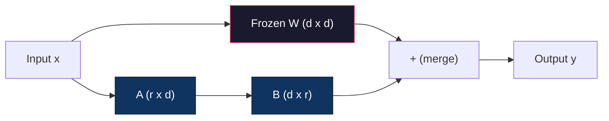
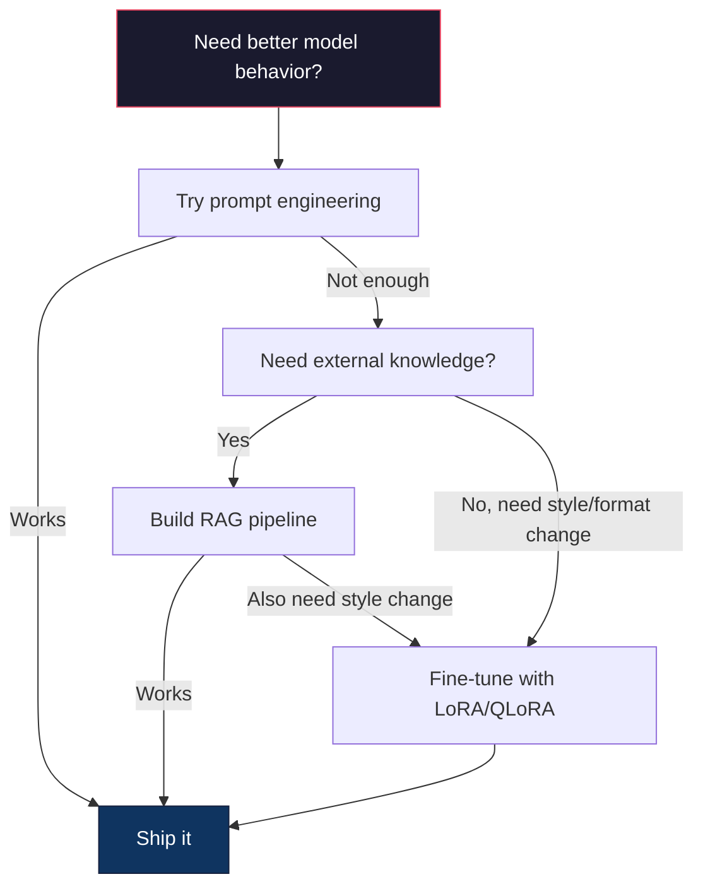

# Fine-Tuning with LoRA & QLoRA

> Full fine-tuning a 7B model requires 56GB of VRAM. You don't have that. Neither do most companies. LoRA lets you fine-tune the same model in 6GB by training less than 1% of the parameters. This isn't a compromise -- it matches full fine-tuning quality on most tasks. The entire open-source fine-tuning ecosystem runs on this one trick.

**Type:** Build
**Languages:** Python
**Prerequisites:** Phase 10, Lesson 06 (Instruction Tuning / SFT)
**Time:** ~75 minutes

## Learning Objectives

- Implement LoRA by injecting low-rank adapter matrices (A and B) into a pretrained model's attention layers
- Calculate the parameter savings of LoRA vs full fine-tuning: rank r with d_model dimensions trains 2*r*d parameters instead of d^2
- Fine-tune a model using QLoRA (4-bit quantized base + LoRA adapters) to fit within consumer GPU memory
- Merge LoRA weights back into the base model for deployment and compare inference speed with and without adapters

## The Problem

You have a base model. Llama 3 8B. You want it to answer customer support tickets in your company's voice. SFT is the answer. But SFT has a cost problem.

Full fine-tuning updates every parameter in the model. Llama 3 8B has 8 billion parameters. In fp16, each parameter takes 2 bytes. That's 16GB just to load the weights. During training, you also need gradients (16GB), optimizer states for Adam (32GB for momentum + variance), and activations. Total: roughly 56GB of VRAM for a single 8B model.

An A100 80GB can barely fit this. Two A100s cost $3-4/hour on cloud providers. Training for 3 epochs on 50,000 examples takes 6-10 hours. That's $30-40 per experiment. Run 10 experiments to get the hyperparameters right and you've spent $400 before deploying anything.

Scale this to Llama 3 70B and the numbers get absurd. 140GB for weights alone. You need a cluster. $100+ per experiment.

There's a deeper problem too. Full fine-tuning modifies every weight in the model. If you fine-tune on customer support data, you might degrade the model's general capabilities. It's called catastrophic forgetting. The model gets better at your task and worse at everything else.

You need a method that trains fewer parameters, uses less memory, and doesn't destroy the model's existing knowledge.

## The Concept

### LoRA: Low-Rank Adaptation

Edward Hu and colleagues at Microsoft published LoRA in June 2021. The paper's insight: the weight updates during fine-tuning have low intrinsic rank. You don't need to update all 16.7 million parameters in a 4096x4096 weight matrix. The useful information in the update can be captured by a matrix of rank 16 or 32.

Here's the math. A standard linear layer computes:

```
y = Wx
```

Where W is a d_out x d_in matrix. For a 4096x4096 attention projection, that's 16,777,216 parameters.

LoRA freezes W and adds a low-rank decomposition:

```
y = Wx + BAx
```

Where B is (d_out x r) and A is (r x d_in). The rank r is much smaller than d -- typically 8, 16, or 32.

For r=16 on a 4096x4096 layer:
- Original parameters: 4096 x 4096 = 16,777,216
- LoRA parameters: (4096 x 16) + (16 x 4096) = 65,536 + 65,536 = 131,072
- Reduction: 131,072 / 16,777,216 = 0.78%

You're training 0.78% of the parameters and getting 95-100% of the quality.



A is initialized with a random Gaussian. B is initialized to zero. This means the LoRA contribution starts at zero -- the model begins training from its original behavior and gradually learns the adaptation.

### The Scaling Factor: Alpha

LoRA introduces a scaling factor alpha that controls how much the low-rank update affects the output:

```
y = Wx + (alpha / r) * BAx
```

When alpha = r, the scaling is 1x. When alpha = 2r (the common default), the scaling is 2x. This hyperparameter controls the learning rate of the LoRA path independently of the base learning rate.

Practical guidance:
- alpha = 2 * rank is a common community convention (the original paper used alpha = rank in most experiments)
- alpha = rank gives 1x scaling, conservative but stable
- Higher alpha means larger updates per step, which can speed convergence or cause instability

### Where to Apply LoRA

A transformer has many linear layers. You don't need to add LoRA to all of them. The original paper tested different combinations:

| Target Layers | Trainable Params (7B) | Quality |
|--------------|----------------------|---------|
| q_proj only | 4.7M | Good |
| q_proj + v_proj | 9.4M | Better |
| q_proj + k_proj + v_proj + o_proj | 18.9M | Best for attention |
| All linear (attention + MLP) | 37.7M | Marginal gain, 2x params |

The sweet spot for most tasks: q_proj + v_proj. This targets the query and value projections in self-attention, which control what the model attends to and what information it extracts. Adding MLP layers helps for complex tasks like code generation but doubles the parameter count for diminishing returns on simpler tasks.

### Rank Selection

The rank r controls the expressiveness of the adaptation:

| Rank | Trainable Params (per layer) | Best For |
|------|---------------------------|----------|
| 4 | 32,768 | Simple classification, sentiment |
| 8 | 65,536 | Single-domain Q&A, summarization |
| 16 | 131,072 | Multi-domain tasks, instruction following |
| 32 | 262,144 | Complex reasoning, code generation |
| 64 | 524,288 | Diminishing returns for most tasks |
| 128 | 1,048,576 | Rarely justified |

Hu et al. showed that r=4 already captures most of the adaptation for simple tasks. r=8 and r=16 are the most common choices in practice. Going beyond r=64 rarely improves quality and starts to lose LoRA's memory advantage.

### QLoRA: 4-Bit Quantization + LoRA

Tim Dettmers and colleagues at the University of Washington published QLoRA in May 2023. The idea: quantize the frozen base model to 4-bit precision, then attach LoRA adapters in fp16 on top.

This changes the memory equation dramatically:

| Method | Weight Memory (7B) | Training Memory (7B) | GPU Required |
|--------|-------------------|---------------------|-------------|
| Full fine-tune (fp16) | 14GB | ~56GB | 1x A100 80GB |
| LoRA (fp16 base) | 14GB | ~18GB | 1x A100 40GB |
| QLoRA (4-bit base) | 3.5GB | ~6GB | 1x RTX 3090 24GB |

QLoRA makes three technical contributions:

**NF4 (Normal Float 4-bit)**: A new data type designed specifically for neural network weights. Neural network weights follow a roughly normal distribution. NF4 places its 16 quantization levels at the quantiles of a standard normal distribution. This is information-theoretically optimal for normally distributed data. It loses less information than uniform 4-bit quantization (INT4) or standard Float4.

**Double quantization**: The quantization constants themselves take memory. Each block of 64 weights needs a fp32 scale factor (4 bytes). For a 7B model, that's an extra 0.4GB. Double quantization quantizes these constants to fp8, reducing the overhead to 0.1GB. Small but it adds up.

**Paged optimizers**: During training, optimizer states (Adam's momentum and variance) can exceed GPU memory on long sequences. Paged optimizers use NVIDIA's unified memory to automatically page optimizer states to CPU RAM when GPU memory is exhausted, and page them back when needed. This prevents OOM crashes at the cost of some throughput.

### The Quality Question

Does reducing parameters or quantizing the base hurt quality? The results from multiple papers:

| Method | MMLU (5-shot) | MT-Bench | HumanEval |
|--------|--------------|----------|-----------|
| Full fine-tune (Llama 2 7B) | 48.3 | 6.72 | 14.6 |
| LoRA r=16 | 47.9 | 6.68 | 14.0 |
| QLoRA r=16 (NF4) | 47.5 | 6.61 | 13.4 |
| QLoRA r=64 (NF4) | 48.1 | 6.70 | 14.2 |

LoRA at r=16 is within 1% of full fine-tuning on most benchmarks. QLoRA at r=16 loses another fraction of a percent. QLoRA at r=64 essentially matches full fine-tuning while using 90% less memory.

### Real-World Costs

Fine-tuning Llama 3 8B on 50,000 examples (3 epochs):

| Method | GPU | Time | Cost |
|--------|-----|------|------|
| Full fine-tune | 2x A100 80GB | 8 hours | ~$32 |
| LoRA r=16 | 1x A100 40GB | 4 hours | ~$8 |
| QLoRA r=16 | 1x RTX 4090 24GB | 6 hours | ~$5 |
| QLoRA r=16 | 1x T4 16GB | 12 hours | ~$4 |

QLoRA on a single consumer GPU costs less than a lunch. This is why the open-source fine-tuning community exploded in 2023.

### Merging Adapters

After training, you have two things: the frozen base model and a small LoRA adapter (typically 10-100MB). You can either:

1. **Keep them separate**: Load the base model, load the adapter on top. Swap adapters for different tasks. This is how you serve multiple fine-tuned variants from one base model.

2. **Merge them permanently**: Compute W' = W + (alpha/r) * BA and save the result as a new full model. The merged model is the same size as the original. No inference overhead. No adapter to manage.

For serving multiple tasks (customer support adapter, code adapter, translation adapter), keep them separate. For deploying a single specialized model, merge.

Advanced merging techniques for combining multiple adapters:

- **TIES-Merging** (Yadav et al. 2023): Trims small-magnitude parameters, resolves sign conflicts, then merges. Reduces interference between adapters.
- **DARE** (Yu et al. 2023): Randomly drops adapter parameters before merging and rescales the rest. Surprisingly effective at combining capabilities.
- **Task arithmetic**: Simply add or subtract adapter weights. Adding a "code" adapter and a "math" adapter often produces a model good at both.

### When NOT to Fine-Tune

Fine-tuning is the third option, not the first.

**First: prompt engineering.** Write a better system prompt. Add few-shot examples. Use chain-of-thought. This costs nothing and takes minutes. If prompting gets you 80% of the way there, you probably don't need to fine-tune.

**Second: RAG.** If the model needs to know about your specific data (documents, knowledge base, product catalog), retrieval is cheaper and more maintainable than baking it into weights. See Lesson 06.

**Third: fine-tuning.** Use this when you need the model to adopt a specific style, format, or reasoning pattern that cannot be achieved through prompting. When you need consistent structured output. When you need to distill a larger model into a smaller one. When latency matters and you can't afford the extra tokens from few-shot prompting.



## Build It

We implement LoRA from scratch in pure PyTorch. No libraries. No magic. You'll build the LoRA layer, inject it into a model, train it, and merge the weights back.

### Step 1: The LoRA Layer

```python
import torch
import torch.nn as nn
import math

class LoRALayer(nn.Module):
    def __init__(self, in_features, out_features, rank=8, alpha=16):
        super().__init__()
        self.rank = rank
        self.alpha = alpha
        self.scaling = alpha / rank

        self.A = nn.Parameter(torch.randn(in_features, rank) * (1 / math.sqrt(rank)))
        self.B = nn.Parameter(torch.zeros(rank, out_features))

    def forward(self, x):
        return (x @ self.A @ self.B) * self.scaling
```

A is initialized with scaled random values. B is initialized to zero. The product BA starts at zero, so the model begins with its original behavior.

### Step 2: LoRA-Wrapped Linear Layer

```python
class LinearWithLoRA(nn.Module):
    def __init__(self, linear, rank=8, alpha=16):
        super().__init__()
        self.linear = linear
        self.lora = LoRALayer(
            linear.in_features, linear.out_features, rank, alpha
        )

        for param in self.linear.parameters():
            param.requires_grad = False

    def forward(self, x):
        return self.linear(x) + self.lora(x)
```

The original linear layer is frozen. Only the LoRA parameters (A and B) are trainable.

### Step 3: Inject LoRA into a Model

```python
def inject_lora(model, target_modules, rank=8, alpha=16):
    for param in model.parameters():
        param.requires_grad = False

    lora_layers = {}
    for name, module in model.named_modules():
        if isinstance(module, nn.Linear):
            if any(t in name for t in target_modules):
                parent_name = ".".join(name.split(".")[:-1])
                child_name = name.split(".")[-1]
                parent = dict(model.named_modules())[parent_name]
                lora_linear = LinearWithLoRA(module, rank, alpha)
                setattr(parent, child_name, lora_linear)
                lora_layers[name] = lora_linear
    return lora_layers
```

First, freeze every parameter in the model. Then walk the model tree, find linear layers matching your target names, and replace them with LoRA-wrapped versions. The LoRA A and B matrices are the only trainable parameters in the entire model.

### Step 4: Count Parameters

```python
def count_parameters(model):
    total = sum(p.numel() for p in model.parameters())
    trainable = sum(p.numel() for p in model.parameters() if p.requires_grad)
    frozen = total - trainable
    return {
        "total": total,
        "trainable": trainable,
        "frozen": frozen,
        "trainable_pct": 100 * trainable / total if total > 0 else 0
    }
```

### Step 5: Merge Weights Back

```python
def merge_lora_weights(model):
    for name, module in model.named_modules():
        if isinstance(module, LinearWithLoRA):
            with torch.no_grad():
                merged = (
                    module.lora.A @ module.lora.B
                ) * module.lora.scaling
                module.linear.weight.data += merged.T
            parent_name = ".".join(name.split(".")[:-1])
            child_name = name.split(".")[-1]
            if parent_name:
                parent = dict(model.named_modules())[parent_name]
            else:
                parent = model
            setattr(parent, child_name, module.linear)
```

After merging, the LoRA layers are gone. The model is the same size as the original with the adaptation baked into the weights. No inference overhead.

### Step 6: Simulated QLoRA Quantization

```python
def quantize_to_nf4(tensor, block_size=64):
    blocks = tensor.reshape(-1, block_size)
    scales = blocks.abs().max(dim=1, keepdim=True).values / 7.0
    scales = torch.clamp(scales, min=1e-8)
    quantized = torch.round(blocks / scales).clamp(-8, 7).to(torch.int8)
    return quantized, scales

def dequantize_from_nf4(quantized, scales, original_shape):
    dequantized = quantized.float() * scales
    return dequantized.reshape(original_shape)
```

This simulates 4-bit quantization by mapping weights into 16 discrete levels within blocks of 64. Production QLoRA uses the bitsandbytes library for true NF4 on GPU.

### Step 7: Training Loop

```python
def train_lora(model, data, epochs=5, lr=1e-3, batch_size=4):
    optimizer = torch.optim.AdamW(
        [p for p in model.parameters() if p.requires_grad], lr=lr
    )
    criterion = nn.MSELoss()

    losses = []
    for epoch in range(epochs):
        epoch_loss = 0.0
        n_batches = 0
        indices = torch.randperm(len(data["inputs"]))

        for i in range(0, len(indices), batch_size):
            batch_idx = indices[i:i + batch_size]
            x = data["inputs"][batch_idx]
            y = data["targets"][batch_idx]

            output = model(x)
            loss = criterion(output, y)

            optimizer.zero_grad()
            loss.backward()
            optimizer.step()

            epoch_loss += loss.item()
            n_batches += 1

        avg_loss = epoch_loss / n_batches
        losses.append(avg_loss)

    return losses
```

### Step 8: Full Demo

```python
def demo():
    torch.manual_seed(42)
    d_model = 256
    n_classes = 10

    model = nn.Sequential(
        nn.Linear(d_model, 512),
        nn.ReLU(),
        nn.Linear(512, 512),
        nn.ReLU(),
        nn.Linear(512, n_classes),
    )

    n_samples = 500
    x = torch.randn(n_samples, d_model)
    y = torch.randint(0, n_classes, (n_samples,))
    y_onehot = torch.zeros(n_samples, n_classes).scatter_(1, y.unsqueeze(1), 1.0)

    data = {"inputs": x, "targets": y_onehot}

    params_before = count_parameters(model)

    lora_layers = inject_lora(
        model, target_modules=["0", "2"], rank=8, alpha=16
    )

    params_after = count_parameters(model)

    losses = train_lora(model, data, epochs=20, lr=1e-3)

    merge_lora_weights(model)
    params_merged = count_parameters(model)

    return {
        "params_before": params_before,
        "params_after": params_after,
        "params_merged": params_merged,
        "losses": losses,
    }
```

The demo creates a small model, injects LoRA into two layers, trains it, and merges the weights back. The parameter count drops from full trainable to ~1% trainable during LoRA training, then returns to the original architecture after merging.

## Use It

With the Hugging Face ecosystem, LoRA on a real model takes about 20 lines:

```python
from transformers import AutoModelForCausalLM, AutoTokenizer
from peft import LoraConfig, get_peft_model, TaskType

model = AutoModelForCausalLM.from_pretrained("meta-llama/Llama-3.1-8B")
tokenizer = AutoTokenizer.from_pretrained("meta-llama/Llama-3.1-8B")

lora_config = LoraConfig(
    task_type=TaskType.CAUSAL_LM,
    r=16,
    lora_alpha=32,
    lora_dropout=0.05,
    target_modules=["q_proj", "v_proj"],
)

model = get_peft_model(model, lora_config)
model.print_trainable_parameters()
```

For QLoRA, add bitsandbytes quantization:

```python
from transformers import BitsAndBytesConfig

bnb_config = BitsAndBytesConfig(
    load_in_4bit=True,
    bnb_4bit_quant_type="nf4",
    bnb_4bit_compute_dtype=torch.bfloat16,
    bnb_4bit_use_double_quant=True,
)

model = AutoModelForCausalLM.from_pretrained(
    "meta-llama/Llama-3.1-8B",
    quantization_config=bnb_config,
    device_map="auto",
)

model = get_peft_model(model, lora_config)
```

That's it. Same training loop. Same data pipeline. The base model now lives in 4-bit, LoRA adapters train in fp16, and the whole thing fits in 6GB.

For training with the Hugging Face Trainer:

```python
from transformers import TrainingArguments, Trainer
from datasets import load_dataset

dataset = load_dataset("tatsu-lab/alpaca", split="train[:5000]")

training_args = TrainingArguments(
    output_dir="./lora-llama",
    num_train_epochs=3,
    per_device_train_batch_size=4,
    gradient_accumulation_steps=4,
    learning_rate=2e-4,
    fp16=True,
    logging_steps=10,
    save_strategy="epoch",
    optim="paged_adamw_8bit",
)

trainer = Trainer(
    model=model,
    args=training_args,
    train_dataset=dataset,
)

trainer.train()

model.save_pretrained("./lora-adapter")
```

The saved adapter is 10-100MB. The base model stays untouched. You can share adapters on the Hugging Face Hub without redistributing the full model.

## Ship It

This lesson produces:
- `outputs/prompt-lora-advisor.md` -- a prompt that helps you decide LoRA rank, target modules, and hyperparameters for your specific task
- `outputs/skill-fine-tuning-guide.md` -- a skill that teaches agents the decision tree for when and how to fine-tune

## Exercises

1. **Rank ablation study.** Run the demo with ranks 2, 4, 8, 16, 32, and 64. Plot final loss vs. rank. Find the point of diminishing returns where doubling the rank no longer halves the loss. For a simple classification task on 256-dim features, this should be around r=8-16.

2. **Target module comparison.** Modify inject_lora to target only layer "0", only layer "2", only layer "4", and all three. Train each variant for 20 epochs. Compare convergence speed and final loss. This mirrors the real decision of targeting q_proj vs v_proj vs all linear layers.

3. **Quantization error analysis.** Take the trained model's weight matrices before and after quantize_to_nf4 / dequantize_from_nf4. Compute the mean squared error, max absolute error, and the correlation between original and reconstructed weights. Experiment with block_size values of 32, 64, 128, and 256.

4. **Multi-adapter serving.** Train two LoRA adapters on different subsets of the data (even indices vs odd indices). Save both adapters. Load the base model once, then swap adapters and verify that each produces different outputs on the same input. This is how production systems serve multiple fine-tuned models from one base.

5. **Merge vs. unmerged inference.** Compare the output of the LoRA model before and after merge_lora_weights on the same 100 inputs. Verify the outputs are identical (within floating-point tolerance of 1e-5). Then benchmark inference speed for both -- merged should be slightly faster since it's a single matrix multiply instead of two.

## Key Terms

| Term | What people say | What it actually means |
|------|----------------|----------------------|
| LoRA | "Efficient fine-tuning" | Low-Rank Adaptation: freeze base weights, train two small matrices A and B whose product approximates the full weight update |
| QLoRA | "Fine-tune on a laptop" | Quantized LoRA: load the base model in 4-bit NF4, train LoRA adapters in fp16 on top, enabling 7B fine-tuning in 6GB VRAM |
| Rank (r) | "How much the model can learn" | The inner dimension of the A and B matrices; controls expressiveness vs. parameter count |
| Alpha | "LoRA learning rate" | Scaling factor applied to the LoRA output; alpha/r scales the adaptation's contribution to the final output |
| NF4 | "4-bit quantization" | Normal Float 4: a 4-bit data type with quantization levels at normal distribution quantiles, optimal for neural network weights |
| Adapter | "The small trained part" | The LoRA A and B matrices saved as a separate file (10-100MB), loadable on top of any copy of the base model |
| Target modules | "Which layers to LoRA" | The specific linear layers (q_proj, v_proj, etc.) where LoRA adapters are injected |
| Merging | "Bake it in" | Computing W + (alpha/r) * BA and replacing the original weight, eliminating the adapter overhead at inference |
| Paged optimizers | "Don't OOM during training" | Offloading optimizer states (Adam momentum, variance) to CPU when GPU memory is exhausted |
| Catastrophic forgetting | "Fine-tuning broke everything else" | When updating all weights causes the model to lose previously learned capabilities |

## Further Reading

- Hu et al., "LoRA: Low-Rank Adaptation of Large Language Models" (2021) -- the original paper introducing the low-rank decomposition method, tested on GPT-3 175B with rank as low as 4
- Dettmers et al., "QLoRA: Efficient Finetuning of Quantized Language Models" (2023) -- introduces NF4, double quantization, and paged optimizers, enabling 65B fine-tuning on a single 48GB GPU
- PEFT library documentation (huggingface.co/docs/peft) -- the standard library for LoRA, QLoRA, and other parameter-efficient methods in the Hugging Face ecosystem
- Yadav et al., "TIES-Merging: Resolving Interference When Merging Models" (2023) -- techniques for combining multiple LoRA adapters without quality degradation
