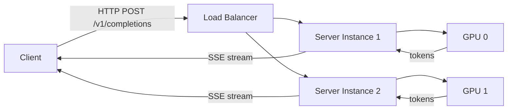
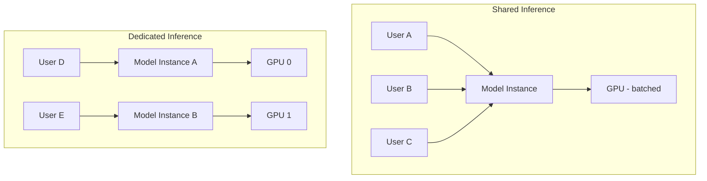
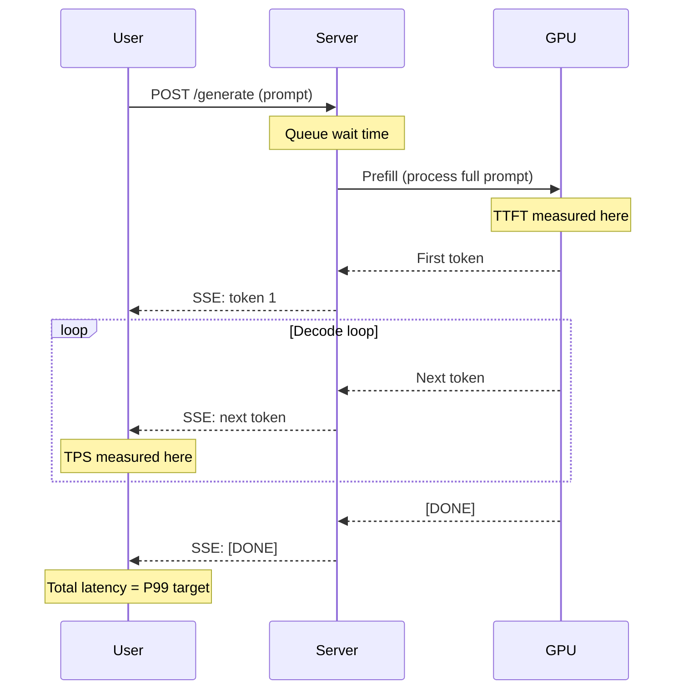
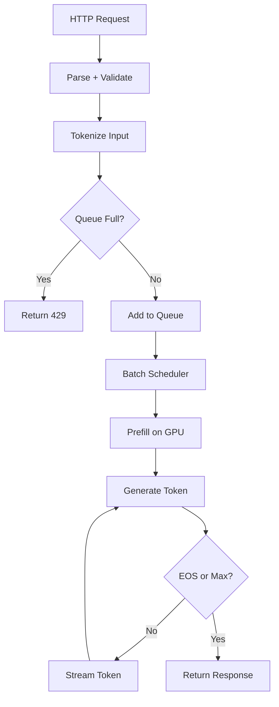

# Model Serving

> Your model works on your laptop. Now 10,000 users want it simultaneously.

**Type:** Build
**Languages:** Python
**Prerequisites:** Phase 10 (LLMs from Scratch), Phase 11 (LLM Engineering)
**Time:** ~90 minutes

## Learning Objectives

- Build a model serving endpoint with FastAPI that handles concurrent requests, streams tokens, and returns structured responses
- Implement continuous batching to group multiple requests into a single GPU forward pass, maximizing throughput
- Configure vLLM or TGI for production serving and benchmark latency (TTFT, TPS) and throughput under load
- Explain the tradeoffs between static batching, continuous batching, and speculative decoding for different traffic patterns

## The Problem

You trained a model. You ran inference in a Jupyter notebook. It works. You call `model.generate()`, wait a few seconds, and get text back. Ship it?

Not even close. That notebook runs on one GPU. It serves one request at a time. When two users send prompts simultaneously, one waits while the other finishes. When the tenth user arrives, the queue is 30 seconds deep. When the hundredth arrives, your process crashes from memory pressure.

Model serving is the engineering discipline of taking a model that works in isolation and making it work under load. This means handling concurrent requests, managing GPU memory across multiple prompts, streaming tokens to users as they are generated, and measuring everything so you know when things break.

The gap between "model works" and "model serves production traffic" is where most AI projects stall. This lesson closes that gap.

## The Concept

### What Serving Actually Means

Serving a model means wrapping it in a service that accepts requests over a network, runs inference on hardware, and returns results. Sounds simple. The complexity hides in the details.



A model sitting in memory on a GPU does nothing until a request arrives. The serving layer is everything between the network and the forward pass: parsing the request, tokenizing the input, scheduling it onto hardware, running the computation, decoding the output, and streaming it back.

### Shared vs Dedicated Inference

There are two deployment models for serving.

**Shared inference** means multiple users share the same model instance. Their requests get batched together. The GPU processes them simultaneously, amortizing the cost of loading model weights across many prompts. This is how every API provider works. OpenAI, Anthropic, Google: they are not spinning up a fresh GPU per request. They pack requests into batches and process them together.

**Dedicated inference** means one user (or one organization) gets their own model instance. Nobody else shares that GPU. Latency is predictable because there is no contention. Cost is higher because the GPU sits idle between requests. This is the model for fine-tuned models, on-prem deployments, and workloads where data cannot leave a specific machine.



Most production systems use shared inference with batching. The economics are simple: an A100 GPU costs ~$2/hour. If it serves one user at a time, that user pays the full cost. If it serves 50 users simultaneously via batching, each pays 1/50th. Batching is why API inference is cheap.

### Online vs Offline Inference

**Online inference** handles requests in real time. A user sends a prompt, the server responds within seconds. Latency matters. Every millisecond of delay is felt. Chat applications, code completion, real-time assistants: all online.

**Offline inference** (also called batch inference) processes large volumes of requests without latency constraints. You submit 100,000 prompts, the system processes them over hours, you get results when it is done. Data labeling, bulk summarization, evaluation suites: all offline.

The engineering is different for each. Online inference optimizes for latency (fast first token, fast streaming). Offline inference optimizes for throughput (maximum requests per GPU-hour, minimum cost per token).

| Property | Online | Offline |
|----------|--------|---------|
| Latency target | < 2 seconds TTFT | Hours acceptable |
| Throughput priority | Medium | Maximum |
| Batching strategy | Dynamic (continuous) | Static (large batches) |
| Cost optimization | Balance latency + cost | Minimize cost per token |
| User experience | Streaming required | Results collected later |

### The Metrics That Matter

Four numbers define model serving performance:

**TTFT (Time to First Token)** - how long from request arrival to the first generated token. Users perceive this as "thinking time." Under 500ms feels instant. Over 2 seconds feels broken. TTFT is dominated by the prefill phase where the model processes the input prompt.

**TPS (Tokens per Second)** - the rate at which tokens stream to the user after generation starts. For reading speed, 30-50 TPS is comfortable. Below 15 TPS feels sluggish. This measures the decode phase where the model generates one token at a time.

**P99 Latency** - the 99th percentile of total request duration. Not the average, not the median. The slowest 1% of requests. This is the number that angry users experience. If your average is 200ms but your P99 is 5 seconds, 1 in 100 users waits 5 seconds.

**GPU Utilization** - what percentage of GPU compute is actually being used. A single request on an A100 might use 15% of compute. Batching 32 requests pushes it toward 80%. Idle GPU time is wasted money.



### The Serving Frameworks

Four frameworks dominate model serving. Each makes different tradeoffs.

**vLLM** is the industry standard for high-throughput LLM serving. Its key innovation is PagedAttention, which manages GPU memory like an operating system manages RAM: allocating and freeing memory in pages rather than contiguous blocks. This eliminates the memory waste that happens when you pre-allocate the maximum possible sequence length for every request. vLLM also implements continuous batching, where new requests join an in-flight batch without waiting for the current batch to finish.

**TGI (Text Generation Inference)** is Hugging Face's serving framework. It supports flash attention, quantization, and tensor parallelism across multiple GPUs. TGI is the default backend for Hugging Face Inference Endpoints. Good integration with the Hugging Face ecosystem, but less throughput than vLLM for most workloads.

**Triton Inference Server** is NVIDIA's multi-framework serving platform. Unlike vLLM and TGI which focus on LLMs, Triton serves any model: PyTorch, TensorFlow, ONNX, TensorRT. It supports model ensembles (chaining multiple models), dynamic batching, and multi-GPU scheduling. Used heavily in enterprise deployments where you serve LLMs alongside vision models, embedding models, and classifiers.

**Ollama** is the simplest option. It runs models locally with a one-line command: `ollama run llama3`. No configuration. No GPU management. It handles quantization, memory management, and API serving automatically. Great for development and small-scale deployment. Not designed for high-throughput production.

| Framework | Best for | Throughput | Complexity | API format |
|-----------|----------|------------|------------|------------|
| vLLM | High-throughput LLM serving | Highest | Medium | OpenAI-compatible |
| TGI | Hugging Face ecosystem | High | Medium | Custom + OpenAI |
| Triton | Multi-model, enterprise | High | High | Custom gRPC/HTTP |
| Ollama | Local dev, simple deploys | Moderate | Low | OpenAI-compatible |

### The OpenAI-Compatible API

The OpenAI chat completions API has become the de facto standard for LLM serving. Every major framework now exposes this interface, which means you can swap backends without changing client code.

```
POST /v1/chat/completions
{
  "model": "my-model",
  "messages": [{"role": "user", "content": "Hello"}],
  "stream": true,
  "max_tokens": 256,
  "temperature": 0.7
}
```

The response streams back as Server-Sent Events (SSE):

```
data: {"choices": [{"delta": {"content": "Hi"}}]}
data: {"choices": [{"delta": {"content": " there"}}]}
data: [DONE]
```

This standardization is powerful. A client written for OpenAI works with vLLM, TGI, Ollama, and any other framework that implements the same API. Swap your serving backend, keep your application code.

### Request Lifecycle

A single request flows through multiple stages:



1. **Parse and validate** the incoming JSON. Check for required fields, enforce token limits.
2. **Tokenize** the input prompt into token IDs the model understands.
3. **Queue** the request if the GPU is busy. Return HTTP 429 if the queue is full.
4. **Prefill** processes the entire input prompt in one forward pass. This is the most compute-intensive step and dominates TTFT.
5. **Decode** generates tokens one at a time, autoregressively. Each token requires a forward pass, but the KV cache avoids recomputing attention for previous tokens.
6. **Stream** each generated token back to the client as an SSE event.
7. **Terminate** when the model produces an end-of-sequence token or hits the max token limit.

### GPU Utilization and Batching

A single inference request uses a fraction of GPU compute. The model weights are loaded into GPU memory once. Processing one prompt barely touches the compute units. The memory bandwidth is the bottleneck, not the FLOPs.

Batching fixes this by processing multiple requests simultaneously. Instead of running one forward pass for one prompt, the GPU runs one forward pass for 32 prompts. The model weights are loaded once, the compute units actually work, and throughput jumps.

**Static batching** collects N requests, processes them together, and waits until all N finish before accepting new ones. Simple but wasteful: if request 1 generates 10 tokens and request 2 generates 500, request 1's GPU slot sits idle for 490 tokens.

**Continuous batching** (also called in-flight batching) fills empty slots as requests finish. When request 1 completes, a new request immediately takes its slot. No GPU cycles wasted.

```
Static Batching:
  Request 1: [====]................  (done early, GPU idle)
  Request 2: [====================]  (long generation)
  Request 3: .....................[==]  (waits for batch to finish)

Continuous Batching:
  Request 1: [====]
  Request 3: .....[========]         (fills slot immediately)
  Request 2: [====================]
```

vLLM's continuous batching is why it achieves 2-4x higher throughput than naive serving.

## Build It

We will build an HTTP model server from scratch. No vLLM, no TGI. Raw Python with asyncio, queuing, streaming, and metrics. This is what those frameworks do under the hood.

The model is simulated (generating fake tokens with realistic timing) so you can run this without a GPU. The serving infrastructure is real: async HTTP, request queuing, SSE streaming, concurrent batch processing, and latency tracking.

### Step 1: The Simulated Model

A real model loads weights and runs forward passes. Our simulated model sleeps for realistic durations to replicate prefill and decode latency. The serving code around it is identical to what you would write for a real model.

### Step 2: The Request Queue

Requests arrive faster than the GPU can process them. A bounded queue absorbs bursts. When the queue is full, new requests get HTTP 429 (too many requests). A background worker pulls from the queue in batches.

### Step 3: Streaming Response

Users should not wait for the entire response. Each token streams to the client as it is generated, using Server-Sent Events. The client sees tokens appear incrementally.

### Step 4: Batch Processing

Instead of processing one request at a time, the server pulls multiple requests from the queue and processes them as a batch. Each request in the batch runs its prefill and decode concurrently.

### Step 5: Metrics Collection

Every request records TTFT, total latency, tokens generated, and queue wait time. The server exposes a `/metrics` endpoint with P50, P99, and throughput statistics.

### Step 6: Load Test

A simulated load test sends concurrent requests to measure how the server behaves under pressure. You will see queue depths grow, latencies increase, and throughput stabilize.

Run the code:

```bash
python main.py
```

The output shows the server starting, processing concurrent requests with batching, streaming tokens, and reporting latency metrics.

## Exercises

1. Add a `/health` endpoint that returns the current queue depth, active requests, and GPU utilization estimate
2. Implement priority queuing: requests with a `priority: high` header skip ahead in the queue
3. Add a token budget: each request specifies `max_tokens`, and the server tracks total tokens generated per minute to enforce a rate limit
4. Implement request cancellation: if the client disconnects mid-stream, the server stops generating tokens for that request
5. Add a `/v1/models` endpoint that returns available models with their max context length and current load

## Key Terms

| Term | What people say | What it actually means |
|------|----------------|----------------------|
| TTFT | "How long until it starts typing" | Time from request arrival to first generated token. Dominated by the prefill phase. |
| TPS | "How fast it talks" | Tokens per second during the decode phase. Measures streaming speed after the first token. |
| P99 | "Worst case latency" | The latency that 99% of requests beat. The 1% of users who experience the tail. |
| Continuous batching | "No wasted GPU cycles" | Filling empty batch slots as requests complete, instead of waiting for the entire batch to finish. |
| PagedAttention | "Virtual memory for KV cache" | vLLM's technique for managing GPU memory in pages, eliminating waste from pre-allocated sequence buffers. |
| Prefill | "Reading the prompt" | The forward pass that processes the entire input prompt. Compute-bound. Runs once per request. |
| Decode | "Writing the response" | The autoregressive loop that generates tokens one at a time. Memory-bandwidth-bound. |
| KV cache | "The model's short-term memory" | Cached key and value tensors from previous tokens so attention does not recompute them each step. |
| SSE | "Streaming over HTTP" | Server-Sent Events. A protocol where the server pushes events to the client over a single HTTP connection. |

## Further Reading

- [vLLM: Easy, Fast, and Cheap LLM Serving](https://arxiv.org/abs/2309.06180) - the PagedAttention paper
- [Orca: A Distributed Serving System for Transformer-Based Generative Models](https://www.usenix.org/conference/osdi22/presentation/yu) - continuous batching origin
- [vLLM documentation](https://docs.vllm.ai/) - production serving setup
- [TGI documentation](https://huggingface.co/docs/text-generation-inference) - Hugging Face serving
- [NVIDIA Triton documentation](https://docs.nvidia.com/deeplearning/triton-inference-server/) - enterprise multi-model serving
- [Ollama](https://ollama.ai/) - simple local model serving
