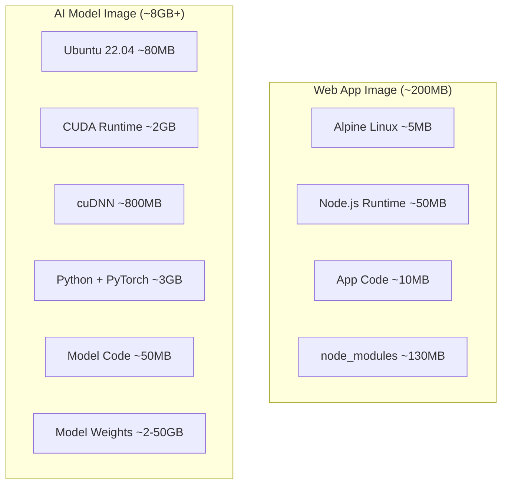
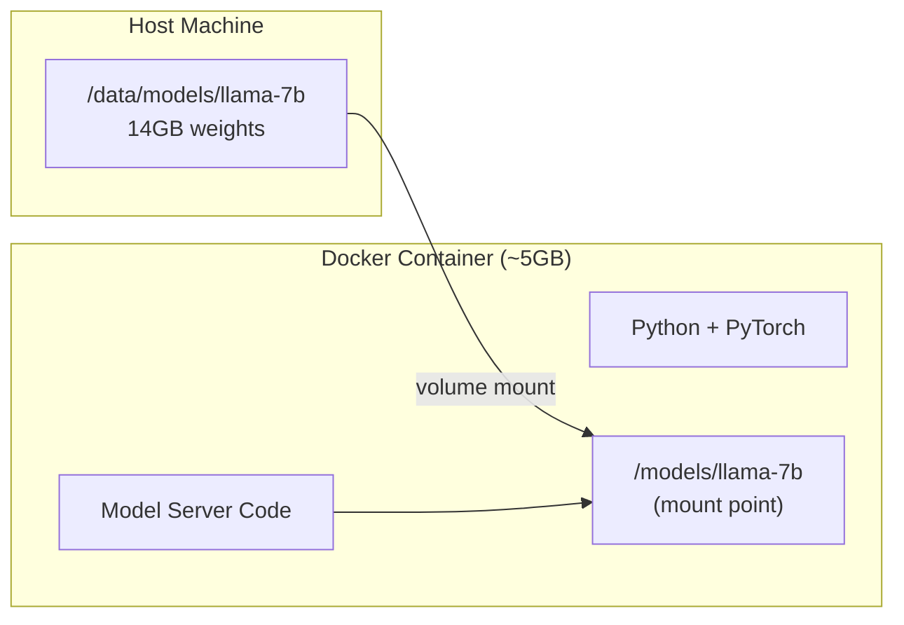
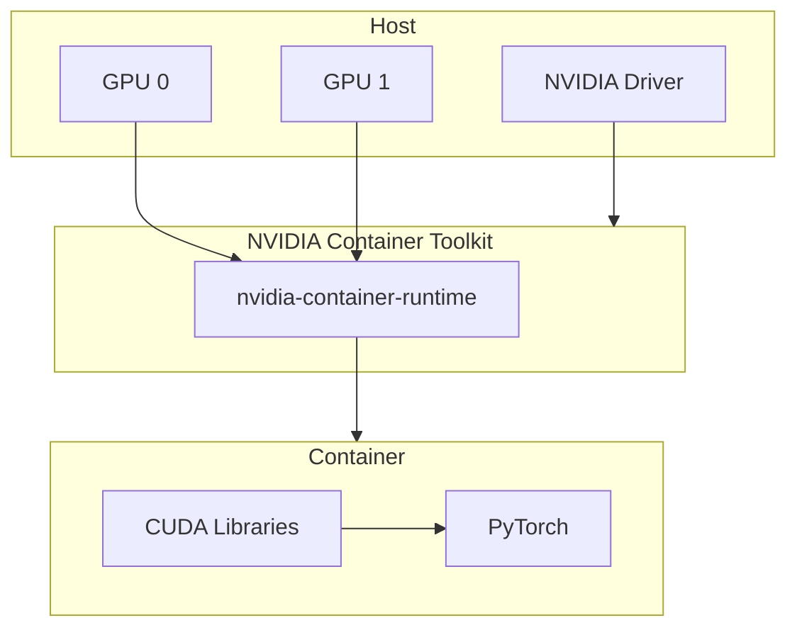

# Docker for AI

> "Works on my machine" meets 50GB model weights and CUDA drivers.

**Type:** Build
**Languages:** Python
**Prerequisites:** Phase 17 Lesson 01 (Model Serving)
**Time:** ~90 minutes

## Learning Objectives

- Write a multi-stage Dockerfile that separates build dependencies from runtime, keeping the final image under 10GB for a PyTorch + CUDA workload
- Configure NVIDIA Container Toolkit for GPU passthrough and verify GPU access inside a running container
- Mount model weights as volumes instead of baking them into images, and explain the size/caching tradeoffs
- Build a Docker Compose setup with a model server, load balancer, and shared GPU resources for local multi-service development

## The Problem

You built a model server. It runs on your laptop. You hand it to a teammate. It does not run on their laptop. Different Python version. Missing CUDA toolkit. Wrong version of PyTorch. The model weights are on your local disk and nowhere else.

This is the classic "works on my machine" problem, but AI makes it ten times worse. A web application needs Node.js and a few npm packages. An AI application needs Python, CUDA drivers, cuDNN, PyTorch compiled for a specific CUDA version, tokenizer libraries with C extensions, and 5-50GB of model weights. One version mismatch and nothing works. The error messages are cryptic. The debugging is brutal.

Docker solves this by packaging everything into a container: the OS, the drivers, the Python environment, the libraries, and optionally the model weights. Anyone with Docker (and a GPU) can run your container with a single command.

But containerizing AI workloads is not the same as containerizing a web app. GPU passthrough requires special runtime configuration. Model weights are too large to bake into images. CUDA driver compatibility is a minefield. This lesson covers the specific patterns you need.

## The Concept

### Why Docker for AI is Different

A typical web application Docker image is 100-500MB. An AI application image starts at 5GB (just the CUDA runtime and PyTorch) and can exceed 50GB with model weights included. This changes everything about how you build, ship, and run containers.



Three problems emerge:

**Build time.** Installing PyTorch with CUDA support takes 5-15 minutes. A naive Dockerfile that reinstalls everything on each code change makes development unbearable. Layer caching is critical.

**Image size.** A 20GB image takes 10 minutes to pull over a fast network. If your CI/CD pipeline builds and pushes this on every commit, you burn hours of developer time per day. Multi-stage builds and weight separation are mandatory.

**GPU access.** Containers are isolated from the host by default. The GPU is a host device. Getting a container to talk to the GPU requires the NVIDIA Container Toolkit, the correct base image, and the right runtime flags. One wrong setting and PyTorch falls back to CPU silently.

### NVIDIA Base Images

NVIDIA publishes official base images that bundle CUDA, cuDNN, and the NVIDIA runtime. These are the foundation for every AI container.

```
nvcr.io/nvidia/cuda:12.4.1-cudnn-runtime-ubuntu22.04 (smaller, inference only)
nvcr.io/nvidia/cuda:12.4.1-cudnn-devel-ubuntu22.04 (larger, includes compiler)
nvcr.io/nvidia/pytorch:24.05-py3 (PyTorch pre-installed)
```

Three variants matter:

**runtime** includes just the CUDA libraries needed to run GPU code. Smallest image. Use this for inference.

**devel** adds the CUDA compiler (nvcc) and headers needed to build GPU code. Larger, but necessary if you compile custom CUDA kernels (Flash Attention, for example).

**PyTorch NGC container** comes with PyTorch, CUDA, cuDNN, and NCCL pre-installed and tested together. Largest but zero compatibility issues. NVIDIA tests these combinations so you do not have to.

| Base Image | Size | Use Case |
|-----------|------|----------|
| cuda:runtime | ~2GB | Running pre-built models |
| cuda:devel | ~4GB | Building custom CUDA extensions |
| pytorch NGC | ~8GB | Maximum compatibility, no version debugging |

### Model Weights: Mount, Don't Bake

Model weights are large, change rarely, and are the same across environments. Baking them into the Docker image is a mistake for three reasons:

1. **Image size explodes.** A 7B parameter model at fp16 is ~14GB. Your image goes from 8GB to 22GB. Every pull downloads all of it.
2. **Rebuild waste.** If you change one line of Python code, Docker rebuilds from that layer forward. If weights are above the code layer, they get cached. But if they are below, 14GB re-uploads on every code change.
3. **Multiple models.** If you serve different models from the same code, you need a separate image per model.

The solution: mount weights from the host filesystem or a network volume.

```
docker run --gpus all \
 -v /data/models/llama-7b:/models/llama-7b \
 -p 8000:8000 \
 my-model-server
```

The container code reads from `/models/llama-7b`. The weights live outside the image. Swap models by changing the mount. No rebuild needed.



### Multi-Stage Builds

A single-stage Dockerfile installs build tools, compiles dependencies, and runs the application. The final image contains everything, including build tools you no longer need.

Multi-stage builds use one stage for building and a different stage for running:

```dockerfile
# Stage 1: Build
FROM nvidia/cuda:12.4.1-cudnn-devel-ubuntu22.04 AS builder
# Install compilers, build wheels, compile extensions

# Stage 2: Runtime
FROM nvidia/cuda:12.4.1-cudnn-runtime-ubuntu22.04
# Copy only the built wheels from stage 1
# No compilers, no build tools, smaller image
```

The runtime image skips the CUDA compiler, header files, and build dependencies. This can cut 2-3GB from the final image.

### GPU Passthrough

Docker containers do not see GPUs by default. You need two things:

1. **NVIDIA Container Toolkit** installed on the host
2. The **--gpus** flag when running the container

```bash
# All GPUs
docker run --gpus all my-image

# Specific GPU
docker run --gpus '"device=0"' my-image

# Two specific GPUs
docker run --gpus '"device=0,1"' my-image
```

Inside the container, `nvidia-smi` shows available GPUs, and PyTorch's `torch.cuda.is_available()` returns True. Without `--gpus`, CUDA code falls back to CPU with no error message. This silent fallback is one of the most common gotchas in AI containerization.



### Health Checks

AI containers have a unique failure mode: the process is alive but the model failed to load. The container reports healthy because the HTTP server is running, but every inference request returns an error because the model is not in GPU memory.

A proper health check verifies that:
1. The HTTP server responds
2. The model is loaded
3. A test inference completes

```dockerfile
HEALTHCHECK --interval=30s --timeout=10s --retries=3 \
 CMD curl -f http://localhost:8000/health || exit 1
```

The `/health` endpoint should run a minimal inference to confirm the model is operational, not just check that the server process exists.

### NVIDIA NIMs

NVIDIA NIMs (NVIDIA Inference Microservices) are pre-packaged containers that bundle a model, the serving framework, and optimized inference code into a single pull-and-run container. Instead of building your own Dockerfile, choosing a serving framework, configuring TensorRT, and debugging CUDA compatibility, you pull a NIM and run it.

```bash
docker run --gpus all -p 8000:8000 \
 nvcr.io/nim/meta/llama-3.1-8b-instruct:latest
```

NIMs expose an OpenAI-compatible API, handle quantization, and include performance optimizations for specific GPU architectures. The tradeoff: less control, but zero configuration.

### Docker Compose for Multi-Container AI

A production AI stack is rarely one container. You need:

- A model server (GPU)
- A reverse proxy or load balancer
- A metrics collector
- Possibly a vector database

Docker Compose orchestrates these together:

```yaml
services:
 model-server:
 build:.
 deploy:
 resources:
 reservations:
 devices:
 - driver: nvidia
 count: 1
 capabilities: [gpu]
 volumes:
 -./models:/models
 ports:
 - "8000:8000"

 nginx:
 image: nginx:alpine
 ports:
 - "80:80"
 depends_on:
 - model-server
```

The `deploy.resources.reservations.devices` section is how Docker Compose allocates GPUs. Without it, the model server gets no GPU access.

## Build It

We will build a complete Docker setup for the model server from Lesson 01. The code generates a Dockerfile, a docker-compose.yml, health check endpoints, and a build/run simulation that demonstrates each concept.

Since Docker itself requires a Docker daemon, the code simulates the build and runtime process while generating all the real configuration files you would use in production.

### Step 1: Generate the Dockerfile

The code produces a multi-stage Dockerfile with NVIDIA base images, proper layer ordering, and health checks. It explains each layer and its purpose.

### Step 2: Generate docker-compose.yml

A full compose file with GPU reservation, volume mounts for model weights, health checks, and a companion nginx container.

### Step 3: Health Check Server

A FastAPI-style health endpoint that verifies model loading status, GPU availability, and inference capability.

### Step 4: Build Simulation

A simulated Docker build that shows layer caching behavior, image size at each stage, and the difference between single-stage and multi-stage builds.

### Step 5: GPU Passthrough Verification

Code that checks for GPU availability and reports the device configuration, simulating what happens inside a container with and without `--gpus`.

Run the code:

```bash
python main.py
```

The output generates all Docker configuration files, simulates builds, and demonstrates GPU detection patterns.

## Exercises

1. Modify the Dockerfile to support both CPU and GPU inference, selecting the base image based on a build argument (`--build-arg GPU=true`)
2. Add a second service to docker-compose.yml that runs a Prometheus metrics collector, scraping the model server's `/metrics` endpoint
3. Implement a model download script that runs at container startup, pulling weights from a remote URL if the local mount is empty
4. Create a `.dockerignore` file that excludes model weights, virtual environments, and IDE files from the build context
5. Add a warm-up step to the Dockerfile's entrypoint that runs a test inference before the server starts accepting traffic

## Key Terms

| Term | What people say | What it actually means |
|------|----------------|----------------------|
| NVIDIA Container Toolkit | "Docker GPU support" | A runtime hook that maps host GPU devices into containers. Required for any GPU workload. |
| Multi-stage build | "Smaller images" | A Dockerfile pattern using separate build and runtime stages to exclude compilers and build tools from the final image. |
| Volume mount | "External storage" | Mapping a host directory into a container's filesystem. Used for model weights to avoid baking them into images. |
| NIM | "Pull and run AI" | NVIDIA Inference Microservice. A pre-packaged container with model, serving framework, and optimizations included. |
| Layer caching | "Docker remembers" | Docker reuses unchanged layers from previous builds. Proper layer ordering means code changes do not retrigger dependency installation. |
| Health check | "Is it actually working" | An endpoint that verifies not just process liveness but model readiness and inference capability. |
| NGC | "NVIDIA's Docker Hub" | NVIDIA GPU Cloud. A registry of GPU-optimized base images, pre-built containers, and model assets. |

## Further Reading

- [NVIDIA Container Toolkit documentation](https://docs.nvidia.com/datacenter/cloud-native/container-toolkit/) - GPU passthrough setup
- [Docker multi-stage builds](https://docs.docker.com/build/building/multi-stage/) - official documentation
- [NVIDIA NGC Catalog](https://catalog.ngc.nvidia.com/) - pre-built AI containers
- [vLLM Docker deployment](https://docs.vllm.ai/en/latest/serving/deploying_with_docker.html) - production vLLM containers
- [NVIDIA NIMs](https://build.nvidia.com/) - pre-packaged inference microservices
