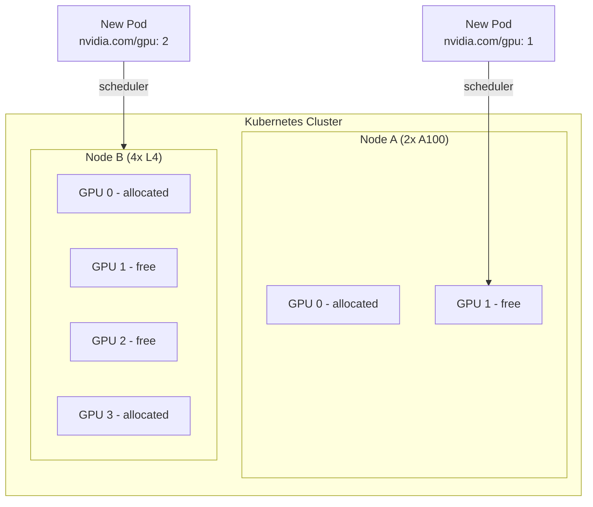
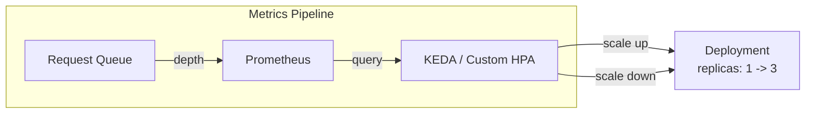
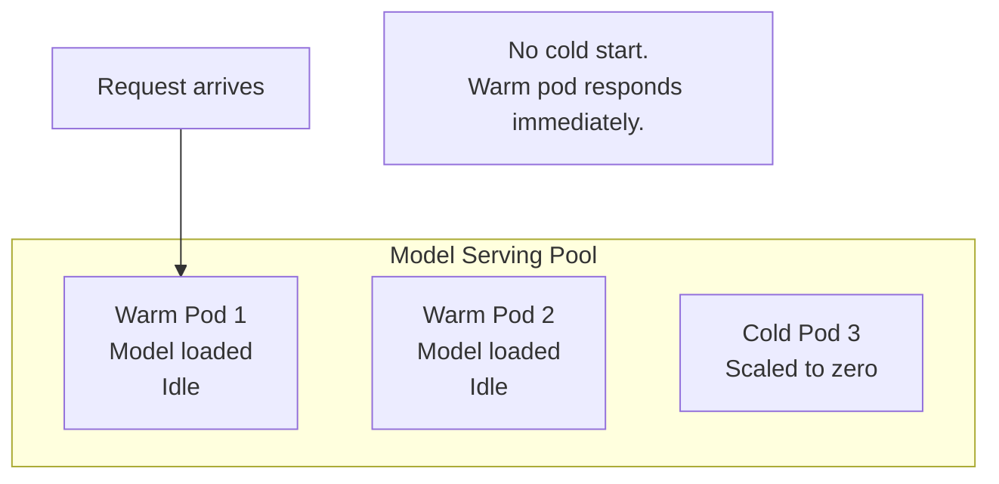
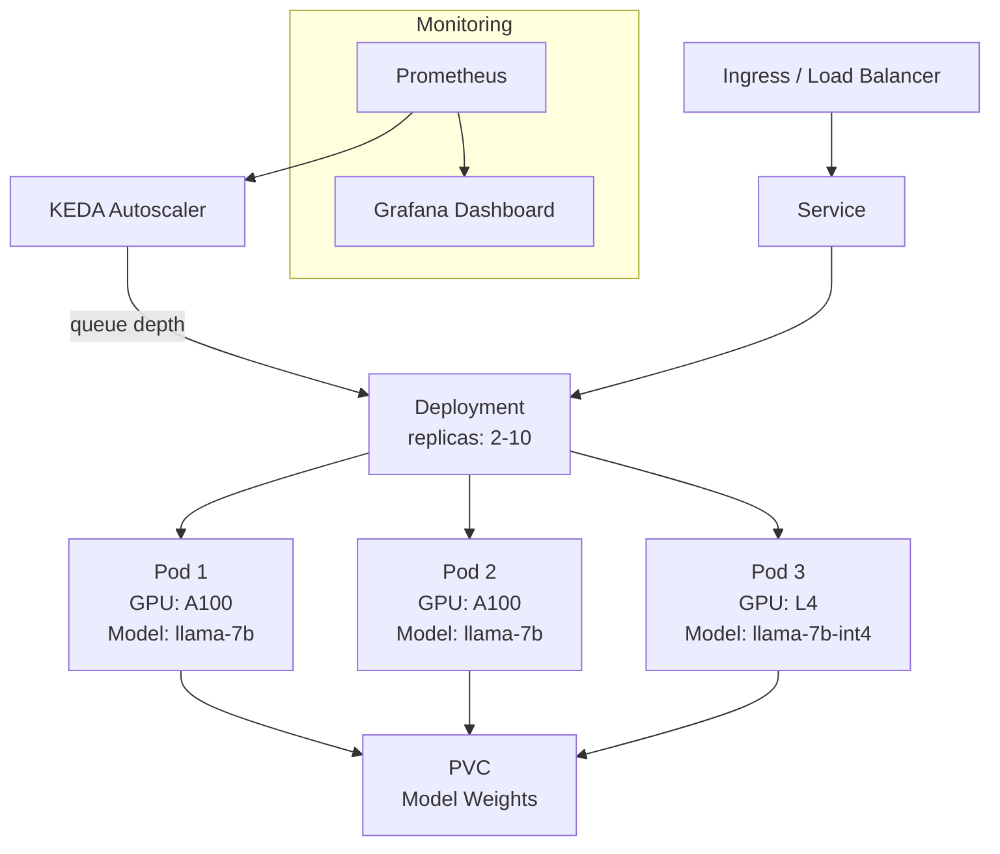

# Kubernetes for AI

> One GPU runs one model. 50 models across 200 GPUs in 3 regions? That's K8s for AI.

**Type:** Build
**Languages:** Python
**Prerequisites:** Phase 17 Lesson 02 (Docker for AI)
**Time:** ~90 minutes

## Learning Objectives

- Deploy a GPU-accelerated model server to Kubernetes using the NVIDIA GPU Operator and resource requests for nvidia.com/gpu
- Configure horizontal pod autoscaling based on request queue depth instead of CPU utilization, and explain why CPU-based scaling fails for GPU workloads
- Implement a warm pool strategy with pre-loaded model weights to mitigate cold start latency during scale-up events
- Write Kubernetes manifests for rolling updates with zero downtime, including readiness probes that verify model loading before accepting traffic

## The Problem

You containerized your model. It runs in Docker with GPU passthrough. One model, one GPU, one machine. Done.

Then reality scales. You need to serve five models. Three of them need A100s, two can run on L4s. Some models are popular at peak hours and idle at night. A new model version needs to deploy without downtime. A GPU fails, and the model on it needs to restart somewhere else. The team in Europe wants low-latency serving from a European data center.

You could manage this by hand: SSH into machines, start containers, monitor them, restart them when they crash. For two machines, this works. For twenty machines across three regions, it is a full-time operations job that no one wants.

Kubernetes automates container orchestration: scheduling workloads onto machines, restarting failures, scaling up and down, rolling out updates. But Kubernetes was built for web services, not GPU workloads. CPUs are fungible (any CPU core can run any container), GPUs are not (a container that needs an A100 cannot run on an L4). Models take 3-5 minutes to load into GPU memory, making cold starts brutal. GPU hours cost 10-50x more than CPU hours, making idle resources expensive.

This lesson covers the specific Kubernetes patterns for AI workloads: GPU scheduling, cold start mitigation, autoscaling on queue depth instead of CPU, spot GPU management, warm pools, and cost control.

## The Concept

### GPU Scheduling

Kubernetes schedules pods onto nodes. For CPU workloads, the scheduler looks at available CPU cores and memory. For GPU workloads, you need one more resource: `nvidia.com/gpu`.

The NVIDIA GPU Operator installs on the cluster and exposes each GPU as a schedulable resource. When a pod requests `nvidia.com/gpu: 1`, the scheduler finds a node with a free GPU and places the pod there.



Key constraints:

**GPUs are not shared by default.** If a pod requests one GPU, it gets exclusive access. No other pod can use that GPU, even if the first pod only uses 30% of its compute. This is different from CPU, where Kubernetes can pack multiple pods onto the same core.

**GPU types matter.** An A100 has 80GB of memory and costs $2/hour. An L4 has 24GB and costs $0.30/hour. A 70B parameter model does not fit on an L4. You need node selectors or node affinity to target specific GPU types.

**GPUs cannot be requested fractionally in vanilla Kubernetes.** You request 1, 2, or 4 GPUs. You cannot request 0.5 GPUs. Multi-instance GPU (MIG) on A100/H100 enables physical GPU partitioning, and time-slicing enables virtual sharing, but both require additional configuration.

```yaml
resources:
 requests:
 nvidia.com/gpu: 1
 limits:
 nvidia.com/gpu: 1
```

### Cold Start: The 3-5 Minute Problem

When a new pod starts, it must:

1. Pull the container image (30-120 seconds for a 5GB image)
2. Download or mount model weights (30-300 seconds for a 14GB model)
3. Load the model into GPU memory (30-120 seconds for a 7B model)
4. Run a warm-up inference (5-10 seconds)

Total: 2-5 minutes before the first request can be served.

For web services, cold start is 2-5 seconds. For AI workloads, it is 100x worse. This has cascading effects:

**Autoscaling is sluggish.** If traffic spikes and the autoscaler creates a new pod, users wait 3-5 minutes before the new capacity is available. By then, the traffic spike may have passed.

**Rolling updates are painful.** Deploying a new version means starting new pods. If the old pods are terminated before the new ones are ready, you have a 3-5 minute gap with no serving capacity.

**Node failures are expensive.** If a node dies, every model on it takes 3-5 minutes to restart on another node.

```mermaid
gantt
 title Pod Cold Start Timeline
 dateFormat X
 axisFormat %s

 section Web App
 Pull image :0, 3
 Start process :3, 5
 Ready :5, 6

 section AI Model
 Pull image :0, 60
 Download weights :60, 180
 Load to GPU :180, 270
 Warm-up inference :270, 280
 Ready :280, 285
```



### Autoscaling on Queue Depth

Standard Kubernetes autoscaling (HPA) scales on CPU or memory utilization. For AI workloads, this is the wrong metric. A model server can have 0% CPU usage while the GPU is saturated, or 100% CPU usage during tokenization while the GPU is idle.

The right metric for AI autoscaling is **queue depth**: how many requests are waiting to be processed. If the queue is growing, you need more replicas. If the queue is empty, you can scale down.



KEDA (Kubernetes Event-Driven Autoscaling) integrates with Prometheus, RabbitMQ, and other metric sources to drive scaling decisions based on custom metrics like queue depth. A basic configuration:

```yaml
triggers:
 - type: prometheus
 metadata:
 serverAddress: http://prometheus:9090
 query: sum(model_server_queue_depth)
 threshold: "10"
```

When the queue exceeds 10 pending requests, KEDA adds replicas. When it drops below, KEDA removes them. The cooldown period prevents thrashing.

But scaling down is where cold start bites hardest. If you scale down to zero pods and traffic returns, the first request waits 3-5 minutes. This is why warm pools exist.

### Warm Pools

A warm pool keeps a minimum number of pods running with models loaded into GPU memory, even when there is no traffic. These pods cost money (GPU hours), but they eliminate cold start for the first burst of requests.



The tradeoff is explicit: warm pool size is a bet on traffic patterns. Two warm pods cost $4/hour in GPU time even when idle. If your minimum traffic always justifies two pods, this is efficient. If your service has hours of zero traffic, you are paying for idle GPUs.

A common pattern: keep 1-2 warm pods during business hours, scale to zero overnight, and accept the cold start penalty for the first morning request.

### Spot GPUs

Cloud providers offer spot (preemptible) GPUs at 60-90% discount. The catch: the GPU can be taken away with 30 seconds notice. For training workloads with checkpointing, this is manageable. For inference, it requires careful handling.

The pattern for spot GPU inference:

1. Run non-critical or overflow traffic on spot instances
2. Keep critical minimum capacity on on-demand instances
3. Handle preemption gracefully: drain requests, signal the load balancer to stop routing traffic, and let another pod absorb the load

```yaml
nodeAffinity:
 preferredDuringSchedulingIgnoredDuringExecution:
 - weight: 80
 preference:
 matchExpressions:
 - key: cloud.google.com/gke-spot
 operator: In
 values: ["true"]
```

This tells the scheduler to prefer spot nodes but allows on-demand as a fallback.

### Cost Management

GPU costs dominate AI infrastructure budgets. An A100 node costs ~$30/hour. A cluster of 10 A100 nodes costs $7,200/day. Small inefficiencies compound fast.

Key cost levers:

**Right-sizing GPU types.** A 7B model at fp16 needs ~14GB of GPU memory. Running it on an 80GB A100 wastes 66GB. An L4 (24GB, $0.30/hour) or T4 (16GB, $0.20/hour) is sufficient and 10x cheaper.

**Quantization.** Running a model at int8 or int4 halves or quarters the memory requirement, enabling smaller (cheaper) GPUs. A 70B model at fp16 needs 4x A100s. At int4, it fits on a single A100.

**Utilization monitoring.** Track GPU utilization per pod. If a pod consistently uses less than 50% of GPU compute, it is a candidate for consolidation (serving multiple models on one GPU via MIG or time-slicing).

**Scale-to-zero for dev/staging.** Development and staging environments do not need 24/7 GPU allocation. Scale to zero when not in use and accept the cold start on demand.

| Strategy | Savings | Tradeoff |
|----------|---------|----------|
| Right-size GPU type | 5-10x | May need to benchmark throughput on smaller GPUs |
| Quantization (int4) | 2-4x | Small quality loss (often negligible) |
| Spot instances | 60-90% | Preemption risk, requires fallback capacity |
| Scale-to-zero (non-prod) | 100% when idle | 3-5 minute cold start on resume |
| Time-slicing/MIG | 2-7x | Increased latency per tenant, complex config |

### Putting It Together: A Production Deployment

A complete AI serving deployment on Kubernetes looks like this:



The deployment uses:
- A Deployment with 2+ replicas for redundancy
- KEDA for queue-depth autoscaling
- PersistentVolumeClaims for shared model weight storage
- Mixed GPU types (A100 for full precision, L4 for quantized)
- Prometheus and Grafana for monitoring
- An Ingress for load balancing across pods

## Build It

We will build the complete set of Kubernetes manifests for deploying an AI model server, plus a Python simulation that demonstrates GPU scheduling, autoscaling decisions, and cost calculations. Since running an actual Kubernetes cluster with GPUs requires cloud infrastructure, the code simulates the control plane behavior while generating real, deployable YAML manifests.

### Step 1: Generate K8s Manifests

The code generates a Deployment, Service, HPA, KEDA ScaledObject, PersistentVolumeClaim, and Ingress. Each manifest includes GPU resource requests, node affinity, health checks, and proper rolling update configuration.

### Step 2: GPU Scheduling Simulation

A simulated scheduler places pods onto nodes with different GPU types and counts. You see how GPU availability affects placement decisions.

### Step 3: Cold Start Simulation

Model cold start times under different configurations: with and without image caching, with local vs network-attached weights, with and without warm pools.

### Step 4: Autoscaling Simulation

A traffic pattern drives queue depth up and down. The autoscaler responds by scaling replicas. You see the delay between traffic increase and capacity becoming available (the cold start penalty).

### Step 5: Cost Calculator

Compute the cost of different deployment configurations: GPU type, replica count, spot vs on-demand, and utilization levels.

Run the code:

```bash
python main.py
```

The output generates production-ready Kubernetes manifests and simulates scheduling, autoscaling, and cost optimization decisions.

## Exercises

1. Add a PodDisruptionBudget that ensures at least one replica is always available during node maintenance
2. Implement a canary deployment strategy: route 10% of traffic to a new model version, then gradually increase
3. Create a CronJob that scales the warm pool from 1 to 3 replicas at 8am and back to 1 at 8pm
4. Add resource quotas to a namespace that limit total GPU allocation to 4 GPUs, preventing runaway scaling
5. Implement a priority class so production model serving pods preempt development workloads when GPUs are scarce

## Key Terms

| Term | What people say | What it actually means |
|------|----------------|----------------------|
| nvidia.com/gpu | "GPU requests" | The Kubernetes resource name for NVIDIA GPUs, exposed by the GPU Operator. Pods request integer quantities. |
| Cold start | "Model loading time" | The 2-5 minutes from pod creation to first inference, dominated by image pull, weight loading, and GPU initialization. |
| KEDA | "Custom autoscaler" | Kubernetes Event-Driven Autoscaling. Scales deployments based on external metrics like queue depth, not just CPU. |
| Warm pool | "Pre-loaded replicas" | Pods kept running with models in GPU memory, ready to serve immediately. Trades idle cost for zero cold start. |
| Spot instance | "Cheap but interruptible GPU" | Cloud GPU instances at 60-90% discount that can be reclaimed with 30 seconds notice. |
| MIG | "GPU partitioning" | Multi-Instance GPU. Physically splits an A100/H100 into up to 7 isolated GPU instances. |
| PVC | "Shared storage" | PersistentVolumeClaim. Attaches network storage to pods for model weights shared across replicas. |
| Node affinity | "Pod placement rules" | Kubernetes scheduling constraints that control which nodes a pod can run on based on labels like GPU type. |
| Rolling update | "Zero-downtime deploy" | Gradually replacing old pods with new ones. Critical for AI where cold start makes simultaneous replacement unacceptable. |

## Further Reading

- [NVIDIA GPU Operator documentation](https://docs.nvidia.com/datacenter/cloud-native/gpu-operator/) - installing GPU support in Kubernetes
- [KEDA documentation](https://keda.sh/) - event-driven autoscaling
- [GKE GPU workload guide](https://cloud.google.com/kubernetes-engine/docs/how-to/gpus) - Google Cloud GPU on Kubernetes
- [EKS GPU scheduling](https://docs.aws.amazon.com/eks/latest/userguide/gpu-ami.html) - AWS GPU on Kubernetes
- [vLLM Kubernetes deployment](https://docs.vllm.ai/en/latest/serving/deploying_with_k8s.html) - production vLLM on K8s
